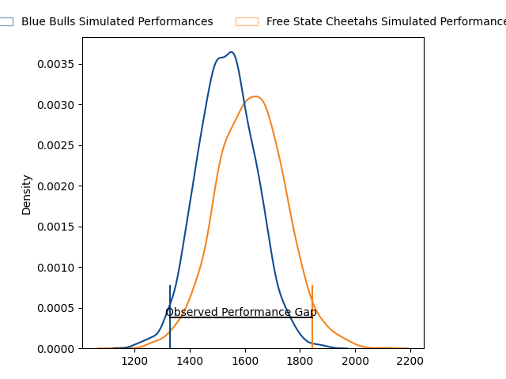
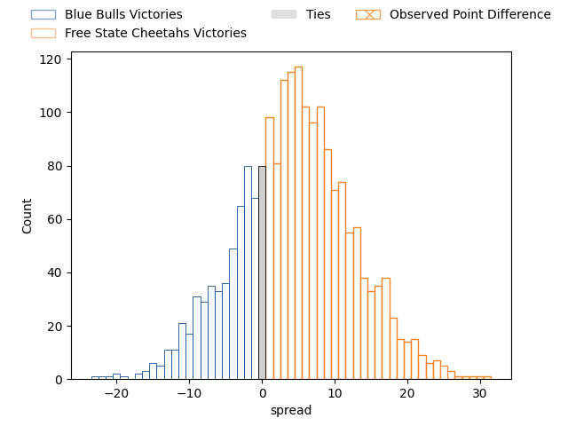
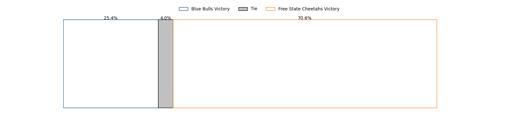

---  
layout: page  
title: Blue Bulls at Free State Cheetahs; 7-32  
date: 2023-03-24 17:00:00 18:00:00 -0500  
categories: match review  
---
# Blue Bulls at Free State Cheetahs; 7-32

# Club Level Predictions

The first set of predictions treats a club as the smallest object, as the club develops its members, organizes a gameplan, and deploys its players as needed for each match. This club model has a prediction of 0.621, which translates to predicting Free State Cheetahs to win by 4.5.

Each club has a rating and a rating deviation (simiar to a Glicko system), and expected performances can be generated. This allows for simulated matches and spreads like the ones below.
## Projected Performances

## Projected Spreads

## Projected Results

# Player Level Predictions

Treating teams instead as an entity made up of the currently active players, I have ratings for each player in an altogether different system. These can be combined to form team ratings once teamsheets are announced, weighting starters a bit higher than the reserves. After the match is played, players can be weighted by their minutes on the field, allowing for an accurate measure of the team's composition. With these compiled team ratings, we can make predictions, measure inaccuracy, and update the individual player ratings.
## Prediction with Player Minutes: Free State Cheetahs by 25.9

Free State Cheetahs by 21.9 on a neutral field

There were 2 large changes in win probability in this match
## Prediction without Player Minutes: Free State Cheetahs by 25.4

Free State Cheetahs by 21.4 on a neutral pitch

|   Away Minutes | Away Player                                                                                    |   Away elo |   Away Percentile |   Number |   Home Percentile |   Home elo | Home Player                                                                              |   Home Minutes |
|---------------:|:-----------------------------------------------------------------------------------------------|-----------:|------------------:|---------:|------------------:|-----------:|:-----------------------------------------------------------------------------------------|---------------:|
|             68 | [Lizo Pumzile Gqoboka](..//playerfiles//LizoPumzileGqoboka_cleaned.md)                         |      93.36 |               nan |        1 |                84 |     107.44 | [Schalk Ferreira](..//playerfiles//SchalkFerreira_cleaned.md)                            |             46 |
|             59 | [Jan Hendrik Wessels](..//playerfiles//JanHendrikWessels_cleaned.md)                           |      71.98 |                 4 |        2 |                73 |     102.08 | [Marnus van der Merwe](..//playerfiles//MarnusvanderMerwe_cleaned.md)                    |             47 |
|             53 | [Robert Hunt](..//playerfiles//RobertHunt_cleaned.md)                                          |      95    |               nan |        3 |                93 |     115.71 | [Hencus van Wyk](..//playerfiles//HencusvanWyk_cleaned.md)                               |             65 |
|             80 | [Willem Hendrik Jacques du Plessis](..//playerfiles//WillemHendrikJacquesduPlessis_cleaned.md) |      80.51 |                13 |        4 |                78 |     110.6  | [Rynier Mark Bernardo](..//playerfiles//RynierMarkBernardo_cleaned.md)                   |             80 |
|             80 | [Reinhardt Ludwig](..//playerfiles//ReinhardtLudwig_cleaned.md)                                |      89.28 |                31 |        5 |                66 |     101.12 | [Victor Kutlwano Sekekete](..//playerfiles//VictorKutlwanoSekekete_cleaned.md)           |             80 |
|             53 | [Cameron Hanekom](..//playerfiles//CameronHanekom_cleaned.md)                                  |      85.32 |               nan |        6 |                94 |     125.4  | [Gideon van der Merwe](..//playerfiles//GideonvanderMerwe_cleaned.md)                    |             74 |
|             51 | [Mihlali Langa Mosi](..//playerfiles//MihlaliLangaMosi_cleaned.md)                             |     100.94 |                63 |        7 |               nan |      95    | [Teboho Stephen Oupa Mohoje](..//playerfiles//TebohoStephenOupaMohoje_cleaned.md)        |             52 |
|             80 | [Hendrik Muller Uys](..//playerfiles//HendrikMullerUys_cleaned.md)                             |      95    |               nan |        8 |                71 |     104.43 | [Jeandre Rudolph](..//playerfiles//JeandreRudolph_cleaned.md)                            |             52 |
|             80 | [Keagan Johannes](..//playerfiles//KeaganJohannes_cleaned.md)                                  |      90.02 |                41 |        9 |                88 |     112.37 | [Ruan Pienaar](..//playerfiles//RuanPienaar_cleaned.md)                                  |             68 |
|             55 | [Chris Smit](..//playerfiles//ChrisSmit_cleaned.md)                                            |     100.35 |                62 |       10 |                57 |      99.04 | [Reinhardt Fortuin](..//playerfiles//ReinhardtFortuin_cleaned.md)                        |             80 |
|             80 | [Kabelo Mokoena](..//playerfiles//KabeloMokoena_cleaned.md)                                    |      98.9  |                59 |       11 |                84 |     111.77 | [Munier Hartzenberg](..//playerfiles//MunierHartzenberg_cleaned.md)                      |             80 |
|             80 | [Lionel Granton Mapoe](..//playerfiles//LionelGrantonMapoe_cleaned.md)                         |      83.41 |                17 |       12 |                80 |     109.62 | [Francois Steyn](..//playerfiles//FrancoisSteyn_cleaned.md)                              |             48 |
|             80 | [Wandisile Simelane](..//playerfiles//WandisileSimelane_cleaned.md)                            |      89.91 |                35 |       13 |                66 |     104.62 | [Robert Thompson Ebersohn](..//playerfiles//RobertThompsonEbersohn_cleaned.md)           |             80 |
|             43 | [Quewin Nortje](..//playerfiles//QuewinNortje_cleaned.md)                                      |      99.41 |                61 |       14 |                55 |      97.52 | [Daniel Kasende Kalepula](..//playerfiles//DanielKasendeKalepula_cleaned.md)             |             80 |
|             78 | [Franco Knoetze](..//playerfiles//FrancoKnoetze_cleaned.md)                                    |      95    |               nan |       15 |                73 |     109.04 | [Cohen Jasper](..//playerfiles//CohenJasper_cleaned.md)                                  |             80 |
|             37 | [Adrian Joubert](..//playerfiles//AdrianJoubert_cleaned.md)                                    |      95    |               nan |       16 |                71 |      99.15 | [Alulutho Tshakweni](..//playerfiles//AluluthoTshakweni_cleaned.md)                      |             34 |
|             29 | [Juan van der Westhuizen](..//playerfiles//JuanvanderWesthuizen_cleaned.md)                    |      95    |               nan |       17 |                12 |      81.48 | [Marko Louis Janse van Rensburg](..//playerfiles//MarkoLouisJansevanRensburg_cleaned.md) |             33 |
|             27 | [Phumzile Maqondwana](..//playerfiles//PhumzileMaqondwana_cleaned.md)                          |      91.29 |                37 |       18 |                46 |      94.85 | [David Benjamin Brits](..//playerfiles//DavidBenjaminBrits_cleaned.md)                   |             32 |
|             27 | [Sebastian Lombard](..//playerfiles//SebastianLombard_cleaned.md)                              |      93.36 |               nan |       19 |                89 |     125.15 | [Daniel Johannes Maartens](..//playerfiles//DanielJohannesMaartens_cleaned.md)           |             28 |
|             25 | [Bernard van der Linde](..//playerfiles//BernardvanderLinde_cleaned.md)                        |      94.7  |                47 |       20 |                72 |     104.45 | [Sibabalo Qoma](..//playerfiles//SibabaloQoma_cleaned.md)                                |             28 |
|             12 | [Jacques van Rooyen](..//playerfiles//JacquesvanRooyen_cleaned.md)                             |      95    |               nan |       21 |               nan |      96.48 | [Laurence Herbert Victor](..//playerfiles//LaurenceHerbertVictor_cleaned.md)             |             15 |
|              2 | [Juan Mostert](..//playerfiles//JuanMostert_cleaned.md)                                        |      96.52 |                50 |       22 |                34 |      96.11 | [Rewan Kruger](..//playerfiles//RewanKruger_cleaned.md)                                  |             12 |
|             21 | [Joe van Zyl](..//playerfiles//JoevanZyl_cleaned.md)                                           |      94.21 |               nan |       23 |                20 |      83.64 | [Tapiwa Lloyd Mafura](..//playerfiles//TapiwaLloydMafura_cleaned.md)                     |              6 |

