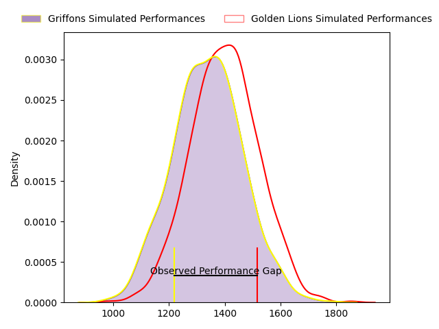
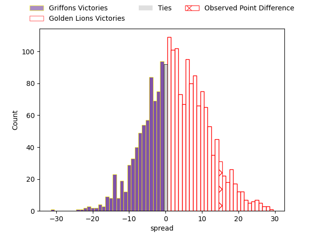

---  
layout: page  
title: Griffons at Golden Lions; 26-41  
date: 2023-03-24 14:00:00 18:00:00 -0500  
categories: match review  
---
# Griffons at Golden Lions; 26-41

# Club Level Predictions

The first set of predictions treats a club as the smallest object, as the club develops its members, organizes a gameplan, and deploys its players as needed for each match. This club model has a prediction of 0.579, which translates to predicting Golden Lions to win by 3.0.

Each club has a rating and a rating deviation (simiar to a Glicko system), and expected performances can be generated. This allows for simulated matches and spreads like the ones below.
## Projected Performances

## Projected Spreads

## Projected Results

# Player Level Predictions

Treating teams instead as an entity made up of the currently active players, I have ratings for each player in an altogether different system. These can be combined to form team ratings once teamsheets are announced, weighting starters a bit higher than the reserves. After the match is played, players can be weighted by their minutes on the field, allowing for an accurate measure of the team's composition. With these compiled team ratings, we can make predictions, measure inaccuracy, and update the individual player ratings.
## Prediction with Player Minutes: Golden Lions by 7.3

Golden Lions by 3.3 on a neutral field

There were 11 large changes in win probability in this match
## Prediction without Player Minutes: Golden Lions by 7.0

Golden Lions by 3.0 on a neutral pitch

|   Away Minutes | Away Player                 |   Away elo |   Away Percentile |   Number |   Home Percentile |   Home elo | Home Player            |   Home Minutes |
|---------------:|:----------------------------|-----------:|------------------:|---------:|------------------:|-----------:|:-----------------------|---------------:|
|             80 | Stephan de Jager            |      92.72 |                40 |        1 |                37 |      91.95 | Sithembiso Sithole     |             46 |
|             54 | Dandré Delport              |      89.91 |                31 |        2 |                68 |     100.52 | Gerrit Jacobus Visagie |             80 |
|             53 | Doctor Booysen              |      87.18 |                21 |        3 |                77 |     103.56 | Ruan-Henry Smith       |             74 |
|             62 | Jaco Willemse               |      97.38 |                55 |        4 |                61 |      97.21 | Raynard Roets          |             80 |
|             80 | Michael Benadie             |      85.92 |                22 |        5 |                85 |     111.53 | Darrien-Lane Landsberg |             80 |
|             80 | Mitch Carstens              |     110.83 |                83 |        6 |                14 |      82.44 | Sibusiso Sangweni      |             80 |
|             80 | Jean-Jacques Pretorius      |      93.72 |                44 |        7 |                35 |      97.31 | Ruhan Straeuli         |             57 |
|             80 | Sokuphumla (Soso) Xakalashe |      86.55 |                22 |        8 |                 9 |      77.82 | Jarod Cairns           |             80 |
|             80 | Jaywinn Juries              |      91.12 |                35 |        9 |               nan |      91.61 | Nico Steyn             |             80 |
|             80 | Duan Pretorius              |     115.99 |                86 |       10 |                20 |      85.81 | Vaughen Isaacs         |             80 |
|             80 | Randy Fillies               |      95    |               nan |       11 |               nan |      89.93 | Ilunga Mukendi         |             80 |
|             80 | Marquit Virgil September    |      63    |                 2 |       12 |                18 |      83.92 | Tyler Bocks            |             80 |
|             80 | Carel-Jan Coetzee           |      55.88 |                 1 |       13 |                36 |      90.97 | Stean Pienaar          |             80 |
|             80 | Jamba Isaac Ulengo          |      87.11 |                23 |       14 |                17 |      83.72 | Boldwin Hansen         |             80 |
|             80 | Domenic Smit                |      91.72 |                41 |       15 |                38 |      90.64 | Tiaan Henk Swanepoel   |             80 |
|             27 | Neo Mohapi                  |      99.41 |               nan |       16 |               nan |     100.81 | Morgan Naude           |             34 |
|             26 | Hendrik Petrus van Schoor   |      91.3  |               nan |       17 |               nan |      95    | PJ Steenkamp           |             23 |
|             18 | Curtley Thomas              |      97.08 |               nan |       18 |               nan |      90.37 | Kabous Bezuidenhout    |              6 |

