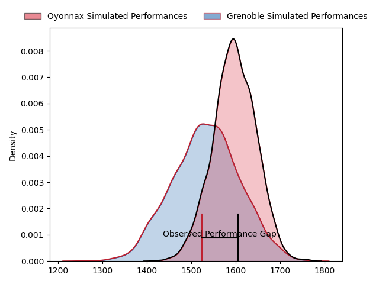
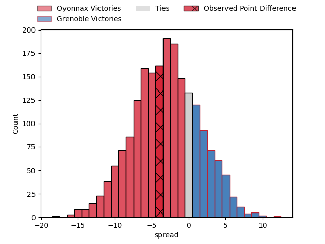

---  
layout: page  
title: Oyonnax at Grenoble; 28-24  
date: 2023-03-24 21:00:00 18:00:00 -0500  
categories: match review  
---
# Oyonnax at Grenoble; 28-24

# Club Level Predictions

The first set of predictions treats a club as the smallest object, as the club develops its members, organizes a gameplan, and deploys its players as needed for each match. This club model has a prediction of 0.413, which translates to predicting Oyonnax to win by 3.1.

Each club has a rating and a rating deviation (simiar to a Glicko system), and expected performances can be generated. This allows for simulated matches and spreads like the ones below.
## Projected Performances

## Projected Spreads

## Projected Results

# Player Level Predictions

Treating teams instead as an entity made up of the currently active players, I have ratings for each player in an altogether different system. These can be combined to form team ratings once teamsheets are announced, weighting starters a bit higher than the reserves. After the match is played, players can be weighted by their minutes on the field, allowing for an accurate measure of the team's composition. With these compiled team ratings, we can make predictions, measure inaccuracy, and update the individual player ratings.
## Prediction with Player Minutes: Oyonnax by 6.0

Oyonnax by 10.0 on a neutral field

There were 9 large changes in win probability in this match
## Prediction without Player Minutes: Oyonnax by 4.2

Oyonnax by 8.2 on a neutral pitch

|   Away Minutes | Away Player                                                           |   Away elo |   Away Percentile |   Number |   Home Percentile |   Home elo | Home Player                                                           |   Home Minutes |
|---------------:|:----------------------------------------------------------------------|-----------:|------------------:|---------:|------------------:|-----------:|:----------------------------------------------------------------------|---------------:|
|             67 | [Tommy Raynaud](..//playerfiles//TommyRaynaud_cleaned.md)             |      99.46 |                65 |        1 |                94 |     118.69 | [Zack Gauthier](..//playerfiles//ZackGauthier_cleaned.md)             |             53 |
|             60 | [Teddy Durand](..//playerfiles//TeddyDurand_cleaned.md)               |      89.45 |                30 |        2 |                54 |      96.1  | [Bernabe Massa](..//playerfiles//BernabeMassa_cleaned.md)             |             57 |
|             31 | [Thibault Berthaud](..//playerfiles//ThibaultBerthaud_cleaned.md)     |      96.98 |                57 |        3 |                51 |      93.85 | [Irakli Aptsiauri](..//playerfiles//IrakliAptsiauri_cleaned.md)       |             52 |
|             60 | [Victor Lebas](..//playerfiles//VictorLebas_cleaned.md)               |      91.46 |                36 |        4 |                81 |     108.91 | [Thomas Lainault](..//playerfiles//ThomasLainault_cleaned.md)         |             53 |
|             80 | [Steve Mafi](..//playerfiles//SteveMafi_cleaned.md)                   |     105.7  |                73 |        5 |                77 |     106.25 | [Tanginoa Halaifonua](..//playerfiles//TanginoaHalaifonua_cleaned.md) |             80 |
|             80 | [Kevin Lebreton](..//playerfiles//KevinLebreton_cleaned.md)           |     152.82 |                99 |        6 |                14 |      82.07 | [Talalelei Gray](..//playerfiles//TalaleleiGray_cleaned.md)           |             48 |
|             67 | [Wandrille Picault](..//playerfiles//WandrillePicault_cleaned.md)     |     113.24 |                86 |        7 |                49 |      95.58 | [Steeve Blanc-Mappaz](..//playerfiles//SteeveBlanc-Mappaz_cleaned.md) |             67 |
|             80 | [Loïc Credoz](..//playerfiles//LoïcCredoz_cleaned.md)                 |     104.9  |                79 |        8 |                94 |     122.13 | [Pio Muarua](..//playerfiles//PioMuarua_cleaned.md)                   |             80 |
|             75 | [Charlie Cassang](..//playerfiles//CharlieCassang_cleaned.md)         |      99.35 |                67 |        9 |                76 |     104.94 | [Éric Escande](..//playerfiles//ÉricEscande_cleaned.md)               |             60 |
|             63 | [Jules Soulan](..//playerfiles//JulesSoulan_cleaned.md)               |     125.29 |                92 |       10 |                73 |     104.99 | [Thomas Fortunel](..//playerfiles//ThomasFortunel_cleaned.md)         |             80 |
|             80 | [Enzo Reybier](..//playerfiles//EnzoReybier_cleaned.md)               |     108.36 |                81 |       11 |                55 |      97.55 | [Lucas Dupont](..//playerfiles//LucasDupont_cleaned.md)               |             80 |
|             80 | [Théo Millet](..//playerfiles//ThéoMillet_cleaned.md)                 |     104.92 |                73 |       12 |                 7 |      76.09 | [Romain Trouilloud](..//playerfiles//RomainTrouilloud_cleaned.md)     |             80 |
|             69 | [Chris Farrell](..//playerfiles//ChrisFarrell_cleaned.md)             |      95    |               nan |       13 |                57 |      98.58 | [Terence Hepetema](..//playerfiles//TerenceHepetema_cleaned.md)       |             57 |
|             80 | [Joe Ravouvou](..//playerfiles//JoeRavouvou_cleaned.md)               |      96.21 |                50 |       14 |                40 |      92.47 | [Karim Qadiri](..//playerfiles//KarimQadiri_cleaned.md)               |             80 |
|             80 | [Aurelien Callandret](..//playerfiles//AurelienCallandret_cleaned.md) |     108.85 |                82 |       15 |                79 |     108.82 | [Julien Farnoux](..//playerfiles//JulienFarnoux_cleaned.md)           |             80 |
|             49 | [Victor Delmas](..//playerfiles//VictorDelmas_cleaned.md)             |     101.84 |               nan |       16 |                69 |     100.57 | [Thibaut Martel](..//playerfiles//ThibautMartel_cleaned.md)           |             32 |
|             20 | [Manu Leiataua](..//playerfiles//ManuLeiataua_cleaned.md)             |      95.19 |                47 |       17 |               nan |      92.55 | [Sam Nixon](..//playerfiles//SamNixon_cleaned.md)                     |             28 |
|             20 | [Tom Murday](..//playerfiles//TomMurday_cleaned.md)                   |      93.28 |                43 |       18 |                70 |     103.45 | [José Duarte Madeira](..//playerfiles//JoséDuarteMadeira_cleaned.md)  |             27 |
|             17 | [Justin Bouraux](..//playerfiles//JustinBouraux_cleaned.md)           |     111.41 |                83 |       19 |                10 |      79.9  | [Luka Goginava](..//playerfiles//LukaGoginava_cleaned.md)             |             27 |
|             13 | [Hugo Hermet](..//playerfiles//HugoHermet_cleaned.md)                 |      98.4  |                61 |       20 |                45 |      93.51 | [Mathis Sarragallet](..//playerfiles//MathisSarragallet_cleaned.md)   |             23 |
|             13 | [Adrien Bordenave](..//playerfiles//AdrienBordenave_cleaned.md)       |      92.7  |                40 |       21 |                20 |      82.61 | [Romain Fusier](..//playerfiles//RomainFusier_cleaned.md)             |             23 |
|             11 | [Florian Vialelle](..//playerfiles//FlorianVialelle_cleaned.md)       |      93.67 |                43 |       22 |                27 |      88.5  | [Felipe Ezcurra](..//playerfiles//FelipeEzcurra_cleaned.md)           |             20 |
|              5 | [Ilan El Khattabi](..//playerfiles//IlanElKhattabi_cleaned.md)        |      81.04 |                12 |       23 |                53 |      94.98 | [Antonin Berruyer](..//playerfiles//AntoninBerruyer_cleaned.md)       |             13 |

