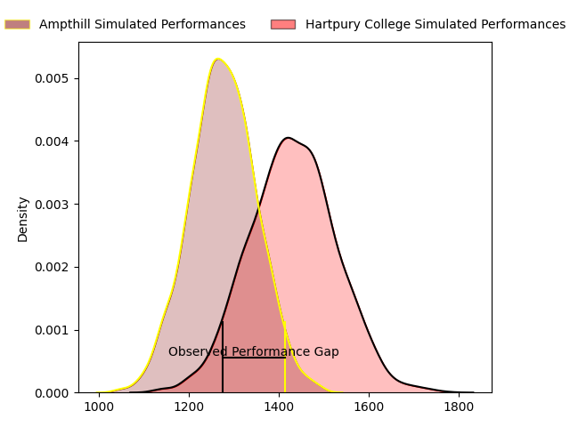
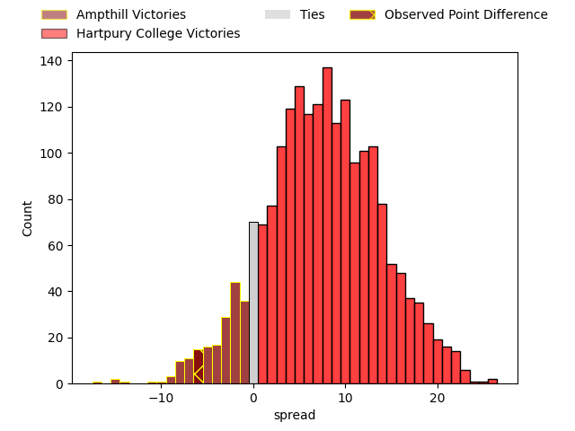

---  
layout: page  
title: Ampthill at Hartpury College; 32-26  
date: 2023-03-24 20:45:00 18:00:00 -0500  
categories: match review  
---
# Ampthill at Hartpury College; 32-26

# Club Level Predictions

The first set of predictions treats a club as the smallest object, as the club develops its members, organizes a gameplan, and deploys its players as needed for each match. This club model has a prediction of 0.705, which translates to predicting Hartpury College to win by 7.8.

Each club has a rating and a rating deviation (simiar to a Glicko system), and expected performances can be generated. This allows for simulated matches and spreads like the ones below.
## Projected Performances

## Projected Spreads

## Projected Results

# Player Level Predictions

Treating teams instead as an entity made up of the currently active players, I have ratings for each player in an altogether different system. These can be combined to form team ratings once teamsheets are announced, weighting starters a bit higher than the reserves. After the match is played, players can be weighted by their minutes on the field, allowing for an accurate measure of the team's composition. With these compiled team ratings, we can make predictions, measure inaccuracy, and update the individual player ratings.
## Prediction with Player Minutes: Ampthill by 2.2

Ampthill by 6.2 on a neutral field

There were 11 large changes in win probability in this match
## Prediction without Player Minutes: Ampthill by 8.4

Ampthill by 12.4 on a neutral pitch

|   Away Minutes | Away Player       |   Away elo |   Away Percentile |   Number |   Home Percentile |   Home elo | Home Player           |   Home Minutes |
|---------------:|:------------------|-----------:|------------------:|---------:|------------------:|-----------:|:----------------------|---------------:|
|             67 | James Flynn       |     101.84 |                73 |        1 |                66 |      99.87 | Joe Wrafter           |             77 |
|             56 | Matt Gallagher    |      98.41 |                61 |        2 |                37 |      91.39 | Will Tanner           |             65 |
|             61 | Joe Sproston      |      90    |                29 |        3 |                92 |     114.3  | Sam Rodman            |             60 |
|             80 | Charlie Beckett   |     103.77 |                72 |        4 |                73 |     103.95 | Jack Davies           |             80 |
|             80 | Harry Wilson      |      86.54 |                22 |        5 |                65 |     100.66 | Ben Glynn             |             67 |
|             80 | Fyn Brown         |      99.29 |                61 |        6 |                25 |      87.94 | Sam Lewis             |             80 |
|             56 | Paddy Ryan        |     121.5  |                92 |        7 |                 9 |      80.66 | Oli Robinson          |             77 |
|             79 | Morgan Strong     |      93.34 |                38 |        8 |                20 |      85.61 | Joe Howard            |             80 |
|             18 | Peter White       |     121.05 |                95 |        9 |                91 |     115.59 | Matty Jones           |             80 |
|             80 | Tom Hardwick      |     103.77 |                72 |       10 |                70 |     103.01 | Tommy Mathews         |             80 |
|             46 | Ollie Dawkins     |     113.09 |                86 |       11 |                17 |      84.18 | Matthew McNab         |             80 |
|             79 | Gwyn Parks        |      94.75 |                46 |       12 |                67 |     102.35 | Harry Ascherl         |             80 |
|             80 | George Worth      |      96.99 |                52 |       13 |                 4 |      69.42 | Jack Reeves           |             80 |
|             80 | Josh Skelcey      |     104.67 |                74 |       14 |                60 |      99.13 | Jack Bates            |             80 |
|             80 | Tomas Bacon       |     103.77 |                68 |       15 |                31 |      88.62 | Jacob Morris          |             46 |
|             62 | Lewis Finlay      |      90.55 |                40 |       16 |                58 |      99.25 | Alex Forrester        |             34 |
|             34 | Alexandrer Harmes |      82.51 |                15 |       17 |                 8 |      78.79 | Jonathan Benz-Salomon |             20 |
|             24 | Samson Adejimi    |      95.27 |               nan |       18 |                72 |     101.81 | Luke Stratford        |             15 |
|             24 | Josh Smart        |      92.39 |                41 |       19 |                51 |      96.51 | Nahum Merigan         |             13 |
|             19 | Jevaughn Warren   |      95.94 |                46 |       20 |                65 |      97.34 | Aristot Benz-Salomon  |              3 |
|             13 | Zac Nearchou      |      97.66 |                62 |       21 |                95 |     128.23 | Harry Short           |              3 |
|              1 | Cai Devine        |     102.74 |                70 |       22 |               nan |     nan    | nan                   |            nan |
|              1 | Joshua Bragman    |      77.03 |                 9 |       23 |               nan |     nan    | nan                   |            nan |

