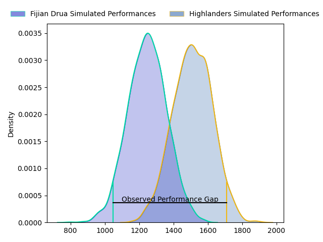
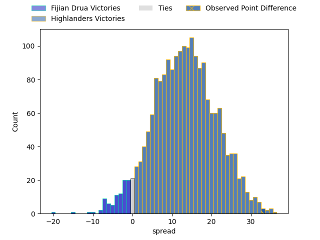

---  
layout: page  
title: Fijian Drua at Highlanders; 24.0-57.0  
date: 2023-03-24 23:35:00 18:00:00 -0500  
categories: match review  
---
# Fijian Drua at Highlanders; 24.0-57.0

# Club Level Predictions

The first set of predictions treats a club as the smallest object, as the club develops its members, organizes a gameplan, and deploys its players as needed for each match. This club model has a prediction of 0.807, which translates to predicting Highlanders to win by 13.2.

Each club has a rating and a rating deviation (simiar to a Glicko system), and expected performances can be generated. This allows for simulated matches and spreads like the ones below.
## Projected Performances

## Projected Spreads

## Projected Results

# Player Level Predictions

Treating teams instead as an entity made up of the currently active players, I have ratings for each player in an altogether different system. These can be combined to form team ratings once teamsheets are announced, weighting starters a bit higher than the reserves. After the match is played, players can be weighted by their minutes on the field, allowing for an accurate measure of the team's composition. With these compiled team ratings, we can make predictions, measure inaccuracy, and update the individual player ratings.
## Prediction with Player Minutes: Highlanders by 16.3

Highlanders by 12.3 on a neutral field

There were 3 large changes in win probability in this match
## Prediction without Player Minutes: Highlanders by 11.5

Highlanders by 7.5 on a neutral pitch

|   Away Minutes | Away Player              |   Away elo |   Away Percentile |   Number |   Home Percentile |   Home elo | Home Player          |   Home Minutes |
|---------------:|:-------------------------|-----------:|------------------:|---------:|------------------:|-----------:|:---------------------|---------------:|
|             50 | Emosi Tuqiri             |     102.24 |                57 |        1 |                88 |     110.75 | Ethan de Groot       |             54 |
|             69 | Tevita Ikanivere         |     118.71 |                94 |        2 |                14 |      82.12 | Leni Apisai          |             63 |
|             48 | Samuela Tawake           |      94.52 |                48 |        3 |                82 |     105.78 | Jermaine Ainsley     |             63 |
|             80 | Isoa Nasilasila          |     128.68 |                96 |        4 |                99 |     153.62 | Pari Pari Parkinson  |             54 |
|             63 | Ratu Rotuisolia          |      92.38 |                38 |        5 |                25 |      87.91 | Will Tucker          |             67 |
|             46 | Joseva Tamani            |      84.94 |                17 |        6 |                15 |      83.22 | Sean Withy           |             80 |
|             60 | Kitione Salawa           |      75.32 |                 7 |        7 |                89 |     116.01 | Billy Harmon         |             80 |
|             80 | Ratu Meli Derenalagi     |     112.59 |                86 |        8 |                39 |      93.26 | Nikora Broughton     |             80 |
|             80 | Frank Lomani             |      87.47 |                24 |        9 |                57 |      98.18 | Aaron Smith          |             54 |
|             33 | Kemu Valentini           |      96.12 |               nan |       10 |                90 |     120.99 | Mitch Hunt           |             58 |
|             51 | Taniela Rakuro           |      93.53 |               nan |       11 |                75 |     104.87 | Jonah Lowe           |             80 |
|             80 | Kalaveti Ravouvou        |     146.93 |                99 |       12 |                14 |      81.44 | Josh Timu            |             80 |
|             80 | Kalaveti Ravouvou        |     146.93 |                99 |       12 |                22 |      85.61 | Thomas Umaga-Jensen  |             80 |
|             80 | Apisalome Vota           |     121.38 |                93 |       13 |                89 |     117.63 | Fetuli Paea          |             80 |
|             80 | Iosefo Masi              |     101.14 |                63 |       14 |                93 |     123.97 | Martin Bogado        |             80 |
|             80 | Selestino Ravutaumada    |      92.65 |                41 |       15 |                17 |      82.78 | Sam Gilbert          |             80 |
|             11 | Zuriel Togiatama         |      91.52 |                39 |       16 |               nan |      95    | Jack Taylor          |             17 |
|             30 | Meli Tuni                |     104.58 |                80 |       17 |                71 |      99.93 | Dan Lienert-Brown    |             26 |
|             32 | Jone Koroiduadua         |      99.27 |                60 |       18 |                78 |     100.04 | Saula Mau            |             17 |
|             17 | Sorovakatini Tuifagalele |      84.34 |                23 |       19 |                 1 |      54.53 | Josh Bekhuis         |             26 |
|             34 | Vilive Miramira          |      88.09 |                22 |       20 |                55 |      97.59 | James Lentjes        |             13 |
|             20 | Elia Canakaivata         |      99.66 |                58 |       21 |                15 |      82.45 | Folau Fakatava       |             26 |
|             29 | Peni Matawalu            |     102.29 |                70 |       22 |                69 |     102.79 | Cameron Millar       |             22 |
|             47 | Teti Tela                |     106.37 |                76 |       23 |                45 |      94.1  | Connor Garden-Bachop |             68 |

