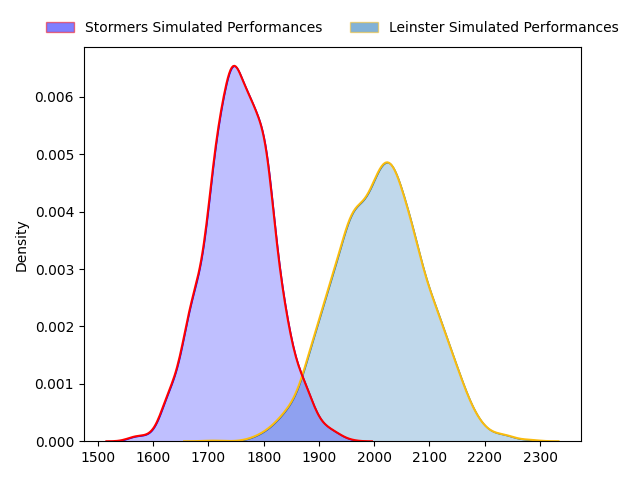
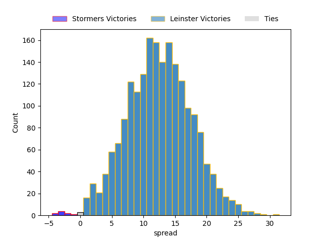

---  
layout: page  
title: Stormers at Leinster; 22-22  
date: 2023-03-24 20:35:00 18:00:00 -0500  
categories: match review  
---
# Stormers at Leinster; 22-22

# Club Level Predictions

The first set of predictions treats a club as the smallest object, as the club develops its members, organizes a gameplan, and deploys its players as needed for each match. This club model has a prediction of 0.802, which translates to predicting Leinster to win by 12.4.

Each club has a rating and a rating deviation (simiar to a Glicko system), and expected performances can be generated. This allows for simulated matches and spreads like the ones below.
## Projected Performances

## Projected Spreads

## Projected Results

# Player Level Predictions

Treating teams instead as an entity made up of the currently active players, I have ratings for each player in an altogether different system. These can be combined to form team ratings once teamsheets are announced, weighting starters a bit higher than the reserves. After the match is played, players can be weighted by their minutes on the field, allowing for an accurate measure of the team's composition. With these compiled team ratings, we can make predictions, measure inaccuracy, and update the individual player ratings.
## Prediction with Player Minutes: Leinster by 15.8

Leinster by 11.8 on a neutral field

There were 6 large changes in win probability in this match
## Prediction without Player Minutes: Leinster by 11.0

Leinster by 7.0 on a neutral pitch

|   Away Minutes | Away Player                  |   Away elo |   Away Percentile |   Number |   Home Percentile |   Home elo | Home Player          |   Home Minutes |
|---------------:|:-----------------------------|-----------:|------------------:|---------:|------------------:|-----------:|:---------------------|---------------:|
|             60 | Steven Kitshoff              |      98.11 |                60 |        1 |                86 |     108.16 | Michael Milne        |             61 |
|             60 | Joseph Dweba                 |      99.52 |                66 |        2 |                78 |     104.59 | John McKee           |             61 |
|             55 | Jozua Francois Malherbe      |      95    |               nan |        3 |                89 |     111.99 | Michael Ala'alatoa   |             61 |
|             80 | Ruben van Heerden            |     113.7  |                88 |        4 |                89 |     115.32 | Ross Molony          |             80 |
|             70 | Marvin Orie                  |      94.09 |                46 |        5 |                62 |      99.5  | Jason Howell Jenkins |             67 |
|             60 | Deon Fourie                  |      97.21 |                54 |        6 |                83 |     110.2  | Rhys Ruddock         |             61 |
|             60 | Ben-Jason Dixon              |     107.19 |                80 |        7 |                81 |     109.27 | Scott Penny          |             80 |
|             80 | Hacjivah Dayimani            |      95.9  |                53 |        8 |                78 |     107.89 | Max Deegan           |             80 |
|             55 | Albertus Paul de Wet         |     100.83 |                67 |        9 |                73 |     103.55 | Luke McGrath         |             67 |
|             80 | Immanuel Libbok              |     102.74 |                69 |       10 |                84 |     112.98 | Harry Byrne          |             80 |
|             80 | Seabelo Senatla              |      98.62 |                59 |       11 |                80 |     107.89 | Dave Kearney         |             80 |
|             80 | Damian Willemse              |      98.97 |                57 |       12 |                59 |      99.53 | Ciaran Frawley       |             80 |
|             80 | Daniel Michael du Plessis    |     100.79 |                63 |       13 |                83 |     111.26 | Liam Turner          |             80 |
|             80 | Suleiman  Hartzenberg        |     109.3  |                82 |       14 |                58 |     102.74 | Rob Russell          |             80 |
|             70 | Clayton Blommetjies          |      89.79 |                34 |       15 |                85 |     112.41 | Jordan Larmour       |             80 |
|             25 | Herschel Jerome Jantjies     |      94.44 |                54 |       16 |               nan |      98.75 | Vakh Abdaladze       |             19 |
|             25 | Johan Neethling Fouche       |      99.7  |                65 |       17 |               nan |      98.82 | Will Connors         |             19 |
|             20 | Willem Gerhardus Engelbrecht |      85.96 |                19 |       18 |               nan |      95    | Edward Byrne         |             19 |
|             20 | Marcel Theunissen            |      85.62 |                19 |       19 |               nan |      97.67 | Lee Barron           |             19 |
|             20 | JJ Kotze                     |      88.86 |                38 |       20 |                46 |      94.18 | Joe McCarthy         |             13 |
|             20 | Juan Brok Harris             |      95.79 |                62 |       21 |                82 |     111.19 | Brian Deeny          |             13 |
|             10 | Ernst van Rhyn               |      88.05 |                26 |       22 |               nan |     nan    | nan                  |            nan |
|             10 | Jean-Luc du Plessis          |      90.26 |                34 |       23 |               nan |     nan    | nan                  |            nan |

