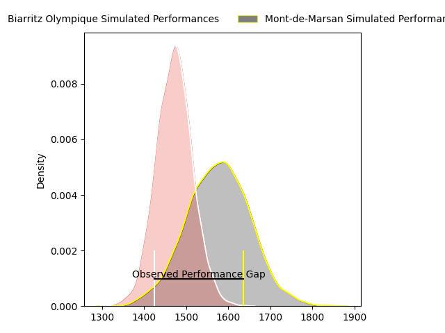
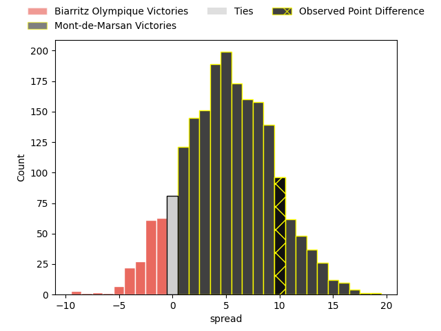
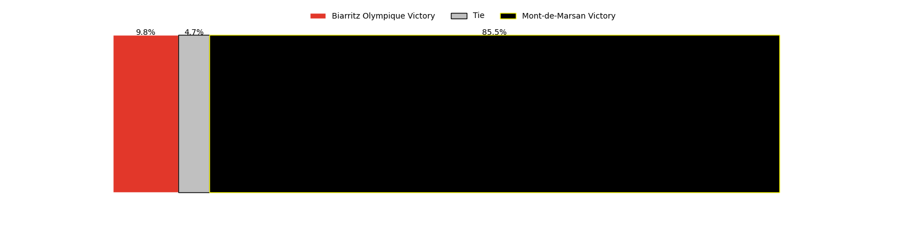

---  
layout: page  
title: Biarritz Olympique at Mont-de-Marsan; 21-31  
date: 2023-03-24 19:00:00 18:00:00 -0500  
categories: match review  
---
# Biarritz Olympique at Mont-de-Marsan; 21-31

# Club Level Predictions

The first set of predictions treats a club as the smallest object, as the club develops its members, organizes a gameplan, and deploys its players as needed for each match. This club model has a prediction of 0.642, which translates to predicting Mont-de-Marsan to win by 5.1.

Each club has a rating and a rating deviation (simiar to a Glicko system), and expected performances can be generated. This allows for simulated matches and spreads like the ones below.
## Projected Performances

## Projected Spreads

## Projected Results

# Player Level Predictions

Treating teams instead as an entity made up of the currently active players, I have ratings for each player in an altogether different system. These can be combined to form team ratings once teamsheets are announced, weighting starters a bit higher than the reserves. After the match is played, players can be weighted by their minutes on the field, allowing for an accurate measure of the team's composition. With these compiled team ratings, we can make predictions, measure inaccuracy, and update the individual player ratings.
## Prediction with Player Minutes: Mont-de-Marsan by 7.5

Mont-de-Marsan by 3.5 on a neutral field

There were 6 large changes in win probability in this match
## Prediction without Player Minutes: Mont-de-Marsan by 10.3

Mont-de-Marsan by 6.3 on a neutral pitch

|   Away Minutes | Away Player                                                         |   Away elo |   Away Percentile |   Number |   Home Percentile |   Home elo | Home Player                                                                      |   Home Minutes |
|---------------:|:--------------------------------------------------------------------|-----------:|------------------:|---------:|------------------:|-----------:|:---------------------------------------------------------------------------------|---------------:|
|             53 | [Guy Millar](..//playerfiles//GuyMillar_cleaned.md)                 |      96.73 |               nan |        1 |                86 |     103.15 | [Max Curie](..//playerfiles//MaxCurie_cleaned.md)                                |             67 |
|             53 | [Clément Renaud](..//playerfiles//ClémentRenaud_cleaned.md)         |      96.28 |                48 |        2 |                94 |     117.83 | [Jose Luis Gonzalez](..//playerfiles//JoseLuisGonzalez_cleaned.md)               |             53 |
|             53 | [Zakaria El Fakir](..//playerfiles//ZakariaElFakir_cleaned.md)      |      99.63 |               nan |        3 |                88 |     110.69 | [Gheorge Gajion](..//playerfiles//GheorgeGajion_cleaned.md)                      |             67 |
|             53 | [Johan Aliouat](..//playerfiles//JohanAliouat_cleaned.md)           |     104.95 |                75 |        4 |                91 |     117.37 | [Romain Durand](..//playerfiles//RomainDurand_cleaned.md)                        |             80 |
|             80 | [Adrian Motoc](..//playerfiles//AdrianMotoc_cleaned.md)             |      91.93 |                38 |        5 |                30 |      89.43 | [Andrei Ostrikov](..//playerfiles//AndreiOstrikov_cleaned.md)                    |             80 |
|             80 | [Josh Tyrell](..//playerfiles//JoshTyrell_cleaned.md)               |     103.96 |                69 |        6 |                84 |     113.82 | [Aurélien Lisena](..//playerfiles//AurélienLisena_cleaned.md)                    |             53 |
|             80 | [Thomas Hebert](..//playerfiles//ThomasHebert_cleaned.md)           |     115.96 |                89 |        7 |                34 |      90.17 | [Léo Banos](..//playerfiles//LéoBanos_cleaned.md)                                |             80 |
|             80 | [Tornike Jalagonia](..//playerfiles//TornikeJalagonia_cleaned.md)   |     109.95 |                81 |        8 |                41 |      93.81 | [Michael Faleafa](..//playerfiles//MichaelFaleafa_cleaned.md)                    |             66 |
|             36 | [Kerman Aurrekoetea](..//playerfiles//KermanAurrekoetea_cleaned.md) |     102.96 |                68 |        9 |                26 |      87.86 | [Christophe Loustalot](..//playerfiles//ChristopheLoustalot_cleaned.md)          |             78 |
|             80 | [Baptiste Germain](..//playerfiles//BaptisteGermain_cleaned.md)     |     101.42 |                65 |       10 |                58 |      99.41 | [Willie du Plessis](..//playerfiles//WillieduPlessis_cleaned.md)                 |             80 |
|             80 | [Steeve Barry](..//playerfiles//SteeveBarry_cleaned.md)             |     101.04 |                66 |       11 |                71 |     105.14 | [Alexandre de Nardi](..//playerfiles//AlexandredeNardi_cleaned.md)               |             80 |
|             77 | [Auguste Cadot](..//playerfiles//AugusteCadot_cleaned.md)           |      91.62 |                32 |       12 |                36 |      91.19 | [Jules Even](..//playerfiles//JulesEven_cleaned.md)                              |             56 |
|             79 | [Joseph Tomane](..//playerfiles//JosephTomane_cleaned.md)           |      98.8  |                57 |       13 |                95 |     121.13 | [Nacani Wakaya](..//playerfiles//NacaniWakaya_cleaned.md)                        |             80 |
|             80 | [Tyler Morgan](..//playerfiles//TylerMorgan_cleaned.md)             |     103.4  |                69 |       14 |                56 |      98.52 | [Ambrose Curtis](..//playerfiles//AmbroseCurtis_cleaned.md)                      |             59 |
|             80 | [Joe Jonas](..//playerfiles//JoeJonas_cleaned.md)                   |      98.85 |                56 |       15 |                93 |     123.96 | [Yoann Laousse Azpiazu](..//playerfiles//YoannLaousseAzpiazu_cleaned.md)         |             80 |
|             44 | [Gilles Bosch](..//playerfiles//GillesBosch_cleaned.md)             |      98.44 |               nan |       16 |                46 |      88.06 | [Romain Laterrade](..//playerfiles//RomainLaterrade_cleaned.md)                  |             27 |
|             27 | [Killian Taofifenua](..//playerfiles//KillianTaofifenua_cleaned.md) |     105.97 |                82 |       17 |                65 |     101.58 | [Veresa Tuqovu Ramototabua](..//playerfiles//VeresaTuqovuRamototabua_cleaned.md) |             27 |
|             27 | [Luka Azariashvili](..//playerfiles//LukaAzariashvili_cleaned.md)   |     100.03 |                66 |       18 |                22 |      85.51 | [Lucas Mensa](..//playerfiles//LucasMensa_cleaned.md)                            |             24 |
|             27 | [Baptiste Erdocio](..//playerfiles//BaptisteErdocio_cleaned.md)     |      96.27 |                54 |       19 |                77 |     107.51 | [Simon Renda](..//playerfiles//SimonRenda_cleaned.md)                            |             21 |
|             27 | [Francois Vergnaud](..//playerfiles//FrancoisVergnaud_cleaned.md)   |      98.18 |                56 |       20 |                94 |     118.98 | [William Wavrin](..//playerfiles//WilliamWavrin_cleaned.md)                      |             14 |
|              1 | [Ilian Perraux](..//playerfiles//IlianPerraux_cleaned.md)           |      95.06 |                47 |       21 |                87 |     109.97 | [Thomas Bultel](..//playerfiles//ThomasBultel_cleaned.md)                        |             13 |
|              3 | [Barnabé Couilloud](..//playerfiles//BarnabéCouilloud_cleaned.md)   |      94.68 |                47 |       22 |                11 |      81.27 | [Lasha Macharashvili](..//playerfiles//LashaMacharashvili_cleaned.md)            |             13 |
|            nan | nan                                                                 |     nan    |               nan |       23 |                51 |      94.4  | [Baptiste Canut](..//playerfiles//BaptisteCanut_cleaned.md)                      |              2 |

