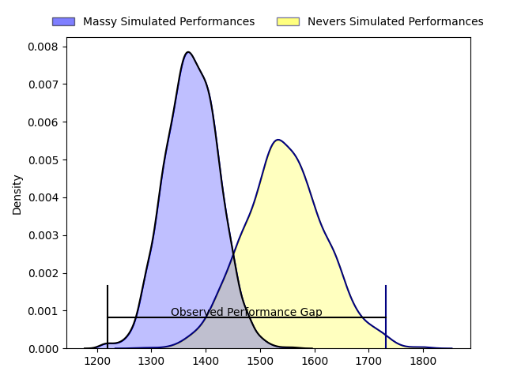
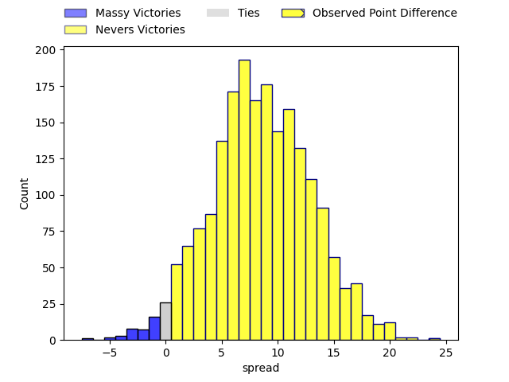
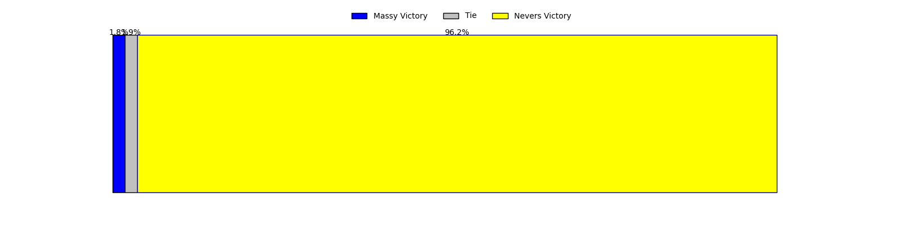

---  
layout: page  
title: Massy at Nevers; 12-36  
date: 2023-03-24 19:30:00 18:00:00 -0500  
categories: match review  
---
# Massy at Nevers; 12-36

# Club Level Predictions

The first set of predictions treats a club as the smallest object, as the club develops its members, organizes a gameplan, and deploys its players as needed for each match. This club model has a prediction of 0.727, which translates to predicting Nevers to win by 8.6.

Each club has a rating and a rating deviation (simiar to a Glicko system), and expected performances can be generated. This allows for simulated matches and spreads like the ones below.
## Projected Performances

## Projected Spreads

## Projected Results

# Player Level Predictions

Treating teams instead as an entity made up of the currently active players, I have ratings for each player in an altogether different system. These can be combined to form team ratings once teamsheets are announced, weighting starters a bit higher than the reserves. After the match is played, players can be weighted by their minutes on the field, allowing for an accurate measure of the team's composition. With these compiled team ratings, we can make predictions, measure inaccuracy, and update the individual player ratings.
## Prediction with Player Minutes: Nevers by 23.3

Nevers by 19.3 on a neutral field

There were 4 large changes in win probability in this match
## Prediction without Player Minutes: Nevers by 21.6

Nevers by 17.6 on a neutral pitch

|   Away Minutes | Away Player              |   Away elo |   Away Percentile |   Number |   Home Percentile |   Home elo | Home Player         |   Home Minutes |
|---------------:|:-------------------------|-----------:|------------------:|---------:|------------------:|-----------:|:--------------------|---------------:|
|             37 | Robin Poipy              |      88.19 |                30 |        1 |                66 |      99.78 | Kamaliele Tufele    |             40 |
|             31 | Pierre-Alexandre Duclieu |      89.74 |                41 |        2 |                58 |      98.7  | Issam Hamel         |             61 |
|              6 | Nicolas Ferrer           |     103.82 |                83 |        3 |               nan |     101.72 | Sosefo Tapu Falatea |             40 |
|             80 | Abongile Nonkontwana     |      93.41 |                44 |        4 |                91 |     116.91 | Maxence Barjaud     |             80 |
|             80 | Evrard Dion Oulai        |      94.31 |                52 |        5 |                47 |      94.84 | Maka Polutele       |             54 |
|             80 | Samuel Nollet            |      91.26 |                34 |        6 |                37 |      93.68 | Julien Kazubek      |             80 |
|             31 | Clément Lanen            |      89.03 |                30 |        7 |                97 |     136.61 | Hugues Bastide      |             80 |
|             51 | Andy Timo                |      84.76 |                19 |        8 |                49 |      99.01 | Shaun Adendorff     |             54 |
|             40 | Benjamin Prier           |     112.24 |                88 |        9 |                86 |     110.76 | Arthurs Barbier     |             40 |
|             47 | Massimo Ortolan          |      81.29 |                13 |       10 |                82 |     108.57 | Shaun Reynolds      |             80 |
|             80 | Nathan Farissier         |      83.51 |                16 |       11 |                47 |      94.93 | Lucas Blanc         |             57 |
|             80 | Mathieu Guillomot        |      51.74 |                 1 |       12 |                23 |      86.05 | Rudy Derrieux       |             80 |
|             51 | Tom Cusson               |     100.5  |                62 |       13 |                67 |     102.45 | Leonard Paris       |             80 |
|             80 | Alex Preira              |     111.39 |                90 |       14 |                68 |     101.97 | Christian Ambadiang |             80 |
|             80 | Juan Kotze               |      82.31 |                17 |       15 |                68 |     103.2  | Kylian Jaminet      |             61 |
|             49 | Andrew Chauveau          |      65.54 |                 4 |       16 |                85 |     107.48 | Aitor Kitutu        |             40 |
|             49 | Pierre Trassoudaine      |     135.48 |                99 |       17 |                54 |      96.21 | Aselo Ikahehegi     |             40 |
|             43 | Fernandez Correa         |      89.53 |                27 |       18 |                61 |      99.28 | Yoan Cottin         |             40 |
|             40 | Samuel Boissinot         |      81.95 |                21 |       19 |               nan |      92.59 | Lasha Jaiani        |             26 |
|             33 | Tom Deleuze              |      87.57 |                24 |       20 |                18 |      86.25 | Steven David        |             26 |
|             29 | Tony Tissot              |      92.17 |                40 |       21 |                53 |      97.92 | Yohan Le Bourhis    |             23 |
|             29 | Thomas Rozière           |      89.38 |                32 |       22 |                40 |      92.26 | Thomas Zenon        |             19 |
|             74 | Guiterembi Vickos        |      88.17 |                23 |       23 |                42 |      93.29 | Quentin Beaudaux    |             19 |

