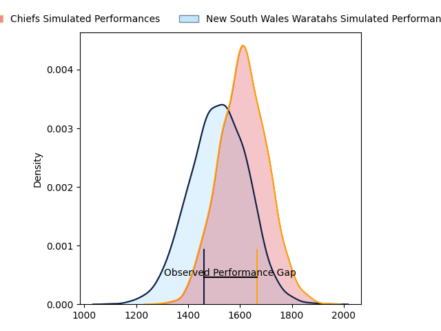
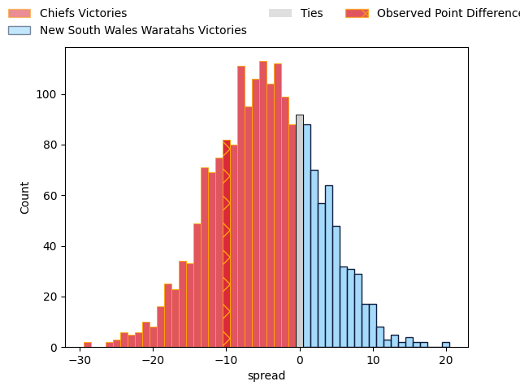

---  
layout: page  
title: Chiefs at New South Wales Waratahs; 24.0-14.0  
date: 2023-03-24 04:35:00 18:00:00 -0500  
categories: match review  
---
# Chiefs at New South Wales Waratahs; 24.0-14.0

# Club Level Predictions

The first set of predictions treats a club as the smallest object, as the club develops its members, organizes a gameplan, and deploys its players as needed for each match. This club model has a prediction of 0.368, which translates to predicting Chiefs to win by 4.9.

Each club has a rating and a rating deviation (simiar to a Glicko system), and expected performances can be generated. This allows for simulated matches and spreads like the ones below.
## Projected Performances

## Projected Spreads

## Projected Results

# Player Level Predictions

Treating teams instead as an entity made up of the currently active players, I have ratings for each player in an altogether different system. These can be combined to form team ratings once teamsheets are announced, weighting starters a bit higher than the reserves. After the match is played, players can be weighted by their minutes on the field, allowing for an accurate measure of the team's composition. With these compiled team ratings, we can make predictions, measure inaccuracy, and update the individual player ratings.
## Prediction with Player Minutes: New South Wales Waratahs by 3.2

Chiefs by 0.8 on a neutral field

There were 5 large changes in win probability in this match
## Prediction without Player Minutes: New South Wales Waratahs by 3.2

Chiefs by 0.8 on a neutral pitch

|   Away Minutes | Away Player          |   Away elo |   Away Percentile |   Number |   Home Percentile |   Home elo | Home Player          |   Home Minutes |
|---------------:|:---------------------|-----------:|------------------:|---------:|------------------:|-----------:|:---------------------|---------------:|
|             47 | Aidan Ross           |     106.58 |                83 |        1 |               nan |      97.68 | Tetera Faulkner      |             47 |
|             52 | Bradley Slater       |     113.79 |                89 |        2 |                91 |     114.4  | Dave Porecki         |             52 |
|             62 | John Ryan            |     105.4  |                81 |        3 |                 8 |      78.16 | Harry Johnson-Holmes |             52 |
|             80 | Brodie Retallick     |     119.15 |                92 |        4 |                23 |      86.49 | Jed Holloway         |             80 |
|             47 | Manaaki Selby-Rickit |      76.86 |                 9 |        5 |                87 |     112.7  | Ned Hanigan          |             77 |
|             80 | Samipeni Finau       |     106.29 |                76 |        6 |                68 |     102.38 | Lachlan Swinton      |             57 |
|             80 | Sam Cane             |     139.22 |                98 |        7 |                97 |     134.64 | Michael Hooper       |             80 |
|             65 | Pita Gus Sowakula    |     101.82 |                66 |        8 |                70 |     106.21 | Will Harris          |             80 |
|             64 | Brad Weber           |     137.44 |                99 |        9 |                96 |     126.33 | Jake Gordon          |             77 |
|             52 | Bryn Gatland         |      97.71 |                53 |       10 |                79 |     108.52 | Ben Donaldson        |             80 |
|             80 | Etene Nanai-Seturo   |      97.69 |                56 |       11 |                87 |     114.01 | Dylan Pietsch        |             66 |
|             80 | Rameka Poihipi       |      93.38 |                42 |       12 |                84 |     112.41 | Joey Walton          |             80 |
|             70 | Alex Nankivell       |      89.21 |                30 |       13 |                21 |      85.32 | Izaia Perese         |             80 |
|             80 | Emoni Narawa         |     105.48 |                75 |       14 |                56 |      97.78 | Mark Nawaqanitawase  |             80 |
|             80 | Damian McKenzie      |      94.96 |                45 |       15 |               nan |      95.38 | Ben Dowling          |             66 |
|             28 | Samisoni Taukei'aho  |     114.64 |                90 |       16 |                92 |     116.87 | Tolu Latu            |             28 |
|             33 | Ollie Norris         |      92.84 |                38 |       17 |                72 |     101.65 | Tom Lambert          |             33 |
|             18 | George Dyer          |      93.82 |                36 |       18 |               nan |      97.03 | Daniel Botha         |             28 |
|             33 | Naitoa Ah Kuoi       |     123.16 |                95 |       19 |                86 |     111.76 | Taleni Seu           |             23 |
|             15 | Kaylum Boshier       |      86.79 |                21 |       20 |               nan |      95    | Zac Von Appen        |              3 |
|             16 | Cortez Ratima        |     112.49 |                88 |       21 |               nan |      95.06 | Harrison Goddard     |              3 |
|             10 | Daniel Rona          |      97.08 |                50 |       22 |               nan |      95    | Harry Wilson         |             14 |
|             28 | Shaun Stevenson      |     104.56 |                70 |       23 |                94 |     124.2  | Nemani Nadolo        |             14 |

