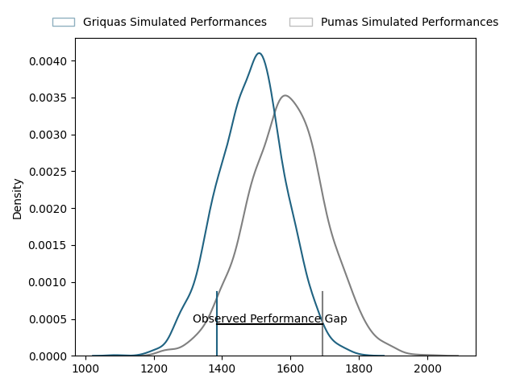
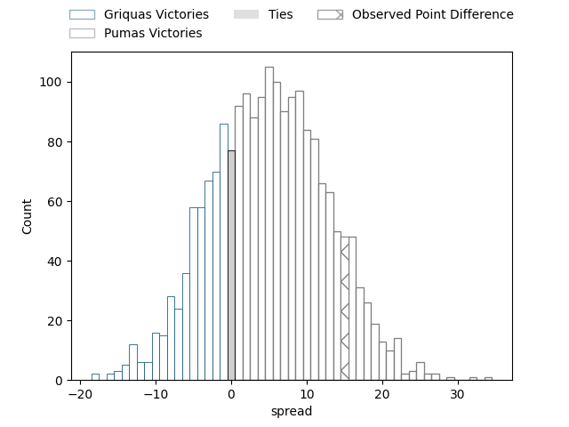
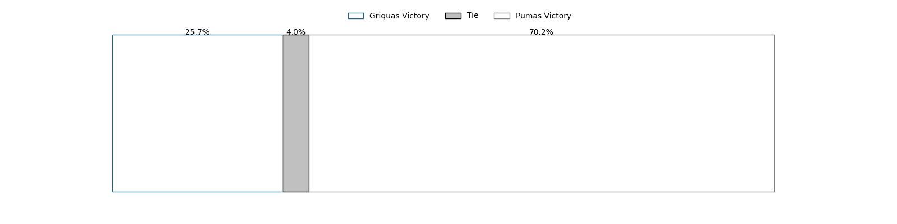

---  
layout: page  
title: Griquas at Pumas; 13-28  
date: 2023-03-24 18:10:00 18:00:00 -0500  
categories: match review  
---
# Griquas at Pumas; 13-28

# Club Level Predictions

The first set of predictions treats a club as the smallest object, as the club develops its members, organizes a gameplan, and deploys its players as needed for each match. This club model has a prediction of 0.633, which translates to predicting Pumas to win by 5.0.

Each club has a rating and a rating deviation (simiar to a Glicko system), and expected performances can be generated. This allows for simulated matches and spreads like the ones below.
## Projected Performances

## Projected Spreads

## Projected Results

# Player Level Predictions

Treating teams instead as an entity made up of the currently active players, I have ratings for each player in an altogether different system. These can be combined to form team ratings once teamsheets are announced, weighting starters a bit higher than the reserves. After the match is played, players can be weighted by their minutes on the field, allowing for an accurate measure of the team's composition. With these compiled team ratings, we can make predictions, measure inaccuracy, and update the individual player ratings.
## Prediction with Player Minutes: Pumas by 5.2

Pumas by 1.2 on a neutral field

There were 4 large changes in win probability in this match
## Prediction without Player Minutes: Pumas by 18.7

Pumas by 14.7 on a neutral pitch

|   Away Minutes | Away Player                                                                        |   Away elo |   Away Percentile |   Number |   Home Percentile |   Home elo | Home Player                                                                               |   Home Minutes |
|---------------:|:-----------------------------------------------------------------------------------|-----------:|------------------:|---------:|------------------:|-----------:|:------------------------------------------------------------------------------------------|---------------:|
|             80 | [Kudzwai Dube](..//playerfiles//KudzwaiDube_cleaned.md)                            |      95.69 |                52 |        1 |                27 |      89.13 | [Corne Fourie](..//playerfiles//CorneFourie_cleaned.md)                                   |             80 |
|             80 | [Gustav Du Rand](..//playerfiles//GustavDuRand_cleaned.md)                         |     100.6  |                69 |        2 |                81 |     105.4  | [Eduan Swart](..//playerfiles//EduanSwart_cleaned.md)                                     |             80 |
|             40 | [Cebolenkosi Dlamini](..//playerfiles//CebolenkosiDlamini_cleaned.md)              |      92.87 |               nan |        3 |                72 |     101.78 | [Ignatius (IG) Michael Prinsloo](..//playerfiles//Ignatius(IG)MichaelPrinsloo_cleaned.md) |             40 |
|             80 | [Derrick Pretorius](..//playerfiles//DerrickPretorius_cleaned.md)                  |      74.48 |                 7 |        4 |                69 |     102.34 | [Deon Slabbert](..//playerfiles//DeonSlabbert_cleaned.md)                                 |             68 |
|             80 | [Albert Liebenberg](..//playerfiles//AlbertLiebenberg_cleaned.md)                  |      74.52 |                 8 |        5 |                97 |     129.44 | [Shane Monro Kirkwood](..//playerfiles//ShaneMonroKirkwood_cleaned.md)                    |             80 |
|             80 | [Stephan Smit](..//playerfiles//StephanSmit_cleaned.md)                            |      89.93 |                33 |        6 |                83 |     110.65 | [Andre Fouché](..//playerfiles//AndreFouché_cleaned.md)                                   |             80 |
|             80 | [Hanru Sirgel](..//playerfiles//HanruSirgel_cleaned.md)                            |     109.01 |                74 |        7 |                35 |      90.63 | [Francois Kleinhans](..//playerfiles//FrancoisKleinhans_cleaned.md)                       |             80 |
|             80 | [Carl Els](..//playerfiles//CarlEls_cleaned.md)                                    |      95.16 |                45 |        8 |                39 |      93.16 | [Kwanda Dimaza](..//playerfiles//KwandaDimaza_cleaned.md)                                 |             65 |
|             80 | [Johan Mulder](..//playerfiles//JohanMulder_cleaned.md)                            |      91.46 |                37 |        9 |                19 |      85.03 | [Giovanne Snyman](..//playerfiles//GiovanneSnyman_cleaned.md)                             |             80 |
|             80 | [Lubabalo Dobela](..//playerfiles//LubabaloDobela_cleaned.md)                      |      88.91 |                27 |       10 |                80 |     108.83 | [Tinus de Beer](..//playerfiles//TinusdeBeer_cleaned.md)                                  |             80 |
|             80 | [Luther Obi](..//playerfiles//LutherObi_cleaned.md)                                |      88.91 |                29 |       11 |                22 |      86.64 | [Lundi Msenge](..//playerfiles//LundiMsenge_cleaned.md)                                   |             80 |
|             80 | [Zander du Plessis](..//playerfiles//ZanderduPlessis_cleaned.md)                   |      92.12 |                39 |       12 |                75 |     106.07 | [Ali Mgijima](..//playerfiles//AliMgijima_cleaned.md)                                     |              9 |
|             80 | [Jay Cee Nel](..//playerfiles//JayCeeNel_cleaned.md)                               |     117.29 |                90 |       13 |                35 |      90.9  | [Diego Appollis](..//playerfiles//DiegoAppollis_cleaned.md)                               |             80 |
|             80 | [Rosco Shane Specman](..//playerfiles//RoscoShaneSpecman_cleaned.md)               |      88.91 |                29 |       14 |                93 |     123.81 | [Etienne Taljaard](..//playerfiles//EtienneTaljaard_cleaned.md)                           |             49 |
|             51 | [Malcolm Jaer](..//playerfiles//MalcolmJaer_cleaned.md)                            |      96.94 |                52 |       15 |                37 |      90.63 | [Devon Frank Williams](..//playerfiles//DevonFrankWilliams_cleaned.md)                    |             80 |
|             29 | [George Alexander Whitehead](..//playerfiles//GeorgeAlexanderWhitehead_cleaned.md) |      95.39 |               nan |       16 |                20 |      86.06 | [Brandon Terry Thomson](..//playerfiles//BrandonTerryThomson_cleaned.md)                  |             71 |
|            nan | nan                                                                                |     nan    |               nan |       17 |               nan |      97.9  | [Raegan Oranje](..//playerfiles//RaeganOranje_cleaned.md)                                 |              9 |
|             40 | [Junior Banda](..//playerfiles//JuniorBanda_cleaned.md)                            |      92.87 |                41 |       18 |               nan |      95.79 | [Ruwald Van der Merwe](..//playerfiles//RuwaldVanderMerwe_cleaned.md)                     |             15 |
|            nan | nan                                                                                |     nan    |               nan |       19 |                48 |      95.66 | [Malembe Mpofu](..//playerfiles//MalembeMpofu_cleaned.md)                                 |             12 |

