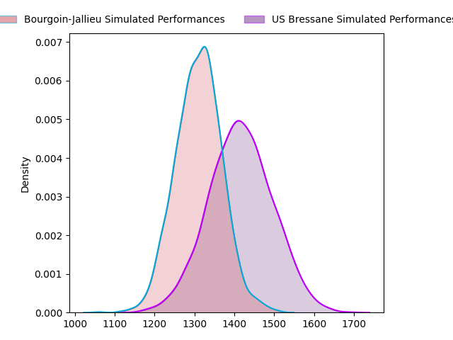
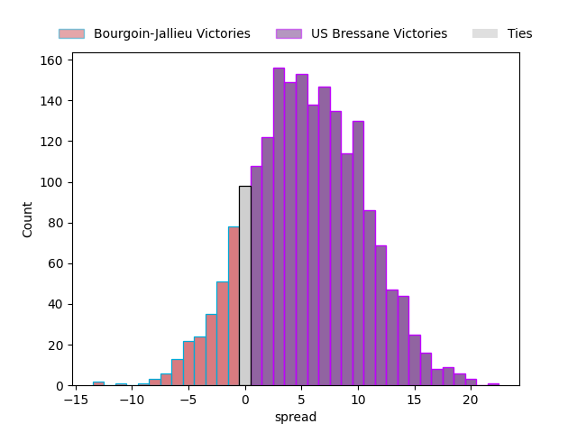
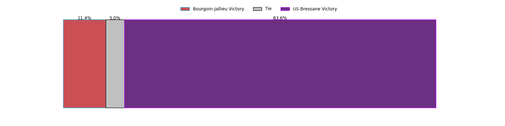

---  
layout: page  
title: Bourgoin-Jallieu at US Bressane; 20-20  
date: 2023-03-24 19:30:00 18:00:00 -0500  
categories: match review  
---
# Bourgoin-Jallieu at US Bressane; 20-20

# Club Level Predictions

The first set of predictions treats a club as the smallest object, as the club develops its members, organizes a gameplan, and deploys its players as needed for each match. This club model has a prediction of 0.647, which translates to predicting US Bressane to win by 5.3.

Each club has a rating and a rating deviation (simiar to a Glicko system), and expected performances can be generated. This allows for simulated matches and spreads like the ones below.
## Projected Performances

## Projected Spreads

## Projected Results

# Player Level Predictions

Treating teams instead as an entity made up of the currently active players, I have ratings for each player in an altogether different system. These can be combined to form team ratings once teamsheets are announced, weighting starters a bit higher than the reserves. After the match is played, players can be weighted by their minutes on the field, allowing for an accurate measure of the team's composition. With these compiled team ratings, we can make predictions, measure inaccuracy, and update the individual player ratings.
## Prediction with Player Minutes: US Bressane by 2.9

Bourgoin-Jallieu by 1.1 on a neutral field

There were 10 large changes in win probability in this match
## Prediction without Player Minutes: US Bressane by 1.7

Bourgoin-Jallieu by 2.3 on a neutral pitch

|   Away Minutes | Away Player                                                               |   Away elo |   Away Percentile |   Number |   Home Percentile |   Home elo | Home Player                                                                |   Home Minutes |
|---------------:|:--------------------------------------------------------------------------|-----------:|------------------:|---------:|------------------:|-----------:|:---------------------------------------------------------------------------|---------------:|
|             48 | [Nugzar Somkhishvili](..//playerfiles//NugzarSomkhishvili_cleaned.md)     |      96.09 |                54 |        1 |                20 |      86.7  | [Teo Bordenave](..//playerfiles//TeoBordenave_cleaned.md)                  |             40 |
|             48 | [Killian Tripier](..//playerfiles//KillianTripier_cleaned.md)             |      88.78 |                30 |        2 |                60 |      97.82 | [Sione Anga'aelangi](..//playerfiles//SioneAnga'aelangi_cleaned.md)        |             40 |
|             60 | [Oktay Yilmaz](..//playerfiles//OktayYilmaz_cleaned.md)                   |      97.75 |                59 |        3 |                 0 |      40.09 | [Erich de Jager](..//playerfiles//ErichdeJager_cleaned.md)                 |             40 |
|             80 | [Robin Gascou](..//playerfiles//RobinGascou_cleaned.md)                   |      80.33 |                13 |        4 |                33 |      90.54 | [Monty Leverstein](..//playerfiles//MontyLeverstein_cleaned.md)            |             80 |
|             40 | [Jonathan Kpoku](..//playerfiles//JonathanKpoku_cleaned.md)               |      85.31 |                21 |        5 |                97 |     131.28 | [Cyril Veyret](..//playerfiles//CyrilVeyret_cleaned.md)                    |             51 |
|             47 | [Kevin Rivoire](..//playerfiles//KevinRivoire_cleaned.md)                 |      86.24 |                20 |        6 |                94 |     124.51 | [Lucas Lyons](..//playerfiles//LucasLyons_cleaned.md)                      |             60 |
|             80 | [Théophile Cotte](..//playerfiles//ThéophileCotte_cleaned.md)             |      92.77 |                36 |        7 |                40 |      91.9  | [Loïc Baradel](..//playerfiles//LoïcBaradel_cleaned.md)                    |             79 |
|             40 | [Poutasi Luafutu](..//playerfiles//PoutasiLuafutu_cleaned.md)             |      95.59 |                39 |        8 |                80 |     109.02 | [Wael May](..//playerfiles//WaelMay_cleaned.md)                            |             80 |
|             80 | [Tomas Munilla](..//playerfiles//TomasMunilla_cleaned.md)                 |      99.25 |                61 |        9 |                15 |      82.96 | [Robin Graulle](..//playerfiles//RobinGraulle_cleaned.md)                  |             28 |
|             52 | [Benjamin Noble](..//playerfiles//BenjaminNoble_cleaned.md)               |      95    |               nan |       10 |                21 |      86.13 | [Christian Lacombe](..//playerfiles//ChristianLacombe_cleaned.md)          |             80 |
|             53 | [Matthieu Nicolas](..//playerfiles//MatthieuNicolas_cleaned.md)           |      98.43 |                58 |       11 |                45 |      94.12 | [Kavekini Tabu](..//playerfiles//KavekiniTabu_cleaned.md)                  |             80 |
|             80 | [Isaiah Leota](..//playerfiles//IsaiahLeota_cleaned.md)                   |     104.8  |                73 |       12 |                 9 |      77.15 | [Maile Mamao](..//playerfiles//MaileMamao_cleaned.md)                      |             80 |
|             80 | [Pablo Patilla](..//playerfiles//PabloPatilla_cleaned.md)                 |      84.74 |                16 |       13 |                23 |      85.9  | [Benjamin Doy](..//playerfiles//BenjaminDoy_cleaned.md)                    |             40 |
|             80 | [Makalea Foliaki](..//playerfiles//MakaleaFoliaki_cleaned.md)             |     106.68 |                78 |       14 |                34 |      90.6  | [Élie De Fleurian](..//playerfiles//ÉlieDeFleurian_cleaned.md)             |             80 |
|             80 | [Nicolas Cachet](..//playerfiles//NicolasCachet_cleaned.md)               |      71.76 |                 7 |       15 |                35 |      89.98 | [Audric Sanlaville](..//playerfiles//AudricSanlaville_cleaned.md)          |             80 |
|             40 | [Kemueli Lavetanakoroi](..//playerfiles//KemueliLavetanakoroi_cleaned.md) |     128.9  |                96 |       16 |                93 |     121.06 | [Nicolas Faure](..//playerfiles//NicolasFaure_cleaned.md)                  |             52 |
|             40 | [Théo Lepage](..//playerfiles//ThéoLepage_cleaned.md)                     |      99.85 |                59 |       17 |                82 |     112.99 | [Sebastian Poet](..//playerfiles//SebastianPoet_cleaned.md)                |             40 |
|             32 | [Romain Favaretto](..//playerfiles//RomainFavaretto_cleaned.md)           |      96.46 |                54 |       18 |                18 |      85.58 | [Clément Jullien](..//playerfiles//ClémentJullien_cleaned.md)              |             40 |
|             33 | [Léandre Cotte](..//playerfiles//LéandreCotte_cleaned.md)                 |      96.44 |                54 |       19 |                12 |      81.53 | [Vazha Kapanadze](..//playerfiles//VazhaKapanadze_cleaned.md)              |             40 |
|             32 | [Mohamed Khribache](..//playerfiles//MohamedKhribache_cleaned.md)         |     102.96 |                74 |       20 |                23 |      87.9  | [Willem Johannes Harmse](..//playerfiles//WillemJohannesHarmse_cleaned.md) |             40 |
|             28 | [Romain Sola](..//playerfiles//RomainSola_cleaned.md)                     |      92.02 |                53 |       21 |                53 |      96.67 | [Koen Bloemen](..//playerfiles//KoenBloemen_cleaned.md)                    |             29 |
|             27 | [Remi Bouet](..//playerfiles//RemiBouet_cleaned.md)                       |     105.16 |                77 |       22 |                25 |      80.78 | [Nicolas Tachat](..//playerfiles//NicolasTachat_cleaned.md)                |             20 |
|             20 | [Maxime Caillet](..//playerfiles//MaximeCaillet_cleaned.md)               |      99.66 |                69 |       23 |                 6 |      75.06 | [Dimitri Jean Etienne](..//playerfiles//DimitriJeanEtienne_cleaned.md)     |              1 |

