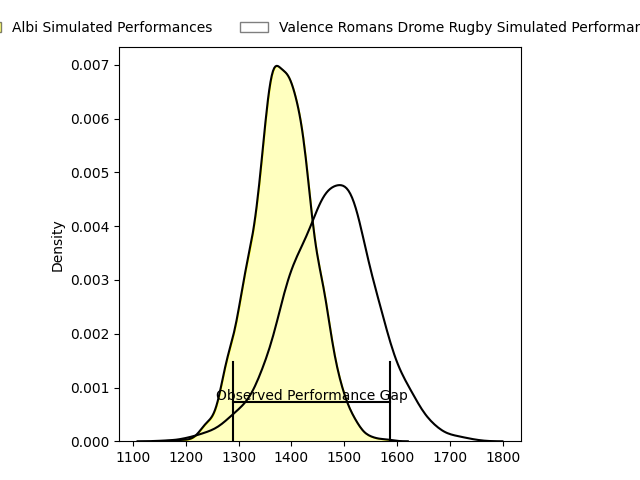
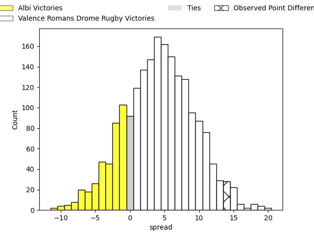
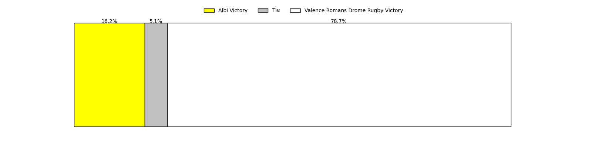

---  
layout: page  
title: Albi at Valence Romans Drome Rugby; 6-20  
date: 2023-03-24 19:30:00 18:00:00 -0500  
categories: match review  
---
# Albi at Valence Romans Drome Rugby; 6-20

# Club Level Predictions

The first set of predictions treats a club as the smallest object, as the club develops its members, organizes a gameplan, and deploys its players as needed for each match. This club model has a prediction of 0.621, which translates to predicting Valence Romans Drome Rugby to win by 4.4.

Each club has a rating and a rating deviation (simiar to a Glicko system), and expected performances can be generated. This allows for simulated matches and spreads like the ones below.
## Projected Performances

## Projected Spreads

## Projected Results

# Player Level Predictions

Treating teams instead as an entity made up of the currently active players, I have ratings for each player in an altogether different system. These can be combined to form team ratings once teamsheets are announced, weighting starters a bit higher than the reserves. After the match is played, players can be weighted by their minutes on the field, allowing for an accurate measure of the team's composition. With these compiled team ratings, we can make predictions, measure inaccuracy, and update the individual player ratings.
## Prediction with Player Minutes: Valence Romans Drome Rugby by 9.2

Valence Romans Drome Rugby by 5.2 on a neutral field

There were 6 large changes in win probability in this match
## Prediction without Player Minutes: Valence Romans Drome Rugby by 10.0

Valence Romans Drome Rugby by 6.0 on a neutral pitch

|   Away Minutes | Away Player                 |   Away elo |   Away Percentile |   Number |   Home Percentile |   Home elo | Home Player            |   Home Minutes |
|---------------:|:----------------------------|-----------:|------------------:|---------:|------------------:|-----------:|:-----------------------|---------------:|
|             48 | Pierre Commenge             |     101.13 |                65 |        1 |                99 |     136.18 | Sami Zouhair           |             52 |
|             48 | Reinach Venter              |      89.43 |                30 |        2 |                87 |     110.5  | Dorian Marco Pena      |             48 |
|             48 | Jean-Baptiste De Clercq     |      98.24 |                61 |        3 |                72 |     101.35 | John Henry Fincham     |             48 |
|             62 | John Henry Heath Backhouse  |      96.26 |                52 |        4 |                94 |     121.2  | Darrell Dyer           |             80 |
|             80 | Jacques Jacobus Engelbrecht |     101.52 |                67 |        5 |                74 |     104.4  | Florian Goumat         |             55 |
|             48 | Pierre Roussel              |     102    |                67 |        6 |                 1 |      57.49 | Axel Bruchet           |             80 |
|             80 | Lucas Guillaume             |     116.84 |                90 |        7 |                23 |      91.33 | Matthew Gicquel        |             17 |
|             80 | Sandrick Maciotta           |     114.77 |                87 |        8 |                69 |     103.19 | Ioane Iashagashvili    |             80 |
|             62 | Gilen Queheille             |      88.43 |                27 |        9 |                10 |      78.68 | Tim Menzel             |             78 |
|             62 | François Fontaine           |      97.38 |                53 |       10 |                86 |     115.94 | Joris Moura            |             78 |
|             80 | Avenisi Vasuinubu           |      93.1  |                42 |       11 |                79 |     107.03 | Mason Emerson          |             80 |
|             56 | Simon Andreu                |      92.8  |                41 |       12 |                63 |     100.73 | Akuila Joeli Tabualevu |             80 |
|             80 | Wandile Gabada  Mjekevu     |      89.92 |                32 |       13 |                91 |     118.79 | Ben Neiceru            |             64 |
|             80 | Charly Vicenzo Trussardi    |     104.04 |                73 |       14 |                78 |     106.6  | Adam Vargas            |             80 |
|             80 | Téo Dospital                |     107.22 |                76 |       15 |                67 |     102.88 | Quentin Gobet          |             80 |
|             32 | Dimitri Tchapnga            |      99.21 |                69 |       16 |                27 |      93.4  | Anthony Aléo           |             28 |
|             32 | Arthur Castant              |     105.78 |                76 |       17 |                81 |     108.15 | Yanis Gimenez          |             32 |
|             32 | Maxime Escur                |      79.67 |                11 |       18 |               nan |     103.17 | Kevin Goze             |             32 |
|             18 | Mohsen Essid                |     103.88 |                73 |       19 |                62 |      99.67 | François Uys           |             25 |
|             32 | Vincent Calas               |      87.84 |                26 |       20 |                75 |     105.94 | Sven Bernat Girlando   |             63 |
|             18 | Titouan Pouzoullic          |      86.04 |                21 |       21 |                28 |      89.02 | Léopold Dupas          |              2 |
|             18 | Benjamin Pehau              |     118.6  |                89 |       22 |                61 |     103.11 | Lucas Méret            |              2 |
|             24 | Paul Clergue                |     108.66 |                82 |       23 |                72 |     105.42 | Charles Bouldoire      |             16 |

