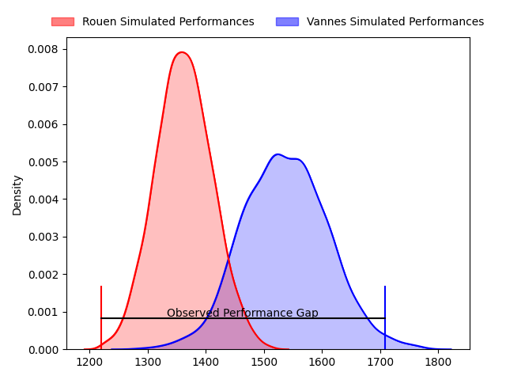
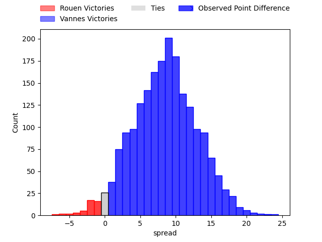
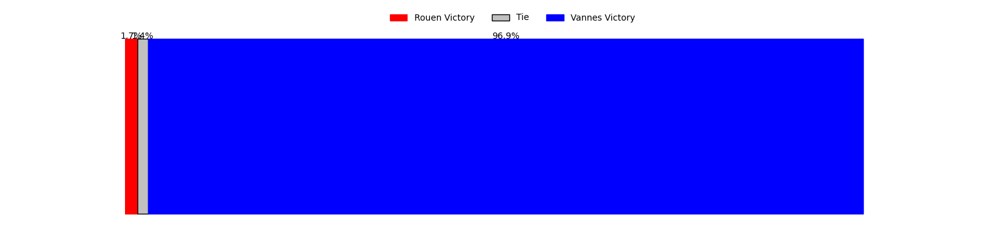

---  
layout: page  
title: Rouen at Vannes; 24-47  
date: 2023-03-24 19:30:00 18:00:00 -0500  
categories: match review  
---
# Rouen at Vannes; 24-47

# Club Level Predictions

The first set of predictions treats a club as the smallest object, as the club develops its members, organizes a gameplan, and deploys its players as needed for each match. This club model has a prediction of 0.726, which translates to predicting Vannes to win by 8.6.

Each club has a rating and a rating deviation (simiar to a Glicko system), and expected performances can be generated. This allows for simulated matches and spreads like the ones below.
## Projected Performances

## Projected Spreads

## Projected Results

# Player Level Predictions

Treating teams instead as an entity made up of the currently active players, I have ratings for each player in an altogether different system. These can be combined to form team ratings once teamsheets are announced, weighting starters a bit higher than the reserves. After the match is played, players can be weighted by their minutes on the field, allowing for an accurate measure of the team's composition. With these compiled team ratings, we can make predictions, measure inaccuracy, and update the individual player ratings.
## Prediction with Player Minutes: Vannes by 16.9

Vannes by 12.9 on a neutral field

There were 7 large changes in win probability in this match
## Prediction without Player Minutes: Vannes by 15.6

Vannes by 11.6 on a neutral pitch

|   Away Minutes | Away Player                    |   Away elo |   Away Percentile |   Number |   Home Percentile |   Home elo | Home Player           |   Home Minutes |
|---------------:|:-------------------------------|-----------:|------------------:|---------:|------------------:|-----------:|:----------------------|---------------:|
|             54 | Soulemane Camara               |     110.66 |                88 |        1 |                98 |     129.1  | Andy Bordelai         |             58 |
|             54 | Lucas Malbert                  |      91.46 |                30 |        2 |                65 |     101.78 | Cyril Blanchard       |             50 |
|             59 | Hugo Ndiaye                    |      97.65 |                64 |        3 |                30 |      95.62 | Phil Kite             |             50 |
|             80 | Jean Leleu                     |      83.79 |                17 |        4 |                49 |      95.62 | Éric Marks            |             80 |
|             62 | Jimi Maximin                   |      99.35 |                63 |        5 |                 3 |      62.54 | Myles Edwards         |             28 |
|             54 | Samuel Maximin                 |      92.3  |               nan |        6 |                51 |      96.14 | Karl Chateau          |             80 |
|             62 | Lucas Costa                    |      85.95 |                19 |        7 |                 2 |      64.44 | Gregoire Bazin        |             80 |
|             80 | Valentino Mapapalangi          |      96.19 |                47 |        8 |                94 |     127.11 | Léon Boulier          |             50 |
|             54 | Théo Nanette                   |      87.49 |                24 |        9 |                76 |     104.83 | Michael Ruru          |             54 |
|             67 | Franck Pourteau                |      88.28 |                26 |       10 |                47 |      95.74 | Jean Chezeau          |             54 |
|             80 | Marius Marty                   |      73.21 |                 7 |       11 |                72 |     103.59 | Romaric Camou         |             62 |
|             80 | John Thomas Jackson            |      83.57 |                17 |       12 |                79 |     108.51 | Andres Vilaseca       |             80 |
|             80 | Opetera Peleseuma              |      92.91 |                41 |       13 |                57 |      98.56 | Sacha Valleau         |             80 |
|             80 | Paul Surano                    |      85.94 |                21 |       14 |                55 |      97.53 | Théo Bastardie        |             80 |
|             80 | Peter Lydon                    |     122.01 |                93 |       15 |                75 |     106.7  | Gwenaël Duplenne      |             80 |
|             26 | Florent Campeggia              |      73.89 |                 7 |       16 |                75 |     104.98 | Edoardo Iachizzi      |             52 |
|             26 | Dylan Jacquot                  |      95    |               nan |       17 |                36 |      95.34 | Théo Beziat           |             30 |
|             26 | Martinus Abraham Tienie Burger |      88.51 |                28 |       18 |               nan |      98.52 | John Afoa             |             30 |
|             26 | Ru-Hann Greyling               |      89.42 |                32 |       19 |                77 |     106.93 | Francisco Gorrisen    |             30 |
|             21 | Cody Thomas                    |      88.43 |                24 |       20 |                90 |     115.19 | Erwan Nicolas         |             26 |
|             18 | Raphaël Vieilledent            |      90.63 |                33 |       21 |                73 |     105.07 | Maxime Lafage         |             26 |
|             18 | Willy N'Diaye                  |      94.44 |                42 |       22 |                34 |      92.06 | Charles-Henri Berguet |             22 |
|             13 | Kevin Milhorat                 |      74.36 |                 7 |       23 |                80 |     107.93 | Nathanael Hulleu      |             18 |

