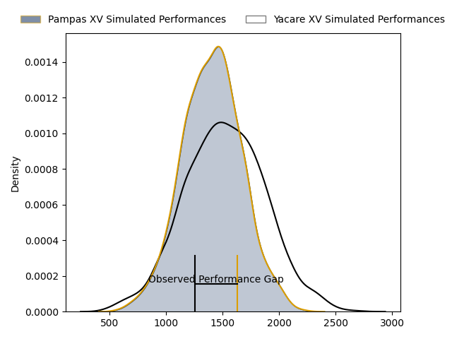
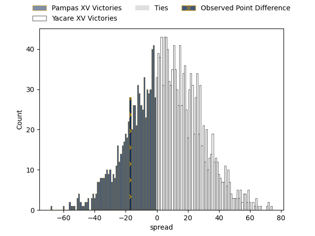

---  
layout: page  
title: Pampas XV at Yacare XV; 22-5  
date: 2023-03-24 22:00:00 18:00:00 -0500  
categories: match review  
---
# Pampas XV at Yacare XV; 22-5

# Club Level Predictions

The first set of predictions treats a club as the smallest object, as the club develops its members, organizes a gameplan, and deploys its players as needed for each match. This club model has a prediction of 0.613, which translates to predicting Yacare XV to win by 5.2.

Each club has a rating and a rating deviation (simiar to a Glicko system), and expected performances can be generated. This allows for simulated matches and spreads like the ones below.
## Projected Performances

## Projected Spreads

## Projected Results

# Player Level Predictions

Treating teams instead as an entity made up of the currently active players, I have ratings for each player in an altogether different system. These can be combined to form team ratings once teamsheets are announced, weighting starters a bit higher than the reserves. After the match is played, players can be weighted by their minutes on the field, allowing for an accurate measure of the team's composition. With these compiled team ratings, we can make predictions, measure inaccuracy, and update the individual player ratings.
## Prediction with Player Minutes: Yacare XV by 7.7

Yacare XV by 3.7 on a neutral field

There were 1 large changes in win probability in this match
## Prediction without Player Minutes: Yacare XV by 5.6

Yacare XV by 1.6 on a neutral pitch

|   Away Minutes | Away Player               |   Away elo |   Away Percentile |   Number |   Home Percentile |   Home elo | Home Player            |   Home Minutes |
|---------------:|:--------------------------|-----------:|------------------:|---------:|------------------:|-----------:|:-----------------------|---------------:|
|             48 | Rodrigo Martinez Manzano  |     103.53 |                77 |        1 |                84 |     107.1  | Lucas Noguera Paz      |             66 |
|             77 | Ramiro Gurovich           |      91.16 |                36 |        2 |                68 |      96.64 | Emilio Gorostiaga      |             42 |
|             56 | Javier Angel Coronel      |      89.43 |                27 |        3 |                47 |      94.27 | Facundo Pomponio       |             66 |
|             52 | Rodrigo Fernandez Criado  |     104.44 |                74 |        4 |                69 |     102.14 | Ignacio Martinez       |             70 |
|             80 | Federico Ignacio Lavanini |      74.72 |                 8 |        5 |                23 |      86.8  | Mariano Garcete Elli   |             80 |
|             70 | Nicolas Damorim           |     114.04 |                87 |        6 |                61 |      99.35 | Felipe Villagran       |             80 |
|             80 | Jeronimo Ureta            |     105.49 |                75 |        7 |                14 |      82.86 | Felipe Puertas         |             80 |
|             80 | Santiago Ruiz             |      90.16 |                31 |        8 |                68 |     102.57 | Marcos Riquelme        |             41 |
|             66 | Mateo Albanese            |     105.61 |                70 |        9 |                62 |      99.54 | Ignacio Inchauspe      |             80 |
|             80 | Joaquin de la Vega Mendia |      43.51 |                 0 |       10 |                69 |     102.86 | Federico Cacciabúe     |             80 |
|             75 | Tomas Passaro             |     120.42 |                92 |       11 |                 3 |      61.82 | Juan Daniel Gonzalez   |             72 |
|             80 | Manuel Alfaro Torneiro    |      81.24 |                14 |       12 |                70 |     100.24 | Ramiro Amarilla        |             80 |
|             78 | Benjamin Elizalde         |      87.97 |                26 |       13 |                96 |     128.26 | Tomas Acosta Pimentel  |             47 |
|             80 | Inaki Delguy              |     103.62 |                74 |       14 |                83 |     109.59 | Federico Gauna         |             80 |
|             80 | Juan Ignacio Lando        |     113.04 |                86 |       15 |                63 |     101.38 | Tomas McCall           |             80 |
|             32 | Javier Corvalan           |      70.17 |                 6 |       16 |                34 |      90.03 | Juan Cruz Perez Rachel |             39 |
|             28 | Lorenzo Colidio           |      99.64 |                68 |       17 |                28 |      88.64 | Mariano Muntaner       |             38 |
|             24 | Renzo Zanella             |      95    |               nan |       18 |                20 |      84.95 | Sebastian Urbieta      |             33 |
|             14 | Rafael Iriarte            |      98.67 |                59 |       19 |                34 |      91.27 | Julian Martin          |             14 |
|             10 | Eliseo Chiavassa          |     100.24 |                64 |       20 |                33 |      91.01 | Estefano Aranda        |             14 |
|              3 | Valentin Minoyetti        |      94.34 |               nan |       21 |               nan |      92.81 | Arturo Lopez           |              8 |
|              5 | Lucio Auad                |      95    |               nan |       22 |               nan |     104.89 | Carlos Plate           |             10 |
|              2 | Joaquin Lamas             |      97.99 |                62 |       23 |               nan |     nan    | nan                    |            nan |

