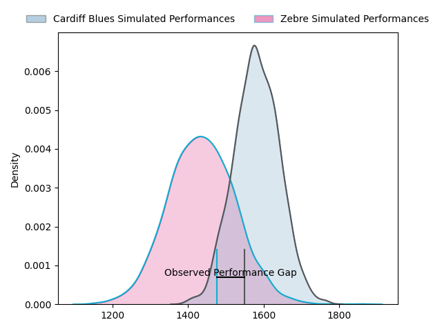
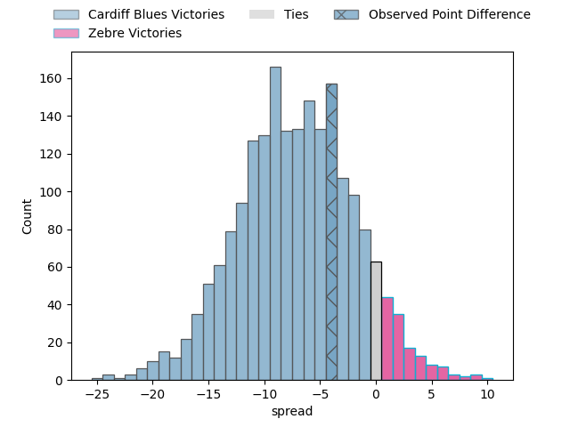
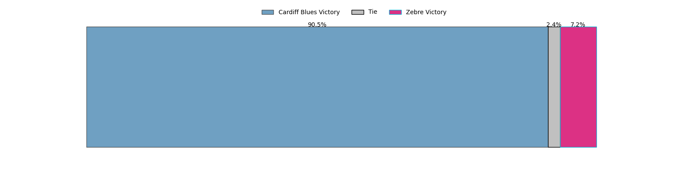

---  
layout: page  
title: Cardiff Blues at Zebre; 34-30  
date: 2023-03-24 20:10:00 18:00:00 -0500  
categories: match review  
---
# Cardiff Blues at Zebre; 34-30

# Club Level Predictions

The first set of predictions treats a club as the smallest object, as the club develops its members, organizes a gameplan, and deploys its players as needed for each match. This club model has a prediction of 0.317, which translates to predicting Cardiff Blues to win by 6.8.

Each club has a rating and a rating deviation (simiar to a Glicko system), and expected performances can be generated. This allows for simulated matches and spreads like the ones below.
## Projected Performances

## Projected Spreads

## Projected Results

# Player Level Predictions

Treating teams instead as an entity made up of the currently active players, I have ratings for each player in an altogether different system. These can be combined to form team ratings once teamsheets are announced, weighting starters a bit higher than the reserves. After the match is played, players can be weighted by their minutes on the field, allowing for an accurate measure of the team's composition. With these compiled team ratings, we can make predictions, measure inaccuracy, and update the individual player ratings.
## Prediction with Player Minutes: Cardiff Blues by 1.3

Cardiff Blues by 5.3 on a neutral field

There were 13 large changes in win probability in this match
## Prediction without Player Minutes: Cardiff Blues by 3.0

Cardiff Blues by 7.0 on a neutral pitch

|   Away Minutes | Away Player         |   Away elo |   Away Percentile |   Number |   Home Percentile |   Home elo | Home Player            |   Home Minutes |
|---------------:|:--------------------|-----------:|------------------:|---------:|------------------:|-----------:|:-----------------------|---------------:|
|             66 | Corey Domachowski   |      98.92 |                70 |        1 |                18 |      85.69 | Paolo Buonfiglio       |             48 |
|             54 | Liam Belcher        |      93.1  |               nan |        2 |               nan |      94.63 | Jacques du Toit        |             52 |
|             66 | Kieran Assirati     |      91.4  |                25 |        3 |                52 |      95.15 | Muhamed Hasa           |             61 |
|             61 | Joshua Turnbull     |      93.01 |                43 |        4 |                54 |      93.02 | Jan-Frederik Uys       |             56 |
|             80 | Teddy Williams      |     100.44 |                69 |        5 |                16 |      82.89 | Leonard Krumov         |             80 |
|             80 | Shane Lewis-Hughes  |      92.85 |               nan |        6 |                14 |      82.72 | Luca Andreani          |             51 |
|             54 | James Botham        |      85.26 |                18 |        7 |               nan |      95    | Jacopo Bianchi         |             80 |
|             80 | James Ratti         |      84.73 |                19 |        8 |                29 |      87.45 | Giovanni Licata        |             80 |
|             73 | Lloyd Williams      |      98.95 |                60 |        9 |                19 |      84.86 | Chris Cook             |             56 |
|             62 | Rhys Priestland     |      90.97 |                38 |       10 |                50 |      93.65 | Geronimo Prisciantelli |             80 |
|             80 | Jason Harries       |      88.19 |                26 |       11 |                21 |      85.83 | Simone Gesi            |             80 |
|             80 | Max Llewellyn       |      95.38 |                47 |       12 |                26 |      87.27 | Enrico Lucchin         |             80 |
|             80 | Mason Grady         |      94.84 |                46 |       13 |                43 |      93.73 | Franco Smith           |             80 |
|             80 | Owen Lane           |      93.01 |                42 |       14 |                34 |      90.62 | Jacobus van Wyk        |             80 |
|             56 | Ben Thomas          |      86.31 |                24 |       15 |                26 |      87.32 | Richard Kriel          |             51 |
|             26 | Kristian Dacey      |      93.88 |                46 |       16 |                 7 |      74.05 | Luca Rizzoli           |             32 |
|             26 | Thomas Young        |      89.89 |                33 |       17 |                26 |      87.98 | Jacopo Trulla          |             29 |
|             24 | Jarrod Evans        |      79.64 |                10 |       18 |                11 |      79.94 | Matt Kvesic            |             29 |
|             19 | Seb Davies          |      92.64 |                40 |       19 |                23 |      87.25 | Giampietro Ribaldi     |             28 |
|             18 | Matthew Morgan      |      95.26 |               nan |       20 |               nan |      95    | David Sisi             |             24 |
|             14 | Rhys Carre          |      84.09 |                15 |       21 |                26 |      87.79 | Alessandro Fusco       |             24 |
|             14 | William Davies-King |      98.91 |               nan |       22 |               nan |      92.99 | Riccardo Genovese      |             19 |
|              7 | Ellis Bevan         |      93.71 |               nan |       23 |               nan |     nan    | nan                    |            nan |

