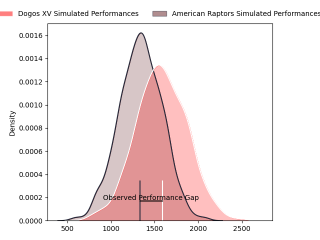
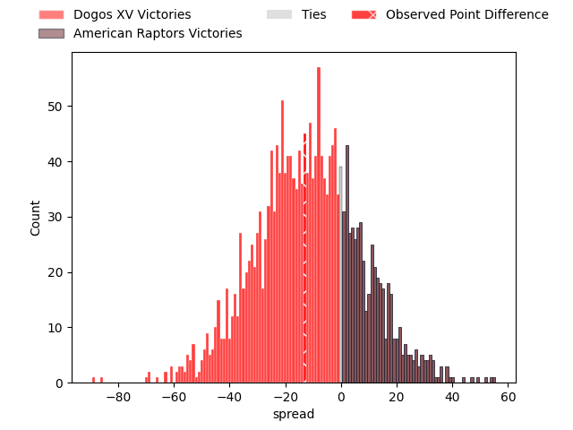

---  
layout: page  
title: Dogos XV at American Raptors; 37-24  
date: 2023-03-25 22:00:00 18:00:00 -0500  
categories: match review  
---
# Dogos XV at American Raptors; 37-24

# Club Level Predictions

The first set of predictions treats a club as the smallest object, as the club develops its members, organizes a gameplan, and deploys its players as needed for each match. This club model has a prediction of 0.27, which translates to predicting Dogos XV to win by 11.9.

Each club has a rating and a rating deviation (simiar to a Glicko system), and expected performances can be generated. This allows for simulated matches and spreads like the ones below.
## Projected Performances

## Projected Spreads

## Projected Results

# Player Level Predictions

Treating teams instead as an entity made up of the currently active players, I have ratings for each player in an altogether different system. These can be combined to form team ratings once teamsheets are announced, weighting starters a bit higher than the reserves. After the match is played, players can be weighted by their minutes on the field, allowing for an accurate measure of the team's composition. With these compiled team ratings, we can make predictions, measure inaccuracy, and update the individual player ratings.
## Prediction with Player Minutes: Dogos XV by 13.4

Dogos XV by 17.4 on a neutral field

There were 6 large changes in win probability in this match
## Prediction without Player Minutes: Dogos XV by 16.1

Dogos XV by 20.1 on a neutral pitch

|   Away Minutes | Away Player               |   Away elo |   Away Percentile |   Number |   Home Percentile |   Home elo | Home Player              |   Home Minutes |
|---------------:|:--------------------------|-----------:|------------------:|---------:|------------------:|-----------:|:-------------------------|---------------:|
|             31 | Santiago Pulella          |     112.95 |                91 |        1 |                25 |      88.14 | Payton Telea-Ilalio      |             66 |
|             63 | Boris Wenger              |      93.31 |                43 |        2 |                29 |      89.05 | Diego Fortuny            |             70 |
|             67 | Octavio Filippa           |     104.84 |                80 |        3 |                32 |      90.68 | Juan Echeverria          |             76 |
|             66 | Lautaro Simes             |     105.08 |                75 |        4 |                31 |      89.97 | Mikey Grandy             |             80 |
|             80 | Franco Molina             |     106.49 |                77 |        5 |                24 |      86.99 | Diego Magno              |             80 |
|             80 | Aitor Bildosola           |      97    |                40 |        6 |                19 |      85.97 | Ronan Murphy             |             80 |
|             80 | Valentin Cabral           |      95    |               nan |        7 |                69 |     101.13 | Tommy Clark              |             71 |
|             40 | Efrain Elias              |     105.82 |                76 |        8 |                28 |      89.31 | Siaki Lolohea Vikilani   |             60 |
|             71 | Agustin Moyano            |     104.31 |                74 |        9 |                28 |      88.57 | Martin Landajo           |             80 |
|             54 | Juan Baronio              |     102.88 |                70 |       10 |                26 |      88.25 | Lucas Gonzalez Amorosino |             71 |
|             80 | Lautaro Cipriani          |      95    |               nan |       11 |                11 |      78.85 | Seimou Smith             |             80 |
|             80 | Leonardo Gea Salim        |      95.36 |                47 |       12 |                43 |      93.88 | Aki Pulu                 |             48 |
|             80 | Faustino Sánchez Valarolo |     110.48 |                82 |       13 |                25 |      86.86 | Watson Filikitonga       |             80 |
|             80 | Mateo Soler               |      97.92 |                56 |       14 |                21 |      85.76 | Ryan James               |             80 |
|             61 | Julian Ignacio Hernandez  |     100.35 |                60 |       15 |                42 |      92.76 | Line Latu                |             80 |
|             49 | Ramiro Valdes Iribarren   |      96.66 |                38 |       16 |                40 |      92.59 | Cash Maluia              |             32 |
|             40 | Gregorio Hernandez        |      92.85 |                21 |       17 |                 2 |      58.06 | Will Crawford            |             20 |
|             19 | Valentino DI Capua        |      92.8  |                33 |       18 |                24 |      88.2  | Ma'ake Muti              |             14 |
|             17 | Roman Pretz               |      94.06 |                30 |       19 |               nan |      95.77 | Chris Schade             |             10 |
|             14 | Federico Albrisi          |      97.77 |               nan |       20 |               nan |      98.53 | Patrick Madden           |              9 |
|             26 | Felipe Mallia             |      96.75 |               nan |       21 |                18 |      85.47 | Shawn Clark              |              9 |
|             13 | Mateo Nunez Miserez       |      91.89 |                36 |       22 |               nan |      94.46 | Adagio Lopeti            |              4 |
|              9 | Juan Cruz Strada          |      97.18 |                51 |       23 |               nan |     nan    | nan                      |            nan |

