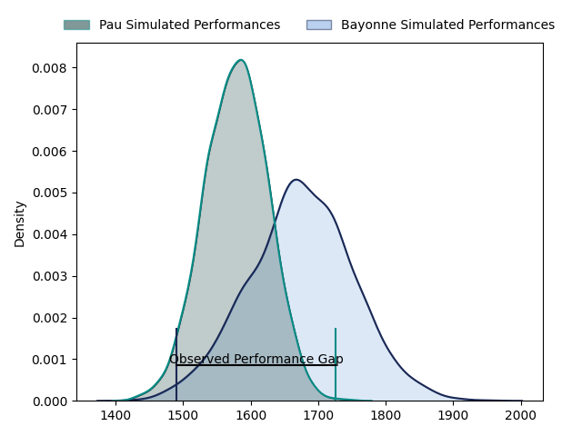
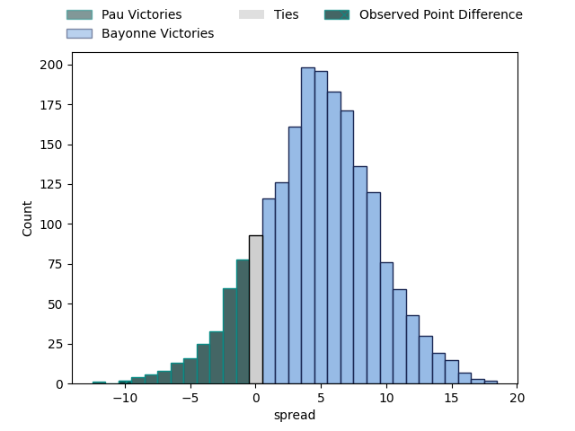
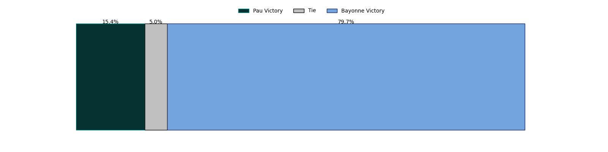

---  
layout: page  
title: Pau at Bayonne; 30-20  
date: 2023-03-25 17:00:00 18:00:00 -0500  
categories: match review  
---
# Pau at Bayonne; 30-20

# Club Level Predictions

The first set of predictions treats a club as the smallest object, as the club develops its members, organizes a gameplan, and deploys its players as needed for each match. This club model has a prediction of 0.617, which translates to predicting Bayonne to win by 4.2.

Each club has a rating and a rating deviation (simiar to a Glicko system), and expected performances can be generated. This allows for simulated matches and spreads like the ones below.
## Projected Performances

## Projected Spreads

## Projected Results

# Player Level Predictions

Treating teams instead as an entity made up of the currently active players, I have ratings for each player in an altogether different system. These can be combined to form team ratings once teamsheets are announced, weighting starters a bit higher than the reserves. After the match is played, players can be weighted by their minutes on the field, allowing for an accurate measure of the team's composition. With these compiled team ratings, we can make predictions, measure inaccuracy, and update the individual player ratings.
## Prediction with Player Minutes: Bayonne by 12.9

Bayonne by 8.9 on a neutral field

There were 9 large changes in win probability in this match
## Prediction without Player Minutes: Bayonne by 12.3

Bayonne by 8.3 on a neutral pitch

|   Away Minutes | Away Player              |   Away elo |   Away Percentile |   Number |   Home Percentile |   Home elo | Home Player           |   Home Minutes |
|---------------:|:-------------------------|-----------:|------------------:|---------:|------------------:|-----------:|:----------------------|---------------:|
|             46 | Ignacio David Calles     |      89.56 |                28 |        1 |                54 |      96.32 | Swan Cormenier        |             24 |
|             61 | Lucas Rey                |      90.86 |                35 |        2 |                79 |     104.56 | Facundo Bosch         |             60 |
|             46 | Siate Tokolahi           |      94.56 |                47 |        3 |                55 |      96.45 | Pascal Cotet          |             65 |
|             75 | Guillaume Ducat          |      99.98 |                63 |        4 |                50 |      95.66 | Denis Marchois        |             51 |
|             49 | Fabrice Metz             |      89.54 |                30 |        5 |                98 |     135.05 | Thomas Ceyte          |             80 |
|             80 | Luke Whitelock           |      95.84 |                50 |        6 |                30 |      88.88 | Pierre Huguet         |             60 |
|             49 | Reece Hewat              |      87.55 |                25 |        7 |                72 |     104.34 | Baptiste Heguy        |             80 |
|             80 | Beka Gorgadze            |     102.08 |                66 |        8 |                68 |     104.93 | Uzair Cassiem         |             80 |
|             57 | Thibault Daubagna        |      96.72 |                50 |        9 |                59 |     100.35 | Guillaume Rouet       |             68 |
|             80 | Zack Henry               |      88.08 |                26 |       10 |                74 |     105.33 | Camille Lopez         |             80 |
|             80 | Aminiasi Tuimaba         |      88.77 |                28 |       11 |                61 |      99.37 | Rémy Baget            |             80 |
|             80 | Tumua Manu               |      77.57 |                10 |       12 |                25 |      93.74 | Eneriko Buliruarua    |             61 |
|             49 | Émilien Gailleton        |     113.57 |                86 |       13 |                27 |      88.06 | Sireli Maqala         |             80 |
|             80 | Clément Laporte          |     100.73 |                65 |       14 |                45 |      94.27 | Marland Yarde         |             80 |
|             80 | Jack Maddocks            |      91.1  |                39 |       15 |                43 |      93.05 | Yohan Orabé           |             74 |
|             34 | Rémi Seneca              |     101.83 |               nan |       16 |                58 |      97.41 | Matis Perchaud        |             56 |
|             34 | Guram Papidze            |     101.41 |                58 |       17 |                15 |      86.78 | Manuel Leindekar      |             29 |
|             31 | Nathan Decron            |      99.28 |                59 |       18 |                28 |      91.42 | Torsten van Jaarsveld |             20 |
|             31 | Sacha Zegueur            |      74.64 |                 7 |       19 |               nan |      95    | Olajuwon Noah         |             20 |
|             31 | Lekima Vuda Tagitagivalu |      97.49 |                55 |       20 |                17 |      82.38 | Peyo Muscarditz       |             19 |
|             23 | Dan Robson               |      87.42 |                24 |       21 |                15 |      87.37 | Pieter Ernst Scholtz  |             15 |
|             19 | Youri Delhommel          |      89.75 |               nan |       22 |                35 |      91.1  | Maxime Machenaud      |             12 |
|              5 | Santiago Grondona        |      94.9  |               nan |       23 |                89 |     120.94 | Thomas Dolhagaray     |              6 |

