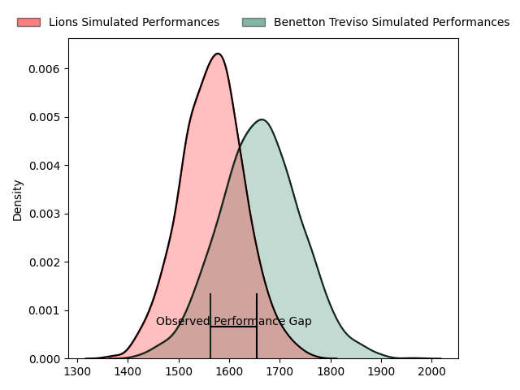
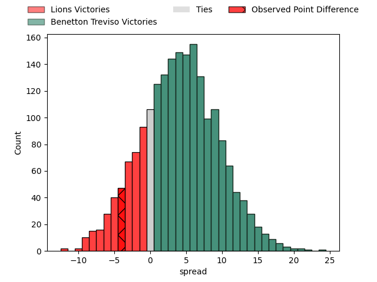
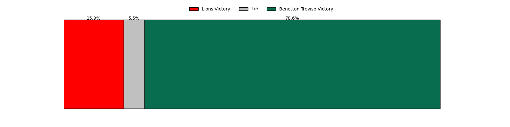

---  
layout: page  
title: Lions at Benetton Treviso; 32-28  
date: 2023-03-25 14:00:00 18:00:00 -0500  
categories: match review  
---
# Lions at Benetton Treviso; 32-28

# Club Level Predictions

The first set of predictions treats a club as the smallest object, as the club develops its members, organizes a gameplan, and deploys its players as needed for each match. This club model has a prediction of 0.614, which translates to predicting Benetton Treviso to win by 4.1.

Each club has a rating and a rating deviation (simiar to a Glicko system), and expected performances can be generated. This allows for simulated matches and spreads like the ones below.
## Projected Performances

## Projected Spreads

## Projected Results

# Player Level Predictions

Treating teams instead as an entity made up of the currently active players, I have ratings for each player in an altogether different system. These can be combined to form team ratings once teamsheets are announced, weighting starters a bit higher than the reserves. After the match is played, players can be weighted by their minutes on the field, allowing for an accurate measure of the team's composition. With these compiled team ratings, we can make predictions, measure inaccuracy, and update the individual player ratings.
## Prediction with Player Minutes: Lions by 4.9

Lions by 8.9 on a neutral field

There were 15 large changes in win probability in this match
## Prediction without Player Minutes: Benetton Treviso by 3.2

Lions by 0.8 on a neutral pitch

|   Away Minutes | Away Player                 |   Away elo |   Away Percentile |   Number |   Home Percentile |   Home elo | Home Player                     |   Home Minutes |
|---------------:|:----------------------------|-----------:|------------------:|---------:|------------------:|-----------:|:--------------------------------|---------------:|
|             58 | Jean-Pierre Smith           |      98.52 |                62 |        1 |                42 |      92.96 | Francisco Nahuel Tetaz Chaparro |             60 |
|             80 | PJ Botha                    |      99.64 |                67 |        2 |                33 |      90.38 | Siua Maile                      |             60 |
|             58 | Asenathi Ntlabakanye        |      80.16 |                10 |        3 |                26 |      89.1  | Simone Ferrari                  |             60 |
|             76 | Willem Alberts              |      92.87 |                41 |        4 |                 2 |      58.82 | Niccolo Cannone                 |             40 |
|             80 | Ruben (Hobo) Schoeman       |     111.18 |                84 |        5 |                41 |      94.18 | Riccardo Favretto               |             80 |
|             80 | Emmanuel Tshituka           |     101.68 |                67 |        6 |                54 |      97.13 | Giovanni Pettinelli             |             80 |
|             80 | Ruan Venter                 |      95.37 |                49 |        7 |                34 |      89.91 | Manuel Zuliani                  |             50 |
|             80 | Francke Horn                |     109.14 |                80 |        8 |                52 |      98    | Lorenzo Cannone                 |             80 |
|             80 | Sanele Nohamba              |     104.69 |                76 |        9 |                38 |      91.74 | Dewald Otto Duvenage            |             55 |
|             80 | Gianni Dean Lombard         |     103.53 |                71 |       10 |                57 |      98.82 | Jacob Umaga                     |             80 |
|             80 | Edwill Charl van der Merwe  |     101.19 |                66 |       11 |                64 |     100.23 | Marcus Watson                   |             80 |
|             80 | Marius Louw                 |     101.07 |                63 |       12 |                45 |      94.5  | Filippo Drago                   |             65 |
|             70 | Manuel Johern (Mannie) Rass |      93.27 |                42 |       13 |                55 |      98.14 | Joaquin Riera                   |             80 |
|             80 | Sibahle Ndiphiwe Maxwane    |     100.14 |                63 |       14 |                29 |      89.14 | Onisi Ratave                    |             63 |
|             80 | Quan Horn                   |     100.05 |                61 |       15 |                63 |     101.01 | Matteo Minozzi                  |             80 |
|             22 | Rhynardt Rinjsburger        |      98.23 |               nan |       16 |                18 |      87.23 | Henry Stowers                   |             40 |
|             22 | Ruan Martin Dreyer          |      95.43 |               nan |       17 |                81 |     108.9  | Federico Ruzza                  |             30 |
|             10 | Rynardt Jonker              |     112.47 |                84 |       18 |                25 |      88.14 | Alessandro Garbisi              |             25 |
|              4 | Travis Gordon               |      83.22 |                17 |       19 |               nan |      91.63 | Thomas Gallo                    |             20 |
|            nan | nan                         |     nan    |               nan |       20 |                43 |      93.32 | Tiziano Pasquali                |             20 |
|            nan | nan                         |     nan    |               nan |       21 |                76 |     103.51 | Bautista Bernasconi             |             20 |
|            nan | nan                         |     nan    |               nan |       22 |               nan |      97.73 | Giacomo Da Re                   |             17 |
|            nan | nan                         |     nan    |               nan |       23 |                37 |      91.99 | Federico Zani                   |             15 |

