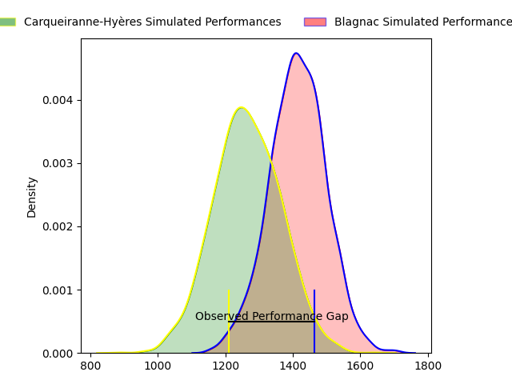
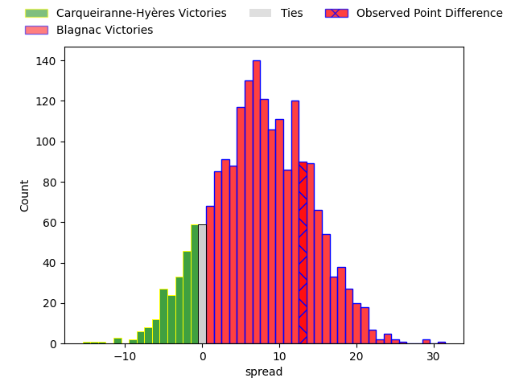
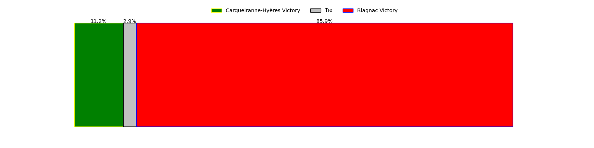

---  
layout: page  
title: Carqueiranne-Hyères at Blagnac; 20-33  
date: 2023-03-25 18:00:00 18:00:00 -0500  
categories: match review  
---
# Carqueiranne-Hyères at Blagnac; 20-33

# Club Level Predictions

The first set of predictions treats a club as the smallest object, as the club develops its members, organizes a gameplan, and deploys its players as needed for each match. This club model has a prediction of 0.696, which translates to predicting Blagnac to win by 7.5.

Each club has a rating and a rating deviation (simiar to a Glicko system), and expected performances can be generated. This allows for simulated matches and spreads like the ones below.
## Projected Performances

## Projected Spreads

## Projected Results

# Player Level Predictions

Treating teams instead as an entity made up of the currently active players, I have ratings for each player in an altogether different system. These can be combined to form team ratings once teamsheets are announced, weighting starters a bit higher than the reserves. After the match is played, players can be weighted by their minutes on the field, allowing for an accurate measure of the team's composition. With these compiled team ratings, we can make predictions, measure inaccuracy, and update the individual player ratings.
## Prediction with Player Minutes: Blagnac by 3.7

Carqueiranne-Hyères by 0.3 on a neutral field

There were 3 large changes in win probability in this match
## Prediction without Player Minutes: Carqueiranne-Hyères by 0.1

Carqueiranne-Hyères by 4.1 on a neutral pitch

|   Away Minutes | Away Player                                                                   |   Away elo |   Away Percentile |   Number |   Home Percentile |   Home elo | Home Player                                                             |   Home Minutes |
|---------------:|:------------------------------------------------------------------------------|-----------:|------------------:|---------:|------------------:|-----------:|:------------------------------------------------------------------------|---------------:|
|             53 | [Liam Chad Hendricks](..//playerfiles//LiamChadHendricks_cleaned.md)          |      98.2  |                44 |        1 |                75 |     100.82 | [Alexis Decaux](..//playerfiles//AlexisDecaux_cleaned.md)               |             52 |
|             47 | [Pierre Traiter](..//playerfiles//PierreTraiter_cleaned.md)                   |      97.52 |                71 |        2 |                24 |      87.44 | [Florian Bertrand](..//playerfiles//FlorianBertrand_cleaned.md)         |             64 |
|             55 | [Lasha Mchelidze](..//playerfiles//LashaMchelidze_cleaned.md)                 |      94.07 |                46 |        3 |                36 |      91.82 | [Marco Trauth](..//playerfiles//MarcoTrauth_cleaned.md)                 |             52 |
|             80 | [Sven D'Hooghe](..//playerfiles//SvenD'Hooghe_cleaned.md)                     |      96.63 |                52 |        4 |                84 |     111.23 | [Vincent Mutel](..//playerfiles//VincentMutel_cleaned.md)               |             80 |
|             45 | [César Damiani](..//playerfiles//CésarDamiani_cleaned.md)                     |      96.24 |                52 |        5 |                73 |     102.03 | [Lilian Rousset](..//playerfiles//LilianRousset_cleaned.md)             |             80 |
|             80 | [Nicolas Baquer](..//playerfiles//NicolasBaquer_cleaned.md)                   |      89.81 |                29 |        6 |                61 |      98.81 | [Nikita Bekov](..//playerfiles//NikitaBekov_cleaned.md)                 |             57 |
|             53 | [Joachim Beaumont](..//playerfiles//JoachimBeaumont_cleaned.md)               |     108.32 |                80 |        7 |                66 |     101.4  | [Ianis Ponsole](..//playerfiles//IanisPonsole_cleaned.md)               |             80 |
|             80 | [Jordan Lavocat](..//playerfiles//JordanLavocat_cleaned.md)                   |      99.19 |                56 |        8 |                19 |      86.63 | [Nekolo Tolofua](..//playerfiles//NekoloTolofua_cleaned.md)             |             57 |
|             53 | [Thomas Sonetti](..//playerfiles//ThomasSonetti_cleaned.md)                   |     118    |                92 |        9 |                39 |      99.14 | [Corentin Penc'hoat](..//playerfiles//CorentinPenc'hoat_cleaned.md)     |             32 |
|             80 | [Théo Defrance](..//playerfiles//ThéoDefrance_cleaned.md)                     |      85.3  |                18 |       10 |                52 |      97.66 | [Valentin Delpy](..//playerfiles//ValentinDelpy_cleaned.md)             |             52 |
|             80 | [Vincent Alessi](..//playerfiles//VincentAlessi_cleaned.md)                   |      82.51 |                18 |       11 |                72 |     104.79 | [Dorian Terrou](..//playerfiles//DorianTerrou_cleaned.md)               |             80 |
|             19 | [Romain Leveque](..//playerfiles//RomainLeveque_cleaned.md)                   |     126.41 |                95 |       12 |                 5 |      68.33 | [Antoine Renaud](..//playerfiles//AntoineRenaud_cleaned.md)             |             80 |
|             80 | [Dylan Michael Sage](..//playerfiles//DylanMichaelSage_cleaned.md)            |      92.31 |                38 |       13 |                36 |      91.31 | [Aurelien Labau](..//playerfiles//AurelienLabau_cleaned.md)             |             80 |
|             61 | [Kalani Robert](..//playerfiles//KalaniRobert_cleaned.md)                     |     129.36 |                96 |       14 |                23 |      86.75 | [Lucas Martins](..//playerfiles//LucasMartins_cleaned.md)               |             80 |
|             80 | [Adrien Amans](..//playerfiles//AdrienAmans_cleaned.md)                       |      89.42 |                33 |       15 |                91 |     119.06 | [Jean-Andre Vernetti](..//playerfiles//Jean-AndreVernetti_cleaned.md)   |             57 |
|             27 | [Eli Serra-Miglietti](..//playerfiles//EliSerra-Miglietti_cleaned.md)         |      94.23 |                42 |       16 |                19 |      86.3  | [Jean-Baptiste Martin](..//playerfiles//Jean-BaptisteMartin_cleaned.md) |             28 |
|             33 | [Michael Tyumenev](..//playerfiles//MichaelTyumenev_cleaned.md)               |      81.22 |                11 |       17 |                94 |     117.37 | [Leeroy Cloostermans](..//playerfiles//LeeroyCloostermans_cleaned.md)   |             16 |
|             25 | [Jean-Baptiste Reggiardo](..//playerfiles//Jean-BaptisteReggiardo_cleaned.md) |      84.7  |                20 |       18 |                66 |      97.93 | [Fabien Lorenzon](..//playerfiles//FabienLorenzon_cleaned.md)           |             28 |
|             35 | [Nathan Gendre](..//playerfiles//NathanGendre_cleaned.md)                     |     100.25 |                64 |       19 |                63 |      97.74 | [Alexandre Perrin](..//playerfiles//AlexandrePerrin_cleaned.md)         |             23 |
|             27 | [Alexander Nowicki](..//playerfiles//AlexanderNowicki_cleaned.md)             |      83.63 |                15 |       20 |                 2 |      66.64 | [Lucas Tolofua](..//playerfiles//LucasTolofua_cleaned.md)               |             23 |
|             27 | [Jérémy Fleury](..//playerfiles//JérémyFleury_cleaned.md)                     |      93.83 |               nan |       21 |                78 |     105.78 | [Paul Ravier](..//playerfiles//PaulRavier_cleaned.md)                   |             48 |
|             61 | [David Raikuna](..//playerfiles//DavidRaikuna_cleaned.md)                     |      92.25 |                38 |       22 |                79 |     108.91 | [Ugo Seunes](..//playerfiles//UgoSeunes_cleaned.md)                     |             28 |
|             19 | [Josselyn Bouchon](..//playerfiles//JosselynBouchon_cleaned.md)               |     101.83 |                67 |       23 |                18 |      83.85 | [Lukas Doyhenard](..//playerfiles//LukasDoyhenard_cleaned.md)           |             23 |

