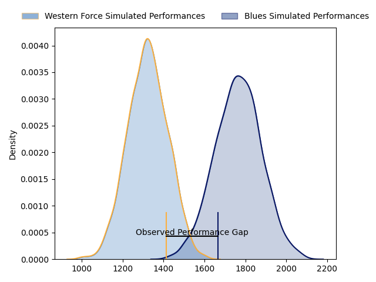
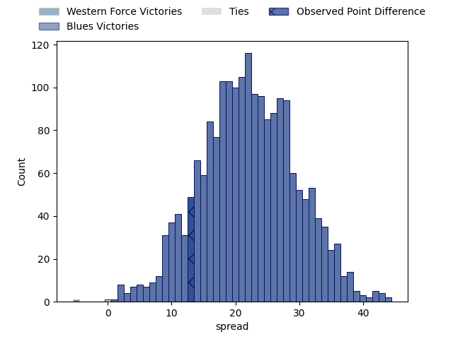

---  
layout: page  
title: Western Force at Blues; 17.0-30.0  
date: 2023-03-25 22:35:00 18:00:00 -0500  
categories: match review  
---
# Western Force at Blues; 17.0-30.0

# Club Level Predictions

The first set of predictions treats a club as the smallest object, as the club develops its members, organizes a gameplan, and deploys its players as needed for each match. This club model has a prediction of 0.917, which translates to predicting Blues to win by 21.9.

Each club has a rating and a rating deviation (simiar to a Glicko system), and expected performances can be generated. This allows for simulated matches and spreads like the ones below.
## Projected Performances

## Projected Spreads

## Projected Results

# Player Level Predictions

Treating teams instead as an entity made up of the currently active players, I have ratings for each player in an altogether different system. These can be combined to form team ratings once teamsheets are announced, weighting starters a bit higher than the reserves. After the match is played, players can be weighted by their minutes on the field, allowing for an accurate measure of the team's composition. With these compiled team ratings, we can make predictions, measure inaccuracy, and update the individual player ratings.
## Prediction with Player Minutes: Blues by 27.1

Blues by 23.1 on a neutral field

There were 4 large changes in win probability in this match
## Prediction without Player Minutes: Blues by 26.7

Blues by 22.7 on a neutral pitch

|   Away Minutes | Away Player           |   Away elo |   Away Percentile |   Number |   Home Percentile |   Home elo | Home Player                   |   Home Minutes |
|---------------:|:----------------------|-----------:|------------------:|---------:|------------------:|-----------:|:------------------------------|---------------:|
|             50 | Angus Wagner          |      90.39 |               nan |        1 |                62 |      98.69 | Josh Fusitua                  |             49 |
|             50 | Folau Fainga'a        |     130.05 |                98 |        2 |                92 |     115.04 | Kurt Eklund                   |             50 |
|             59 | Santiago Medrano      |     118.58 |                94 |        3 |                89 |     111.3  | Ofa Tu'ungafasi               |             49 |
|             51 | Felix Kalapu          |      48.69 |                 1 |        4 |                84 |     111.09 | James Tucker                  |             53 |
|             80 | Jeremy Williams       |      76.47 |                 9 |        5 |                77 |     106.58 | Cameron Suafoa                |             80 |
|             41 | Michael Wells         |      91.24 |                37 |        6 |                32 |      89.67 | Anton Segner                  |             80 |
|             80 | Tim Anstee            |      55.13 |                 0 |        7 |                33 |      89.83 | Adrian Choat                  |             40 |
|             72 | Rahboni Vosayaco      |      90.69 |                32 |        8 |                97 |     127.32 | Hoskins Sotutu                |             70 |
|             59 | Gareth Simpson        |     101.08 |                67 |        9 |                77 |     105.43 | Sam Nock                      |             53 |
|             80 | Hamish Stewart        |     127.02 |                96 |       10 |                89 |     116.21 | Stephen Perofeta              |             80 |
|             80 | Toni Pulu             |     126.29 |                95 |       11 |                86 |     113.57 | Mark Telea                    |             80 |
|             67 | Bayley Kuenzle        |      79.24 |                11 |       12 |                91 |     118.75 | Harry Plummer                 |             80 |
|             80 | Sam Spink             |      96.73 |                51 |       13 |                90 |     118.49 | Bryce Heem                    |             50 |
|             80 | Zach Kibirige         |      72.47 |                 6 |       14 |                95 |     126.27 | Jacob Ratumaitavuki-Kneepkens |             80 |
|             80 | Chase Tiatia          |     103.54 |                67 |       15 |                53 |      96.95 | Zarn Sullivan                 |             80 |
|             30 | Tom Horton            |     102.57 |                73 |       16 |                45 |      93.7  | Ricky Riccitelli              |             30 |
|             30 | Marley Pearce         |      95    |               nan |       17 |                44 |      92.67 | Jordan Lay                    |             31 |
|             21 | Siosifa Amone         |      93.29 |               nan |       18 |                73 |     102.46 | Marcel Renata                 |             31 |
|             29 | Ryan McCauley         |      77.03 |                10 |       19 |                90 |     116.22 | Tom Robinson                  |             40 |
|             39 | Ollie Callan          |      76.22 |                 7 |       20 |                68 |     103.57 | Sam Darry                     |             27 |
|             21 | Issak Fines-Leleiwasa |      94.74 |                51 |       21 |                41 |      94.19 | Taine Plumtree                |             10 |
|              8 | Jake Strachan         |      78.53 |                14 |       22 |                18 |      84.4  | Taufa Funaki                  |             27 |
|             13 | George Poolman        |      92.05 |               nan |       23 |                68 |     103.97 | Corey Evans                   |             30 |

