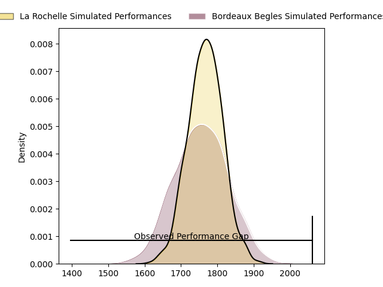
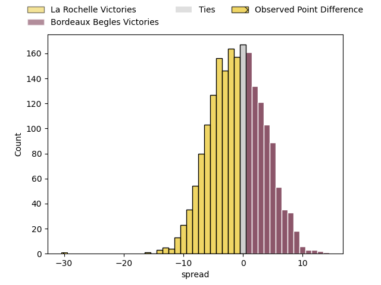

---  
layout: page  
title: La Rochelle at Bordeaux Begles; 36-6  
date: 2023-03-25 21:05:00 18:00:00 -0500  
categories: match review  
---
# La Rochelle at Bordeaux Begles; 36-6

# Club Level Predictions

The first set of predictions treats a club as the smallest object, as the club develops its members, organizes a gameplan, and deploys its players as needed for each match. This club model has a prediction of 0.486, which translates to predicting La Rochelle to win by 0.5.

Each club has a rating and a rating deviation (simiar to a Glicko system), and expected performances can be generated. This allows for simulated matches and spreads like the ones below.
## Projected Performances

## Projected Spreads

## Projected Results

# Player Level Predictions

Treating teams instead as an entity made up of the currently active players, I have ratings for each player in an altogether different system. These can be combined to form team ratings once teamsheets are announced, weighting starters a bit higher than the reserves. After the match is played, players can be weighted by their minutes on the field, allowing for an accurate measure of the team's composition. With these compiled team ratings, we can make predictions, measure inaccuracy, and update the individual player ratings.
## Prediction with Player Minutes: Bordeaux Begles by 15.6

Bordeaux Begles by 11.6 on a neutral field

There were 6 large changes in win probability in this match
## Prediction without Player Minutes: Bordeaux Begles by 15.5

Bordeaux Begles by 11.5 on a neutral pitch

|   Away Minutes | Away Player               |   Away elo |   Away Percentile |   Number |   Home Percentile |   Home elo | Home Player          |   Home Minutes |
|---------------:|:--------------------------|-----------:|------------------:|---------:|------------------:|-----------:|:---------------------|---------------:|
|             45 | Hayden Thompson-Stringer  |      89.15 |                27 |        1 |                69 |     104.29 | Lesko Kaulashvili    |             50 |
|             37 | Pierre Bourgarit          |      92.18 |                39 |        2 |                87 |     110.4  | Maxime Lamothe       |             50 |
|             52 | Uini Atonio               |     124.69 |                97 |        3 |                40 |      92.77 | Sipili Falatea       |             46 |
|             61 | Thomas Lavault            |      92.18 |                39 |        4 |                29 |      89.29 | Cyril Cazeaux        |             54 |
|             80 | William Skelton           |      90.58 |                33 |        5 |                83 |     110.85 | Jan Andre Marais     |             80 |
|             61 | Ultan Dillane             |      92.2  |                40 |        6 |                67 |     101.92 | Mahamadou Diaby      |             80 |
|             80 | Levani Botia              |      94.97 |                48 |        7 |                77 |     106.93 | Antoine Miquel       |             54 |
|             46 | Yoan Tanga Mangene        |      88.9  |                27 |        8 |                84 |     110.87 | Tom Willis           |             80 |
|             66 | Tawera Kerr-Barlow        |     105.09 |                76 |        9 |                49 |      95.24 | Maxime Lucu          |             70 |
|             64 | UJ Seuteni                |      91.98 |                38 |       10 |                66 |     102.11 | Zack Holmes          |             60 |
|             80 | Pierre Boudehent          |      90.05 |                33 |       11 |                84 |     111.27 | Santiago Cordero     |             80 |
|             80 | Jules Favre               |      92.9  |                42 |       12 |                85 |     112.59 | Tani Vili            |             46 |
|             80 | Raymond Rhule             |     109.97 |                83 |       13 |                82 |     110.29 | Nicolas Depoortere   |             80 |
|             80 | Teddy Thomas              |     108.61 |                80 |       14 |                85 |     112.6  | Louis Bielle Biarrey |             80 |
|             80 | Brice Dulin               |      93.85 |                44 |       15 |                87 |     114.89 | Romain Buros         |             80 |
|             43 | Quentin Lespiaucq-Brettes |      95.42 |                55 |       16 |                75 |     103.02 | Jefferson Poirot     |             30 |
|             34 | Gregory Alldritt          |     112.76 |                86 |       17 |                30 |      91.55 | Clément Maynadier    |             30 |
|             35 | Joel Sclavi               |      85.67 |                22 |       18 |                68 |     101.84 | Thomas Jolmes        |             26 |
|             28 | Georges-Henri Colombe     |      89.93 |                29 |       19 |                42 |      96.27 | Vadim Cobilas        |             34 |
|             19 | Romain Sazy               |     107.03 |                79 |       20 |                58 |      99.3  | Yoram Moefana        |             34 |
|             19 | Matthias Haddad           |      95    |               nan |       21 |               nan |      96.1  | Pierre Bochaton      |             26 |
|             16 | Hugo Reus                 |      95    |               nan |       22 |                30 |      91.24 | Mateo Garcia         |             20 |
|             14 | Thomas Berjon             |      92.23 |                40 |       23 |                75 |     104.93 | Jules Gimbert        |             10 |

