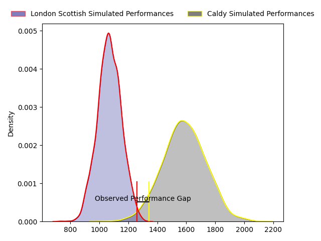
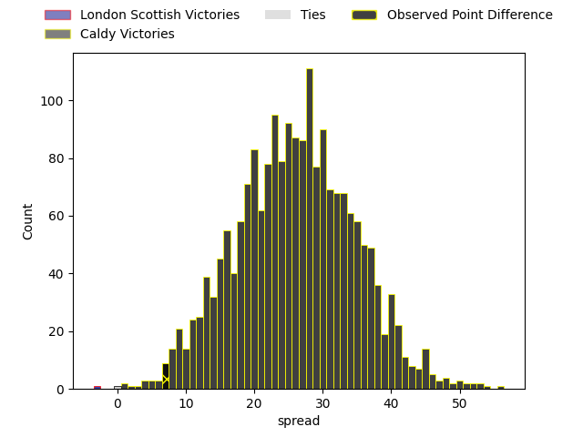

---  
layout: page  
title: London Scottish at Caldy; 19-26  
date: 2023-03-25 16:00:00 18:00:00 -0500  
categories: match review  
---
# London Scottish at Caldy; 19-26

# Club Level Predictions

The first set of predictions treats a club as the smallest object, as the club develops its members, organizes a gameplan, and deploys its players as needed for each match. This club model has a prediction of 0.946, which translates to predicting Caldy to win by 25.8.

Each club has a rating and a rating deviation (simiar to a Glicko system), and expected performances can be generated. This allows for simulated matches and spreads like the ones below.
## Projected Performances

## Projected Spreads

## Projected Results

# Player Level Predictions

Treating teams instead as an entity made up of the currently active players, I have ratings for each player in an altogether different system. These can be combined to form team ratings once teamsheets are announced, weighting starters a bit higher than the reserves. After the match is played, players can be weighted by their minutes on the field, allowing for an accurate measure of the team's composition. With these compiled team ratings, we can make predictions, measure inaccuracy, and update the individual player ratings.
## Prediction with Player Minutes: London Scottish by 1.8

London Scottish by 5.8 on a neutral field

There were 7 large changes in win probability in this match
## Prediction without Player Minutes: London Scottish by 2.4

London Scottish by 6.4 on a neutral pitch

|   Away Minutes | Away Player        |   Away elo |   Away Percentile |   Number |   Home Percentile |   Home elo | Home Player         |   Home Minutes |
|---------------:|:-------------------|-----------:|------------------:|---------:|------------------:|-----------:|:--------------------|---------------:|
|             33 | William Hobson     |      99.78 |                71 |        1 |                48 |      94.66 | Adam Aigbokhae      |             80 |
|             53 | Harri Morris       |     104.58 |                79 |        2 |                40 |      92.48 | Oliver Hearn        |             80 |
|             75 | Joe Rees           |      93.39 |                43 |        3 |                39 |      92.53 | Nathan Rushton      |             60 |
|             80 | Matas Jurevicius   |      90.51 |                33 |        4 |                33 |      90.37 | Josiah Dickinson    |             60 |
|             80 | Bailey Ransom      |     116.31 |                88 |        5 |                25 |      87.77 | Thomas Sanders      |             80 |
|             80 | Will Trenholm      |      91.45 |                37 |        6 |                18 |      85.11 | Callum Ridgway      |             80 |
|             80 | Jack Ingall        |      58.58 |                 1 |        7 |                42 |      91.63 | Nyle Davidson       |             77 |
|             51 | Viliami Taulani    |      99.76 |                59 |        8 |                15 |      82.45 | Rouben Birch        |             80 |
|             80 | Lewis Gjaltema     |     103.65 |                73 |        9 |                47 |      93.17 | Chris Pilgrim       |             49 |
|             80 | Nathan Chamberlain |      89.98 |                30 |       10 |                12 |      80.84 | Rhys Hayes          |             80 |
|             51 | Louis Lynagh       |      95    |               nan |       11 |                45 |      88.93 | Michael Cartmill    |             80 |
|             80 | Lennox Anyanwu     |     103    |                68 |       12 |                34 |      90.44 | Lewis Barker        |             62 |
|             80 | Vilikesa Wara      |      90.85 |                35 |       13 |                20 |      85.3  | Dan Bibby           |             80 |
|             44 | Luke Mehson        |      95.79 |                49 |       14 |                28 |      88.55 | Nick Royle          |             80 |
|             80 | Cameron Anderson   |      93.84 |                44 |       15 |                43 |      93.57 | Elliott Gourlay     |             80 |
|             47 | Jordan Els         |      96.22 |                54 |       16 |                62 |     103.45 | Anerin (Nye) Thomas |             31 |
|             36 | Austin Wallis      |      95.02 |                48 |       17 |                55 |      95.26 | Ryan Higginson      |             20 |
|             29 | Noah Ferdinand     |      40.22 |                 0 |       18 |                73 |     104.25 | Martin Gerrard      |              4 |
|             29 | Matt Wilkinson     |     107.78 |                80 |       19 |                37 |      91.35 | Louis Beer          |             18 |
|             27 | Lawrence Mason     |      92.3  |               nan |       20 |               nan |      95.87 | Thomas Parry        |             16 |
|              5 | Rhys Litterick     |      93.58 |               nan |       21 |               nan |      92.09 | Ethan Caine         |              3 |

