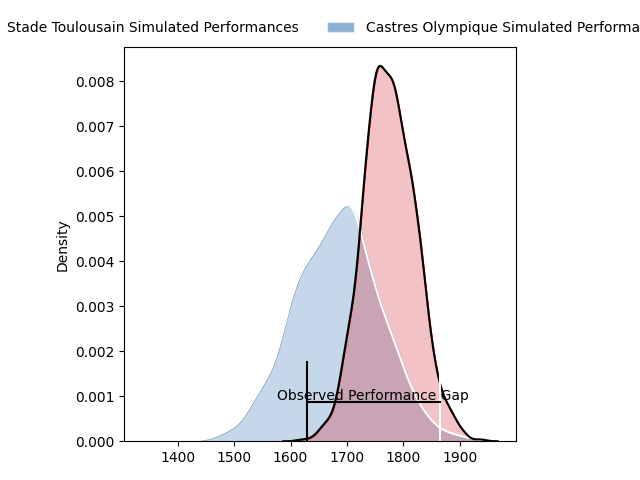
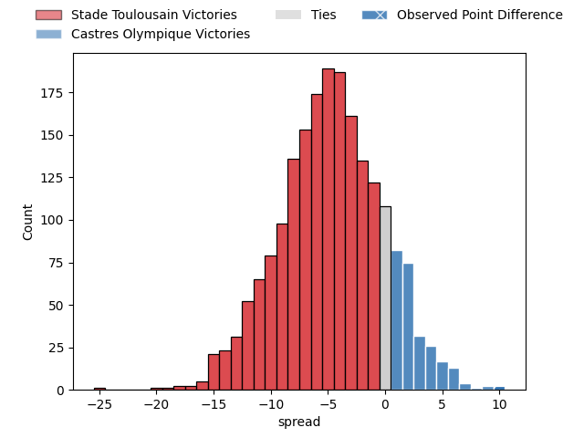
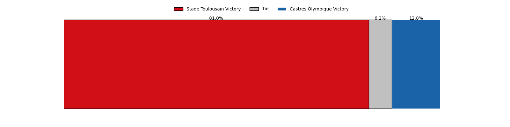

---  
layout: page  
title: Stade Toulousain at Castres Olympique; 17-27  
date: 2023-03-25 15:00:00 18:00:00 -0500  
categories: match review  
---
# Stade Toulousain at Castres Olympique; 17-27

# Club Level Predictions

The first set of predictions treats a club as the smallest object, as the club develops its members, organizes a gameplan, and deploys its players as needed for each match. This club model has a prediction of 0.374, which translates to predicting Stade Toulousain to win by 4.5.

Each club has a rating and a rating deviation (simiar to a Glicko system), and expected performances can be generated. This allows for simulated matches and spreads like the ones below.
## Projected Performances

## Projected Spreads

## Projected Results

# Player Level Predictions

Treating teams instead as an entity made up of the currently active players, I have ratings for each player in an altogether different system. These can be combined to form team ratings once teamsheets are announced, weighting starters a bit higher than the reserves. After the match is played, players can be weighted by their minutes on the field, allowing for an accurate measure of the team's composition. With these compiled team ratings, we can make predictions, measure inaccuracy, and update the individual player ratings.
## Prediction with Player Minutes: Stade Toulousain by 6.0

Stade Toulousain by 10.0 on a neutral field

There were 8 large changes in win probability in this match
## Prediction without Player Minutes: Stade Toulousain by 8.0

Stade Toulousain by 12.0 on a neutral pitch

|   Away Minutes | Away Player                                                             |   Away elo |   Away Percentile |   Number |   Home Percentile |   Home elo | Home Player                                                                       |   Home Minutes |
|---------------:|:------------------------------------------------------------------------|-----------:|------------------:|---------:|------------------:|-----------:|:----------------------------------------------------------------------------------|---------------:|
|             62 | [Rodrigue Neti](..//playerfiles//RodrigueNeti_cleaned.md)               |     102.64 |                66 |        1 |                35 |      91.55 | [Quentin Walcker](..//playerfiles//QuentinWalcker_cleaned.md)                     |             61 |
|             60 | [Peato Mauvaka](..//playerfiles//PeatoMauvaka_cleaned.md)               |      96.81 |                56 |        2 |                52 |      95.62 | [Gaëtan Barlot](..//playerfiles//GaëtanBarlot_cleaned.md)                         |             71 |
|             55 | [David Ainu'u](..//playerfiles//DavidAinu'u_cleaned.md)                 |      91.77 |                36 |        3 |                34 |      91.3  | [Wilfried Hounkpatin](..//playerfiles//WilfriedHounkpatin_cleaned.md)             |             71 |
|             41 | [Richie Arnold](..//playerfiles//RichieArnold_cleaned.md)               |     100.25 |                64 |        4 |                68 |     102.02 | [Ryno Pieterse](..//playerfiles//RynoPieterse_cleaned.md)                         |             63 |
|             55 | [Clement Verge](..//playerfiles//ClementVerge_cleaned.md)               |      98.91 |               nan |        5 |                23 |      86.77 | [Thomas Staniforth](..//playerfiles//ThomasStaniforth_cleaned.md)                 |             80 |
|             80 | [Rynhard Elstadt](..//playerfiles//RynhardElstadt_cleaned.md)           |      92.02 |                40 |        6 |                48 |      94.83 | [Nick Champion de Crespigny](..//playerfiles//NickChampiondeCrespigny_cleaned.md) |             80 |
|             80 | [Joshua Brennan](..//playerfiles//JoshuaBrennan_cleaned.md)             |     103.93 |                73 |        7 |                53 |      96.66 | [Tyler Ardron](..//playerfiles//TylerArdron_cleaned.md)                           |             80 |
|             80 | [Alexandre Roumat](..//playerfiles//AlexandreRoumat_cleaned.md)         |     106.68 |                76 |        8 |                63 |     101.13 | [Kevin Kornath](..//playerfiles//KevinKornath_cleaned.md)                         |             61 |
|             41 | [Paul Graou](..//playerfiles//PaulGraou_cleaned.md)                     |     128.62 |                98 |        9 |                55 |      97.23 | [Santiago Arata Perrone](..//playerfiles//SantiagoArataPerrone_cleaned.md)        |             66 |
|             62 | [Tim Nanai-Williams](..//playerfiles//TimNanai-Williams_cleaned.md)     |      95    |               nan |       10 |                40 |      92.94 | [Benjamin Urdapilleta](..//playerfiles//BenjaminUrdapilleta_cleaned.md)           |             80 |
|             80 | [Matthis Lebel](..//playerfiles//MatthisLebel_cleaned.md)               |      97.07 |                54 |       11 |                19 |      84.79 | [Filipo Nakosi](..//playerfiles//FilipoNakosi_cleaned.md)                         |             80 |
|             16 | [Sofiane Guitoune](..//playerfiles//SofianeGuitoune_cleaned.md)         |     112.36 |                84 |       12 |                42 |      93.22 | [Adrea Cocagi](..//playerfiles//AdreaCocagi_cleaned.md)                           |             61 |
|             80 | [Pierre-Louis Barassi](..//playerfiles//Pierre-LouisBarassi_cleaned.md) |      99.94 |                45 |       13 |                50 |      96.38 | [Adrien Seguret](..//playerfiles//AdrienSeguret_cleaned.md)                       |             80 |
|             80 | [Dimitri Delibes](..//playerfiles//DimitriDelibes_cleaned.md)           |      92.68 |                35 |       14 |                31 |      89.7  | [Geoffrey Palis](..//playerfiles//GeoffreyPalis_cleaned.md)                       |             80 |
|             80 | [Melvyn Jaminet](..//playerfiles//MelvynJaminet_cleaned.md)             |      93.71 |                45 |       15 |                20 |      83.72 | [Julien Dumora](..//playerfiles//JulienDumora_cleaned.md)                         |             66 |
|             64 | [Santiago Chocobares](..//playerfiles//SantiagoChocobares_cleaned.md)   |      91.08 |                36 |       16 |                19 |      83.66 | [Baptiste Delaporte](..//playerfiles//BaptisteDelaporte_cleaned.md)               |             19 |
|             39 | [Martin Page-Relo](..//playerfiles//MartinPage-Relo_cleaned.md)         |      94.5  |                50 |       17 |                11 |      80.25 | [Vilimoni Botitu](..//playerfiles//VilimoniBotitu_cleaned.md)                     |             19 |
|             39 | [Emmanuel Meafou](..//playerfiles//EmmanuelMeafou_cleaned.md)           |     109.34 |                82 |       18 |                15 |      87.24 | [Antoine Tichit](..//playerfiles//AntoineTichit_cleaned.md)                       |             19 |
|             25 | [Paul Mallez](..//playerfiles//PaulMallez_cleaned.md)                   |      96.83 |               nan |       19 |                12 |      81.65 | [Gauthier Maravat](..//playerfiles//GauthierMaravat_cleaned.md)                   |             17 |
|             25 | [Alban Placines](..//playerfiles//AlbanPlacines_cleaned.md)             |      95.05 |                49 |       20 |               nan |      95    | [Jeremy Fernandez](..//playerfiles//JeremyFernandez_cleaned.md)                   |             14 |
|             18 | [Edgar Retiere](..//playerfiles//EdgarRetiere_cleaned.md)               |     104.31 |                72 |       21 |                39 |      92.2  | [Louis Le Brun](..//playerfiles//LouisLeBrun_cleaned.md)                          |             14 |
|             18 | [Maxime Duprat](..//playerfiles//MaximeDuprat_cleaned.md)               |     110.02 |                88 |       22 |                81 |     106.15 | [Brice Humbert](..//playerfiles//BriceHumbert_cleaned.md)                         |              9 |
|             20 | [Guillaume Cramont](..//playerfiles//GuillaumeCramont_cleaned.md)       |      97.85 |                57 |       23 |                31 |      90.01 | [Levan Chilachava](..//playerfiles//LevanChilachava_cleaned.md)                   |              9 |

