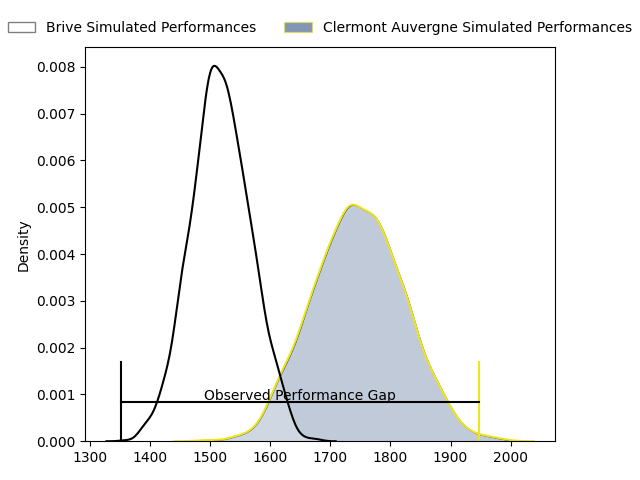

---  
layout: page  
title: Brive at Clermont Auvergne; 10-38  
date: 2023-03-25 17:00:00 18:00:00 -0500  
categories: match review  
---
# Brive at Clermont Auvergne; 10-38

# Club Level Predictions

The first set of predictions treats a club as the smallest object, as the club develops its members, organizes a gameplan, and deploys its players as needed for each match. This club model has a prediction of 0.793, which translates to predicting Clermont Auvergne to win by 11.8.

Each club has a rating and a rating deviation (simiar to a Glicko system), and expected performances can be generated. This allows for simulated matches and spreads like the ones below.
## Projected Performances

## Projected Spreads

## Projected Results

# Player Level Predictions

Treating teams instead as an entity made up of the currently active players, I have ratings for each player in an altogether different system. These can be combined to form team ratings once teamsheets are announced, weighting starters a bit higher than the reserves. After the match is played, players can be weighted by their minutes on the field, allowing for an accurate measure of the team's composition. With these compiled team ratings, we can make predictions, measure inaccuracy, and update the individual player ratings.
## Prediction with Player Minutes: Clermont Auvergne by 8.0

Clermont Auvergne by 4.0 on a neutral field

There were 4 large changes in win probability in this match
## Prediction without Player Minutes: Clermont Auvergne by 7.5

Clermont Auvergne by 3.5 on a neutral pitch

|   Away Minutes | Away Player               |   Away elo |   Away Percentile |   Number |   Home Percentile |   Home elo | Home Player        |   Home Minutes |
|---------------:|:--------------------------|-----------:|------------------:|---------:|------------------:|-----------:|:-------------------|---------------:|
|             47 | Wesley Tapueluelu         |      95.91 |                62 |        1 |                66 |      99.97 | Etienne Falgoux    |             66 |
|             47 | Motu Farao Matu'u         |      87.41 |                24 |        2 |                21 |      86.68 | Étienne Fourcade   |             55 |
|             41 | Marcel van der Merwe      |      88.11 |                23 |        3 |                44 |      92.35 | Cristian Ojovan    |             55 |
|             80 | Retief Marais             |      93.79 |                42 |        4 |                49 |      95.4  | Thibault Lanen     |             80 |
|             41 | Julien Delannoy           |     101.39 |                66 |        5 |                30 |      89.79 | Tomas Lavanini     |             70 |
|             80 | Esteban Abadie            |      84.96 |                17 |        6 |                45 |      93.62 | Arthur Iturria     |             57 |
|             80 | Saïd Hireche              |      96.25 |                51 |        7 |                63 |      96.57 | Fritz Lee          |             80 |
|             41 | Mesulame Kunavula         |      94.86 |                43 |        8 |               nan |      95.47 | Lucas Dessaigne    |             80 |
|             51 | Leo Carbonneau            |      73.21 |                 6 |        9 |                71 |      99.85 | Sebastien Bézy     |             55 |
|             80 | Stuart Olding             |      95    |               nan |       10 |                31 |      90.11 | Anthony Belleau    |             66 |
|             80 | Axel Muller               |      87.6  |                25 |       11 |                32 |      90.15 | Alivereti Raka     |             80 |
|             41 | Setareki Bituniyata       |      94.72 |                47 |       12 |                40 |      92.56 | George Moala       |             80 |
|             80 | Setariki Tuicuvu          |      93.99 |                44 |       13 |               nan |      95    | Julien Heriteau    |             60 |
|             80 | Arthur Bonneval           |      90.63 |                35 |       14 |                34 |      90.55 | Bautista Delguy    |             80 |
|             22 | Thomas Laranjeira         |      95    |               nan |       15 |                46 |      94.53 | Alex Newsome       |             80 |
|             58 | Sam Arnold                |      92.52 |               nan |       16 |                41 |      96.02 | Benjamin Boudou    |             25 |
|             39 | Mathis Ferté              |      73.35 |                 7 |       17 |                58 |      97.34 | Rabah Slimani      |             25 |
|             39 | Lucas Martin Paulos Adler |      93.9  |                45 |       18 |                45 |      93.86 | Baptiste Jauneau   |             25 |
|             39 | Rodrigo Bruni             |      95    |               nan |       19 |               nan |      95    | Loïc Godener       |             23 |
|             39 | Francisco Coria Marchetti |      84.12 |                16 |       20 |                61 |      94.34 | Cheikh Tiberghien  |             20 |
|             29 | Paul Abadie               |      92.78 |                34 |       21 |                62 |      98.27 | Jules Plisson      |             14 |
|             33 | Daniel Brennan            |      96.99 |                56 |       22 |                39 |      93.62 | Daniel Bibi Biziwu |             14 |
|             33 | Lucas Da Silva            |      95.81 |                59 |       23 |               nan |      94.29 | Edward Annandale   |             10 |

