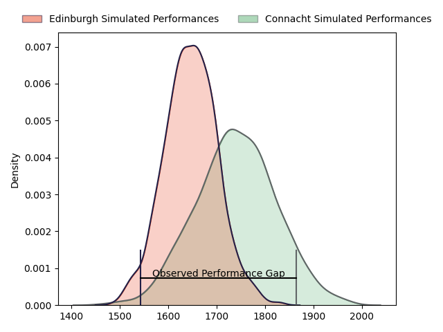
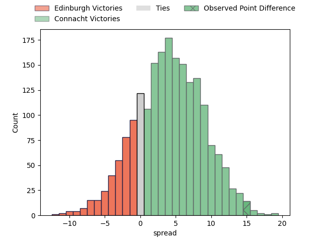

---  
layout: page  
title: Edinburgh at Connacht; 26-41  
date: 2023-03-25 16:00:00 18:00:00 -0500  
categories: match review  
---
# Edinburgh at Connacht; 26-41

# Club Level Predictions

The first set of predictions treats a club as the smallest object, as the club develops its members, organizes a gameplan, and deploys its players as needed for each match. This club model has a prediction of 0.63, which translates to predicting Connacht to win by 4.7.

Each club has a rating and a rating deviation (simiar to a Glicko system), and expected performances can be generated. This allows for simulated matches and spreads like the ones below.
## Projected Performances

## Projected Spreads

## Projected Results

# Player Level Predictions

Treating teams instead as an entity made up of the currently active players, I have ratings for each player in an altogether different system. These can be combined to form team ratings once teamsheets are announced, weighting starters a bit higher than the reserves. After the match is played, players can be weighted by their minutes on the field, allowing for an accurate measure of the team's composition. With these compiled team ratings, we can make predictions, measure inaccuracy, and update the individual player ratings.
## Prediction with Player Minutes: Connacht by 7.0

Connacht by 3.0 on a neutral field

There were 3 large changes in win probability in this match
## Prediction without Player Minutes: Connacht by 9.4

Connacht by 5.4 on a neutral pitch

|   Away Minutes | Away Player              |   Away elo |   Away Percentile |   Number |   Home Percentile |   Home elo | Home Player             |   Home Minutes |
|---------------:|:-------------------------|-----------:|------------------:|---------:|------------------:|-----------:|:------------------------|---------------:|
|             60 | Abram Adrian Boan Venter |      78.33 |                 8 |        1 |                74 |      99.77 | Peter Dooley            |             58 |
|             54 | Stuart McInally          |      91.53 |                37 |        2 |                55 |      96.22 | Dylan Tierney-Martin    |             54 |
|             38 | Lee-Roy Atalifo          |      91.58 |                35 |        3 |                71 |     101.11 | Jack Aungier            |             54 |
|             80 | Sam Skinner              |     115.12 |                89 |        4 |                50 |      93.27 | Oisin Dowling           |             80 |
|             80 | Grant Gilchrist          |     127.75 |                96 |        5 |                64 |     100.31 | Niall Murray            |             54 |
|             48 | Ben Muncaster            |      96.03 |               nan |        6 |                65 |     100.96 | Cian Prendergast        |             80 |
|             80 | Conor Boyle              |      84.07 |                17 |        7 |                68 |     102.08 | Conor Oliver            |             80 |
|             80 | Viliame Mata             |      80.48 |                12 |        8 |                63 |      97.66 | Jarrad Butler           |             58 |
|             60 | Henry Pyrgos             |      88.02 |                22 |        9 |                33 |      90.2  | Caolin Blade            |             67 |
|             80 | Blair Kinghorn           |     146.72 |                98 |       10 |                62 |     100.22 | David Hawkshaw          |             60 |
|             61 | Damien Hoyland           |      84.8  |                19 |       11 |                76 |     105.73 | John Porch              |             80 |
|             61 | James Lang               |      84.03 |                18 |       12 |                57 |      98.77 | Cathal Forde            |             80 |
|             80 | Mark Bennett             |      74.75 |                 8 |       13 |                45 |      94.27 | Thomas Farrell          |             80 |
|             80 | Darcy Graham             |      95    |               nan |       14 |                66 |     101.37 | Diarmuid Kilgallen      |             48 |
|             80 | Emiliano Boffelli        |      80.24 |                14 |       15 |               nan |      96.7  | Oran McNulty            |             80 |
|             42 | WP Nel                   |     131.59 |                98 |       16 |               nan |      94.48 | Shane Jennings          |             32 |
|              6 | Glen Young               |      96.66 |                54 |       17 |                68 |     103.33 | Darragh Murray          |             26 |
|             26 | David Cherry             |      90.89 |                33 |       18 |                40 |      95.57 | Dominic Robertson-McCoy |             26 |
|             26 | Marshall Sykes           |      87.57 |                25 |       19 |                60 |      95.67 | David Heffernan         |             26 |
|             20 | Ben Vellacott            |      91.44 |                37 |       20 |                36 |      92.78 | Shamus Hurley-Langton   |             22 |
|             20 | Luan de Bruin            |      93.44 |               nan |       21 |               nan |      99.85 | Jordan Duggan           |             22 |
|             19 | Chris Dean               |      90.83 |               nan |       22 |               nan |      96.04 | Tom Daly                |             20 |
|             19 | Nathan Sweeney           |      95    |               nan |       23 |                64 |     104.55 | Kieran Marmion          |             13 |

