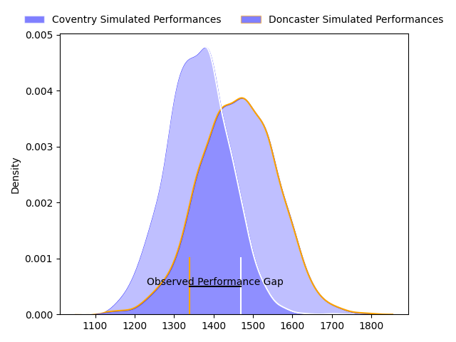
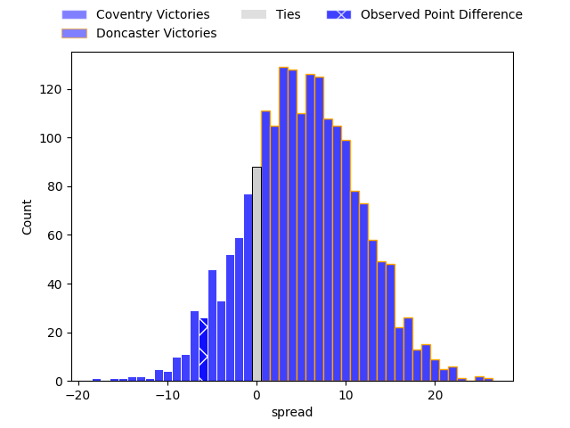

---  
layout: page  
title: Coventry at Doncaster; 45-39  
date: 2023-03-25 15:30:00 18:00:00 -0500  
categories: match review  
---
# Coventry at Doncaster; 45-39

# Club Level Predictions

The first set of predictions treats a club as the smallest object, as the club develops its members, organizes a gameplan, and deploys its players as needed for each match. This club model has a prediction of 0.64, which translates to predicting Doncaster to win by 5.1.

Each club has a rating and a rating deviation (simiar to a Glicko system), and expected performances can be generated. This allows for simulated matches and spreads like the ones below.
## Projected Performances

## Projected Spreads

## Projected Results

# Player Level Predictions

Treating teams instead as an entity made up of the currently active players, I have ratings for each player in an altogether different system. These can be combined to form team ratings once teamsheets are announced, weighting starters a bit higher than the reserves. After the match is played, players can be weighted by their minutes on the field, allowing for an accurate measure of the team's composition. With these compiled team ratings, we can make predictions, measure inaccuracy, and update the individual player ratings.
## Prediction with Player Minutes: Coventry by 13.3

Coventry by 17.3 on a neutral field

There were 5 large changes in win probability in this match
## Prediction without Player Minutes: Coventry by 7.8

Coventry by 11.8 on a neutral pitch

|   Away Minutes | Away Player                                                         |   Away elo |   Away Percentile |   Number |   Home Percentile |   Home elo | Home Player                                                     |   Home Minutes |
|---------------:|:--------------------------------------------------------------------|-----------:|------------------:|---------:|------------------:|-----------:|:----------------------------------------------------------------|---------------:|
|             45 | [Arthur Cordwell](..//playerfiles//ArthurCordwell_cleaned.md)       |      96.52 |               nan |        1 |                 7 |      72.84 | [Conor Davidson](..//playerfiles//ConorDavidson_cleaned.md)     |             60 |
|             67 | [Will Biggs](..//playerfiles//WillBiggs_cleaned.md)                 |     101.49 |                71 |        2 |                 7 |      75.16 | [George Roberts](..//playerfiles//GeorgeRoberts_cleaned.md)     |             72 |
|             45 | [Ollie Andrews](..//playerfiles//OllieAndrews_cleaned.md)           |     104.33 |                78 |        3 |               nan |      93.21 | [Andrew Foster](..//playerfiles//AndrewFoster_cleaned.md)       |             67 |
|             80 | [James Tyas](..//playerfiles//JamesTyas_cleaned.md)                 |      81.82 |                15 |        4 |                 1 |      49.54 | [Ehize Ehizode](..//playerfiles//EhizeEhizode_cleaned.md)       |              3 |
|             80 | [Adam Peters](..//playerfiles//AdamPeters_cleaned.md)               |     114.81 |                87 |        5 |               nan |      91.48 | [Theo Vukasinovic](..//playerfiles//TheoVukasinovic_cleaned.md) |             61 |
|             80 | [Tom Ball](..//playerfiles//TomBall_cleaned.md)                     |     121.12 |                92 |        6 |                78 |     107.53 | [Sam Hudson](..//playerfiles//SamHudson_cleaned.md)             |             80 |
|             80 | [Josh Bainbridge](..//playerfiles//JoshBainbridge_cleaned.md)       |     118.07 |                91 |        7 |                25 |      87.72 | [Rhys Tait](..//playerfiles//RhysTait_cleaned.md)               |             60 |
|             57 | [Senitiki Nayalo](..//playerfiles//SenitikiNayalo_cleaned.md)       |     107.89 |                78 |        8 |                29 |      89.5  | [John Kelly](..//playerfiles//JohnKelly_cleaned.md)             |             80 |
|             80 | [Will Chudley](..//playerfiles//WillChudley_cleaned.md)             |      95.41 |                50 |        9 |                75 |     104.47 | [Alex Dolly](..//playerfiles//AlexDolly_cleaned.md)             |             72 |
|             80 | [Evan Mitchell](..//playerfiles//EvanMitchell_cleaned.md)           |      82.33 |                12 |       10 |                30 |      89.96 | [Sam Olver](..//playerfiles//SamOlver_cleaned.md)               |             80 |
|             80 | [James Martin](..//playerfiles//JamesMartin_cleaned.md)             |      95.6  |                48 |       11 |                87 |     114.64 | [Maliq Holden](..//playerfiles//MaliqHolden_cleaned.md)         |             80 |
|             80 | [Lucas Titherington](..//playerfiles//LucasTitherington_cleaned.md) |     103.64 |                70 |       12 |                28 |      88.46 | [Connor Edwards](..//playerfiles//ConnorEdwards_cleaned.md)     |             80 |
|             80 | [Will Rigg](..//playerfiles//WillRigg_cleaned.md)                   |     104.49 |                72 |       13 |                 8 |      75.39 | [Joe Margetts](..//playerfiles//JoeMargetts_cleaned.md)         |             80 |
|             80 | [Will Talbot-Davies](..//playerfiles//WillTalbot-Davies_cleaned.md) |      92.3  |                41 |       14 |                 6 |      71.73 | [George Simpson](..//playerfiles//GeorgeSimpson_cleaned.md)     |             80 |
|             80 | [Louis Brown](..//playerfiles//LouisBrown_cleaned.md)               |     113.59 |                86 |       15 |                55 |      98.54 | [Billy McBryde](..//playerfiles//BillyMcBryde_cleaned.md)       |             67 |
|             35 | [James Kenny](..//playerfiles//JamesKenny_cleaned.md)               |      94.08 |                49 |       16 |                27 |      88.4  | [Max Williamson](..//playerfiles//MaxWilliamson_cleaned.md)     |             77 |
|             35 | [Jake Bridges](..//playerfiles//JakeBridges_cleaned.md)             |      86.95 |                17 |       17 |                44 |      91.48 | [Kai Owen](..//playerfiles//KaiOwen_cleaned.md)                 |             20 |
|             23 | [Rhys Thomas](..//playerfiles//RhysThomas_cleaned.md)               |     103.2  |                71 |       18 |                58 |      97.28 | [Jack Metcalf](..//playerfiles//JackMetcalf_cleaned.md)         |             20 |
|             13 | [Billy Harding](..//playerfiles//BillyHarding_cleaned.md)           |      83.77 |               nan |       19 |               nan |      94.78 | [Adam Hopkinson](..//playerfiles//AdamHopkinson_cleaned.md)     |             19 |
|            nan | nan                                                                 |     nan    |               nan |       20 |                 9 |      78.15 | [Karl Garside](..//playerfiles//KarlGarside_cleaned.md)         |             13 |
|            nan | nan                                                                 |     nan    |               nan |       21 |                 2 |      61.55 | [Robbie Smith](..//playerfiles//RobbieSmith_cleaned.md)         |             13 |
|            nan | nan                                                                 |     nan    |               nan |       22 |               nan |      92.83 | [Will Yarnell](..//playerfiles//WillYarnell_cleaned.md)         |              8 |
|            nan | nan                                                                 |     nan    |               nan |       23 |                52 |      95.44 | [Will Holling](..//playerfiles//WillHolling_cleaned.md)         |              8 |

