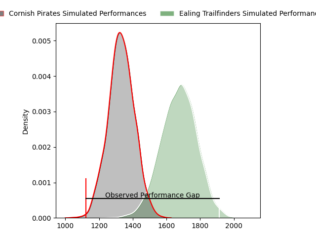
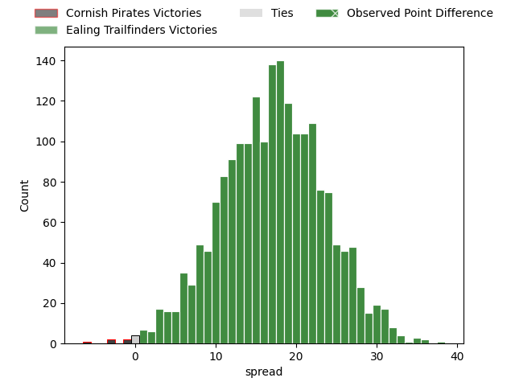

---  
layout: page  
title: Cornish Pirates at Ealing Trailfinders; 12-50  
date: 2023-03-25 16:00:00 18:00:00 -0500  
categories: match review  
---
# Cornish Pirates at Ealing Trailfinders; 12-50

# Club Level Predictions

The first set of predictions treats a club as the smallest object, as the club develops its members, organizes a gameplan, and deploys its players as needed for each match. This club model has a prediction of 0.87, which translates to predicting Ealing Trailfinders to win by 17.0.

Each club has a rating and a rating deviation (simiar to a Glicko system), and expected performances can be generated. This allows for simulated matches and spreads like the ones below.
## Projected Performances

## Projected Spreads

## Projected Results

# Player Level Predictions

Treating teams instead as an entity made up of the currently active players, I have ratings for each player in an altogether different system. These can be combined to form team ratings once teamsheets are announced, weighting starters a bit higher than the reserves. After the match is played, players can be weighted by their minutes on the field, allowing for an accurate measure of the team's composition. With these compiled team ratings, we can make predictions, measure inaccuracy, and update the individual player ratings.
## Prediction with Player Minutes: Ealing Trailfinders by 15.4

Ealing Trailfinders by 11.4 on a neutral field

There were 3 large changes in win probability in this match
## Prediction without Player Minutes: Ealing Trailfinders by 17.2

Ealing Trailfinders by 13.2 on a neutral pitch

|   Away Minutes | Away Player       |   Away elo |   Away Percentile |   Number |   Home Percentile |   Home elo | Home Player             |   Home Minutes |
|---------------:|:------------------|-----------:|------------------:|---------:|------------------:|-----------:|:------------------------|---------------:|
|             52 | Ollie Adkins      |      80.38 |                 9 |        1 |                93 |     114.58 | Will Davis              |             79 |
|             52 | Morgan Nelson     |      98.25 |               nan |        2 |                52 |      95.41 | Alun Walker             |             69 |
|             47 | Harvey Beaton     |      87.61 |                22 |        3 |                52 |      95.96 | George Davis            |             60 |
|             80 | James Fender      |      94.29 |                48 |        4 |                64 |     100.32 | Andrew Davidson         |             80 |
|             56 | Steele Barker     |      93.88 |                44 |        5 |               nan |      92.09 | Barney Maddison         |             80 |
|             80 | Alex Everett      |      93.19 |                43 |        6 |                59 |      98.85 | Rob Farrar              |             80 |
|             60 | Will Gibson       |      95.58 |                49 |        7 |                92 |     121.03 | Ollie Newman            |             52 |
|             80 | Ben Grubb         |      95    |               nan |        8 |                70 |     104.09 | Jack Digby              |             70 |
|             44 | Alex Schwarz      |      82.26 |                15 |        9 |                64 |      99.85 | Craig Hampson           |             65 |
|             60 | Harry Bazalgette  |     100.88 |                64 |       10 |                52 |      97.53 | Craig Willis            |             33 |
|             80 | Arthur Relton     |      99.59 |                62 |       11 |                77 |     105.9  | Cian Kelleher           |             80 |
|             52 | Joe Elderkin      |      89.42 |                31 |       12 |                69 |     101.58 | Patrick Benjamin Howard |             78 |
|             80 | Rory Parata       |      99.86 |                60 |       13 |                74 |     105.49 | Max Bodilly             |             80 |
|             80 | Robin Wedlake     |      97.55 |                55 |       14 |                99 |     147.81 | James Cordy-Redden      |             80 |
|             80 | Alexander AJ Cant |     119.86 |                91 |       15 |                53 |      97.51 | Jonah Holmes            |             80 |
|             36 | Ruaridh Dawson    |      94.64 |                42 |       16 |                 1 |      54.28 | Dan Lancaster           |             47 |
|             33 | Matt Johnson      |      99.99 |                74 |       17 |                75 |     104.62 | Simon Uzokwe            |             28 |
|             28 | Hayden King       |      99.86 |               nan |       18 |                30 |      94.86 | Ross Kane               |             20 |
|             28 | Garyn Smith       |      90.68 |                42 |       19 |                82 |     102.33 | Jordan Burns            |             15 |
|             24 | Cory Teague       |      67.9  |                 4 |       20 |                50 |      95.5  | Shaun Malton            |             11 |
|             28 | William Crane     |      92.38 |                40 |       21 |                44 |      95.31 | Will Montgomery         |             10 |
|             20 | Carwyn Penny      |      86.73 |                32 |       22 |                13 |      80.98 | Reuben Bird-Tulloch     |              2 |
|             20 | Max Norey         |      90.48 |               nan |       23 |               nan |      95    | Lefty Zigiriadis        |              1 |

