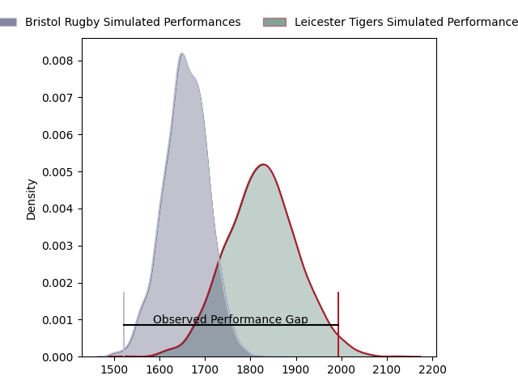

---  
layout: page  
title: Bristol Rugby at Leicester Tigers; 24.0-46.0  
date: 2023-03-25 08:30:00 18:00:00 -0500  
categories: match review  
---
# Bristol Rugby at Leicester Tigers; 24.0-46.0

# Club Level Predictions

The first set of predictions treats a club as the smallest object, as the club develops its members, organizes a gameplan, and deploys its players as needed for each match. This club model has a prediction of 0.724, which translates to predicting Leicester Tigers to win by 8.5.

Each club has a rating and a rating deviation (simiar to a Glicko system), and expected performances can be generated. This allows for simulated matches and spreads like the ones below.
## Projected Performances

## Projected Spreads

## Projected Results

# Player Level Predictions

Treating teams instead as an entity made up of the currently active players, I have ratings for each player in an altogether different system. These can be combined to form team ratings once teamsheets are announced, weighting starters a bit higher than the reserves. After the match is played, players can be weighted by their minutes on the field, allowing for an accurate measure of the team's composition. With these compiled team ratings, we can make predictions, measure inaccuracy, and update the individual player ratings.
## Prediction with Player Minutes: Bristol Rugby by 0.5

Bristol Rugby by 4.5 on a neutral field

There were 9 large changes in win probability in this match
## Prediction without Player Minutes: Leicester Tigers by 1.4

Bristol Rugby by 2.6 on a neutral pitch

|   Away Minutes | Away Player     |   Away elo |   Away Percentile |   Number |   Home Percentile |   Home elo | Home Player         |   Home Minutes |
|---------------:|:----------------|-----------:|------------------:|---------:|------------------:|-----------:|:--------------------|---------------:|
|             49 | Yann Thomas     |      91.99 |                37 |        1 |                87 |     109.37 | Tom West            |             50 |
|             49 | Harry Thacker   |      93.71 |                45 |        2 |                26 |      87.84 | Julian Montoya      |             68 |
|             46 | Max Lahiff      |      94.7  |                49 |        3 |                82 |     105.66 | Joe Heyes           |             50 |
|              7 | Samuel Lewis    |     103.98 |                72 |        4 |                67 |     102.1  | George Martin       |             80 |
|             80 | Chris Vui       |     111.41 |                85 |        5 |                92 |     122.24 | Cameron Henderson   |             72 |
|             80 | Steven Luatua   |     132.89 |                97 |        6 |                95 |     127.05 | Hanro Liebenberg    |             80 |
|             80 | Fitz Harding    |     115.7  |                88 |        7 |                77 |     106.51 | Olly Cracknell      |             51 |
|             73 | Magnus Bradbury |      91.9  |                36 |        8 |                77 |     107.07 | Jasper Wiese        |             80 |
|             75 | Harry Randall   |     111.99 |                88 |        9 |                38 |      91.77 | Ben Youngs          |             61 |
|             80 | AJ MacGinty     |     108    |                79 |       10 |                95 |     130.12 | Handre Pollard      |             72 |
|             73 | Gabriel Ibitoye |     109.4  |                82 |       11 |                65 |     100.83 | Harry Potter        |             80 |
|             72 | James Williams  |     105.5  |                74 |       12 |                75 |     105.72 | Jimmy Gopperth      |             80 |
|             80 | Semi Radradra   |     128.3  |                96 |       13 |                28 |      88.39 | Matt Scott          |             61 |
|             80 | Ioan Lloyd      |      87.47 |                11 |       14 |                25 |      87.48 | Anthony Watson      |             80 |
|             80 | Charles Piutau  |     119.95 |                91 |       15 |                79 |     108.94 | Mike Brown          |             80 |
|             31 | Fred Davies     |      95.45 |               nan |       16 |                 4 |      73.76 | Charlie Clare       |             12 |
|             31 | Ellis Genge     |      97.14 |                57 |       17 |                92 |     115.34 | James Cronin        |             30 |
|             34 | George Kloska   |     101.48 |               nan |       18 |                16 |      84.03 | Dan Cole            |             30 |
|              7 | Jake Heenan     |      91.17 |                27 |       19 |                42 |      93.02 | Eli Snyman          |              8 |
|             73 | Daniel Thomas   |     111.8  |                88 |       20 |                81 |     113.25 | Tommy Reffell       |             29 |
|              5 | Andy Uren       |      73.47 |                 4 |       21 |                41 |      92.66 | Jack van Poortvliet |             19 |
|              8 | Sam Bedlow      |     119.53 |                86 |       22 |                52 |      98.72 | Charlie Atkinson    |              8 |
|              7 | Noah Heward     |      96.42 |                51 |       23 |                60 |     100.05 | Freddie Steward     |             19 |

