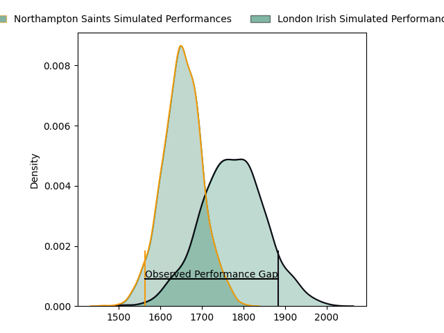
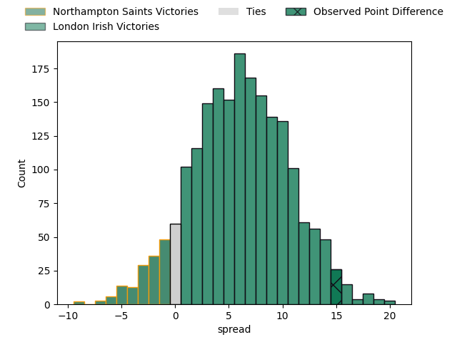

---  
layout: page  
title: Northampton Saints at London Irish; 22.0-37.0  
date: 2023-03-25 13:30:00 18:00:00 -0500  
categories: match review  
---
# Northampton Saints at London Irish; 22.0-37.0

# Club Level Predictions

The first set of predictions treats a club as the smallest object, as the club develops its members, organizes a gameplan, and deploys its players as needed for each match. This club model has a prediction of 0.67, which translates to predicting London Irish to win by 6.2.

Each club has a rating and a rating deviation (simiar to a Glicko system), and expected performances can be generated. This allows for simulated matches and spreads like the ones below.
## Projected Performances

## Projected Spreads

## Projected Results

# Player Level Predictions

Treating teams instead as an entity made up of the currently active players, I have ratings for each player in an altogether different system. These can be combined to form team ratings once teamsheets are announced, weighting starters a bit higher than the reserves. After the match is played, players can be weighted by their minutes on the field, allowing for an accurate measure of the team's composition. With these compiled team ratings, we can make predictions, measure inaccuracy, and update the individual player ratings.
## Prediction with Player Minutes: London Irish by 12.8

London Irish by 8.8 on a neutral field

There were 10 large changes in win probability in this match
## Prediction without Player Minutes: London Irish by 14.6

London Irish by 10.6 on a neutral pitch

|   Away Minutes | Away Player          |   Away elo |   Away Percentile |   Number |   Home Percentile |   Home elo | Home Player                |   Home Minutes |
|---------------:|:---------------------|-----------:|------------------:|---------:|------------------:|-----------:|:---------------------------|---------------:|
|             62 | Alex Waller          |     130.66 |                98 |        1 |                57 |      97.16 | Danilo Fischetti           |             72 |
|             22 | Robbie Smith         |      88.9  |                29 |        2 |                93 |     116.71 | Agustin Creevy             |             53 |
|             33 | Trevor Davison       |      66.28 |                 2 |        3 |                90 |     112.45 | Oli Hoskins                |             57 |
|             80 | David Ribbans        |     104.02 |                72 |        4 |                49 |      95.37 | Api Ratuniyarawa           |             56 |
|             62 | Alex Moon            |     114.77 |                88 |        5 |                98 |     136.96 | Rob Simmons                |             80 |
|             80 | Lukhan Salakaia-Loto |      81    |                14 |        6 |                85 |     111.87 | Matt Rogerson              |             57 |
|             80 | Lewis Ludlam         |      93.73 |                45 |        7 |                97 |     133.55 | Tom Pearson                |             80 |
|             70 | Juarno Augustus      |      96.79 |                47 |        8 |                85 |     112.17 | So'otala Fa'aso'o          |             62 |
|             70 | Alex Mitchell        |     104.2  |                80 |        9 |                57 |      98.03 | Hugh O'Sullivan            |             53 |
|             50 | Fin Smith            |      83.6  |                16 |       10 |                94 |     127.49 | Paddy Jackson              |             80 |
|             80 | Tommy Freeman        |     109.85 |                83 |       11 |                15 |      82.55 | Ollie Hassell-Collins      |             80 |
|             80 | Rory Hutchinson      |      89.19 |                28 |       12 |                67 |     102.37 | Rory Jennings              |             80 |
|             80 | Fraser Dingwall      |      73.88 |                 7 |       13 |                84 |     112.34 | Benhard Janse van Rensburg |             80 |
|             80 | James Ramm           |     130.43 |                96 |       14 |                26 |      88.02 | Lucio Cinti                |             62 |
|             80 | George Furbank       |     127.89 |                95 |       15 |                87 |     115.24 | Ben Loader                 |             80 |
|             58 | Tom Cruse            |      89.86 |                65 |       16 |                 6 |      77.19 | Mike Willemse              |             27 |
|             18 | Ethan Waller         |     101.82 |                69 |       17 |               nan |      94.83 | Tarek Haffar               |              8 |
|             47 | Paul Hill            |     104.13 |                78 |       18 |                 9 |      81.51 | Lovejoy Chawatama          |             23 |
|             18 | Angus Scott-Young    |     112.11 |                85 |       19 |                86 |     108.13 | Chunya Munga               |             24 |
|             10 | Sam Graham           |     121.47 |                93 |       20 |                41 |      92.43 | Juan Martin Gonzalez       |             23 |
|             10 | Tom James            |     101.22 |                68 |       21 |                63 |     102.46 | Chandler Cunningham-South  |             18 |
|              0 | Tom Litchfield       |      91.62 |               nan |       22 |                22 |      86.82 | Joe Powell                 |             27 |
|             30 | Tom Collins          |     119.79 |                91 |       23 |                64 |     100.28 | Henry Arundell             |             18 |

