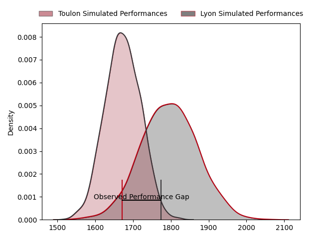
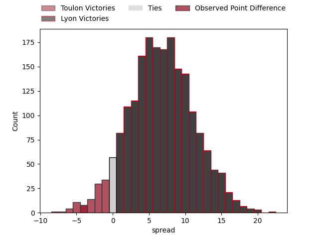

---  
layout: page  
title: Toulon at Lyon; 27-23  
date: 2023-03-25 17:00:00 18:00:00 -0500  
categories: match review  
---
# Toulon at Lyon; 27-23

# Club Level Predictions

The first set of predictions treats a club as the smallest object, as the club develops its members, organizes a gameplan, and deploys its players as needed for each match. This club model has a prediction of 0.677, which translates to predicting Lyon to win by 6.5.

Each club has a rating and a rating deviation (simiar to a Glicko system), and expected performances can be generated. This allows for simulated matches and spreads like the ones below.
## Projected Performances

## Projected Spreads

## Projected Results

# Player Level Predictions

Treating teams instead as an entity made up of the currently active players, I have ratings for each player in an altogether different system. These can be combined to form team ratings once teamsheets are announced, weighting starters a bit higher than the reserves. After the match is played, players can be weighted by their minutes on the field, allowing for an accurate measure of the team's composition. With these compiled team ratings, we can make predictions, measure inaccuracy, and update the individual player ratings.
## Prediction with Player Minutes: Toulon by 2.4

Toulon by 6.4 on a neutral field

There were 9 large changes in win probability in this match
## Prediction without Player Minutes: Toulon by 4.4

Toulon by 8.4 on a neutral pitch

|   Away Minutes | Away Player         |   Away elo |   Away Percentile |   Number |   Home Percentile |   Home elo | Home Player               |   Home Minutes |
|---------------:|:--------------------|-----------:|------------------:|---------:|------------------:|-----------:|:--------------------------|---------------:|
|             47 | Dany Priso          |     102.96 |                76 |        1 |                35 |      91.38 | Sébastien Taofifenua      |             56 |
|             50 | Teddy Baubigny      |     107.32 |                84 |        2 |                72 |     101.91 | Liam Coltman              |             56 |
|             47 | Kieran Brookes      |      98.78 |                38 |        3 |                69 |     100.44 | Demba Bamba               |             56 |
|             80 | Swan Rebbadj        |     101.88 |                67 |        4 |                62 |      99.7  | Temo Sukayawa Mayanavanua |             16 |
|             80 | Brian Alainu'uese   |     109.49 |                82 |        5 |                73 |     104.05 | Romain Taofifenua         |             80 |
|             75 | Cornell du Preez    |     107.7  |                78 |        6 |                75 |     105.09 | Félix Lambey              |             80 |
|             80 | Charles Ollivon     |     136.92 |                97 |        7 |                94 |     124.94 | Beka Saghinadze           |             66 |
|             50 | Mathieu Bastareaud  |      92.82 |                35 |        8 |                49 |      97.16 | Arno Botha                |             80 |
|             56 | Baptiste Serin      |     107.57 |                81 |        9 |                31 |      85.63 | Baptiste Couilloud        |             59 |
|             56 | Ihaia West          |     105.71 |                75 |       10 |                76 |     102.2  | Léo Berdeu                |             80 |
|             80 | Jiuta Wainiqolo     |     104.93 |                75 |       11 |                90 |     117.5  | Davit Niniashvili         |             80 |
|             80 | Duncan Paia'aua     |     106.1  |                75 |       12 |                70 |     104    | Josua Tuisova             |             80 |
|             80 | Waisea Nayacavelu   |     104.22 |                71 |       13 |                74 |     105.28 | Josiah Maraku             |             80 |
|             38 | Cheslin Kolbe       |     107.62 |                79 |       14 |                85 |     112.26 | Ethan Dumortier           |             80 |
|             80 | Thomas Salles       |      97.91 |                53 |       15 |                40 |      91.68 | Toby Arnold               |             39 |
|             42 | Jérémy Sinzelle     |      91.11 |                32 |       16 |                25 |      87.72 | Loann Goujon              |             64 |
|             33 | Bruce Devaux        |      99.67 |                58 |       17 |                22 |      86.29 | Lima Sopoaga              |             41 |
|             33 | Beka Gigashvili     |     113.05 |                90 |       18 |                65 |     100.9  | Jerome Rey                |             24 |
|             30 | Christopher Tolofua |      92.4  |               nan |       19 |                39 |      92.36 | Francisco Gomez Kodela    |             24 |
|             30 | Facundo Isa         |     106.19 |                76 |       20 |               nan |      94.33 | Yanis Charcosset          |             24 |
|             24 | Benoit Paillaugue   |      89.72 |                28 |       21 |                58 |      98.28 | Jonathan Pelissié         |             21 |
|             24 | Dan Biggar          |     139.3  |                98 |       22 |                47 |      96.72 | Mickael Guillard          |             14 |
|              5 | Matthias Halagahu   |     102.23 |                68 |       23 |               nan |     nan    | nan                       |            nan |

