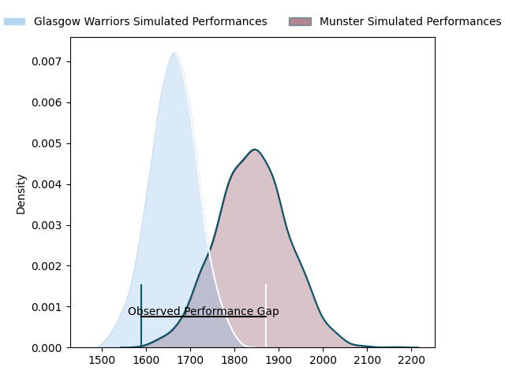
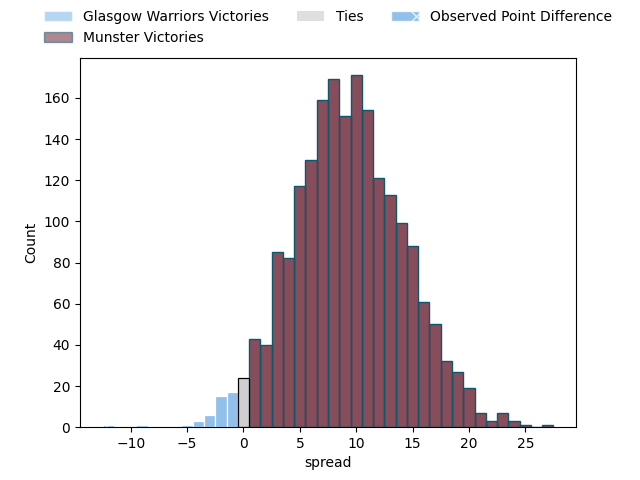

---  
layout: page  
title: Glasgow Warriors at Munster; 38-26  
date: 2023-03-25 18:15:00 18:00:00 -0500  
categories: match review  
---
# Glasgow Warriors at Munster; 38-26

# Club Level Predictions

The first set of predictions treats a club as the smallest object, as the club develops its members, organizes a gameplan, and deploys its players as needed for each match. This club model has a prediction of 0.743, which translates to predicting Munster to win by 9.4.

Each club has a rating and a rating deviation (simiar to a Glicko system), and expected performances can be generated. This allows for simulated matches and spreads like the ones below.
## Projected Performances

## Projected Spreads

## Projected Results

# Player Level Predictions

Treating teams instead as an entity made up of the currently active players, I have ratings for each player in an altogether different system. These can be combined to form team ratings once teamsheets are announced, weighting starters a bit higher than the reserves. After the match is played, players can be weighted by their minutes on the field, allowing for an accurate measure of the team's composition. With these compiled team ratings, we can make predictions, measure inaccuracy, and update the individual player ratings.
## Prediction with Player Minutes: Munster by 10.7

Munster by 6.7 on a neutral field

There were 7 large changes in win probability in this match
## Prediction without Player Minutes: Munster by 10.4

Munster by 6.4 on a neutral pitch

|   Away Minutes | Away Player              |   Away elo |   Away Percentile |   Number |   Home Percentile |   Home elo | Home Player              |   Home Minutes |
|---------------:|:-------------------------|-----------:|------------------:|---------:|------------------:|-----------:|:-------------------------|---------------:|
|             57 | Nathan McBeth            |      97.98 |                60 |        1 |                82 |     105.85 | Dave Kilcoyne            |             40 |
|             46 | Fraser Brown             |     104.61 |                69 |        2 |                58 |      97.48 | Diarmuid Barron          |             52 |
|             65 | Zander Fagerson          |     108.83 |                87 |        3 |                85 |     107.79 | Roman Salanoa            |             52 |
|             57 | Jean-Pierre du Preez     |     109.47 |                82 |        4 |                87 |     112.97 | Jean Kleyn               |             59 |
|             80 | Scott Cummings           |      95.19 |                49 |        5 |                67 |     101.55 | Fineen Wycherley         |             80 |
|             76 | Matt Fagerson            |      98.18 |                63 |        6 |                69 |     102.98 | Jack O'Donoghue          |             52 |
|             80 | Rory Darge               |      93.67 |                44 |        7 |                84 |     111.03 | John Hodnett             |             80 |
|             65 | Sione Vailanu            |      99.25 |                57 |        8 |                85 |     111.83 | Gavin Coombes            |             80 |
|             57 | Ali Price                |      95.99 |                47 |        9 |                79 |     105.95 | Paddy Patterson          |             44 |
|             76 | Domingo Miotti           |      96.29 |                48 |       10 |                74 |     105.26 | Joey Carbery             |             62 |
|             80 | Jamie Dobie              |     100.42 |                62 |       11 |                88 |     116.1  | Shane Daly               |             80 |
|             80 | Sam Johnson              |     107.85 |                78 |       12 |                72 |     102.91 | Jack Crowley             |             80 |
|             80 | Stafford McDowall        |     107.85 |                78 |       13 |                86 |     114    | Malakai Fekitoa          |             80 |
|             80 | Cole Forbes              |     107.85 |                79 |       14 |                46 |      94.49 | Calvin Nash              |             80 |
|             80 | Ollie Smith              |     111.18 |                84 |       15 |                67 |     103.72 | Michael Haley            |             66 |
|             34 | Johnny Matthews          |      97.72 |                59 |       16 |                82 |     105.72 | Josh Wycherley           |             40 |
|             23 | Allan Michael Elgin Dell |      94.43 |                47 |       17 |                86 |     110.88 | Craig Casey              |             36 |
|             23 | Lewis Bean               |     103.64 |                72 |       18 |                84 |     112.33 | Alex Kendellen           |             28 |
|             23 | George Horne             |     100.4  |                66 |       19 |               nan |     100.48 | Stephen Archer           |             28 |
|             15 | Thomas Gordon            |     105.59 |                77 |       20 |               nan |     114.39 | Scott Buckley            |             28 |
|             15 | Lucio Sordoni            |      97.35 |                58 |       21 |               nan |      93.93 | Rudolph Gerhardus Snyman |             21 |
|              4 | Tom Jordan               |      84.4  |                17 |       22 |                57 |     100.44 | Rory Scannell            |             18 |
|              4 | Alex Samuel              |     106.55 |                75 |       23 |                69 |     102.34 | Simon Zebo               |             14 |

