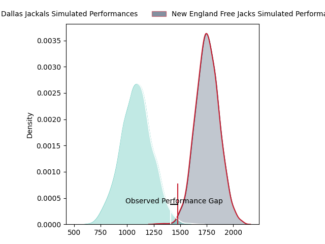
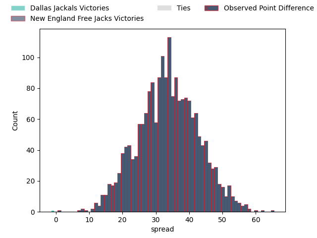

---  
layout: page  
title: Dallas Jackals at New England Free Jacks; 9-10  
date: 2023-03-25 21:30:00 18:00:00 -0500  
categories: match review  
---
# Dallas Jackals at New England Free Jacks; 9-10

# Club Level Predictions

The first set of predictions treats a club as the smallest object, as the club develops its members, organizes a gameplan, and deploys its players as needed for each match. This club model has a prediction of 0.971, which translates to predicting New England Free Jacks to win by 33.6.

Each club has a rating and a rating deviation (simiar to a Glicko system), and expected performances can be generated. This allows for simulated matches and spreads like the ones below.
## Projected Performances

## Projected Spreads

## Projected Results

# Player Level Predictions

Treating teams instead as an entity made up of the currently active players, I have ratings for each player in an altogether different system. These can be combined to form team ratings once teamsheets are announced, weighting starters a bit higher than the reserves. After the match is played, players can be weighted by their minutes on the field, allowing for an accurate measure of the team's composition. With these compiled team ratings, we can make predictions, measure inaccuracy, and update the individual player ratings.
## Prediction with Player Minutes: New England Free Jacks by 25.1

New England Free Jacks by 21.1 on a neutral field

There were 5 large changes in win probability in this match
## Prediction without Player Minutes: New England Free Jacks by 31.7

New England Free Jacks by 27.7 on a neutral pitch

|   Away Minutes | Away Player         |   Away elo |   Away Percentile |   Number |   Home Percentile |   Home elo | Home Player        |   Home Minutes |
|---------------:|:--------------------|-----------:|------------------:|---------:|------------------:|-----------:|:-------------------|---------------:|
|             67 | Nicolas Revol       |     103.2  |                76 |        1 |                63 |     100.36 | Foster Dewitt      |             48 |
|             69 | Dewald Kotze        |      76.98 |                 7 |        2 |               nan |      96.23 | Kianu Kereru-Symes |             48 |
|             61 | Juan Pablo Zeiss    |      88.73 |                26 |        3 |               nan |     100.77 | Joel Hintz         |             48 |
|             80 | Sam Golla           |      87.47 |                24 |        4 |                90 |     116.75 | Semisi Paea        |             57 |
|             80 | Lucas Bur           |      91.81 |                38 |        5 |                92 |     118.45 | Conor Keys         |             80 |
|             80 | Jeronimo Gomez Vara |      83.62 |                15 |        6 |                78 |     111.06 | Mitchell Jacobson  |             80 |
|             80 | Conrado Roura       |      27.5  |                 0 |        7 |                 0 |      31.34 | Joe Johnston       |             70 |
|             77 | Jan Adriaan Booysen |      85.37 |                20 |        8 |                97 |     130.59 | Wian Conradie      |             80 |
|             80 | Nazareno Valentini  |      91.17 |                36 |        9 |               nan |      97.6  | Kieran McClea      |             57 |
|             80 | Martin Elias        |     133.39 |                96 |       10 |                94 |     128.47 | Jayson Potroz      |             80 |
|             80 | James Vaifale       |     108.08 |                80 |       11 |                96 |     130.59 | Paul Balekana      |             80 |
|             80 | Alejandro Torres    |      63    |                 2 |       12 |                 5 |      69.13 | Wayne van der Bank |             80 |
|             80 | Tomas Malanos       |     108.71 |                79 |       13 |                86 |     113.65 | Ben Lesage         |             80 |
|             80 | Lui Sitama          |      94.04 |                58 |       14 |                87 |     114.45 | Taniela Filimone   |             57 |
|             80 | Marcos Moroni       |      88.72 |                31 |       15 |                86 |     112.8  | Reece MacDonald    |             73 |
|             13 | Liam Murray         |      44.84 |                 0 |       16 |                 9 |      79.1  | Kyle Ciquera       |             32 |
|             11 | Connor Robinson     |      93.78 |               nan |       17 |                88 |     111.63 | Andrew Quattrin    |             32 |
|             19 | Kyle Steeves        |      94.2  |               nan |       18 |                94 |     118.92 | Cole Keith         |             32 |
|              3 | Cameron Nelson      |      95    |               nan |       19 |                79 |     109.96 | Sam Fischli        |             23 |
|            nan | nan                 |     nan    |               nan |       20 |                 0 |      28.87 | Cam Davidowicz     |             10 |
|            nan | nan                 |     nan    |               nan |       21 |                 0 |      15.54 | Holden Yungert     |             23 |
|            nan | nan                 |     nan    |               nan |       22 |                 8 |      76.64 | Zach Bastres       |             23 |
|            nan | nan                 |     nan    |               nan |       23 |                 6 |      72.32 | Spencer Jones      |              7 |

