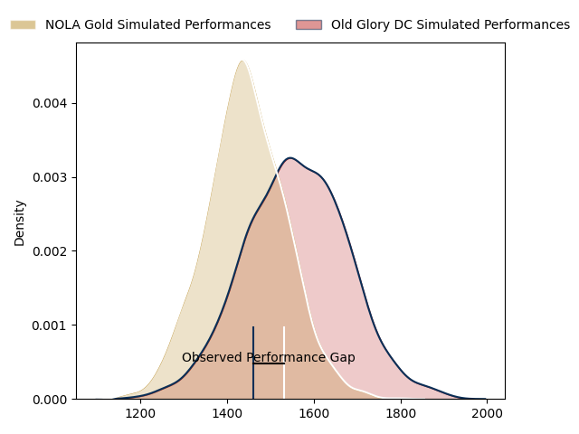
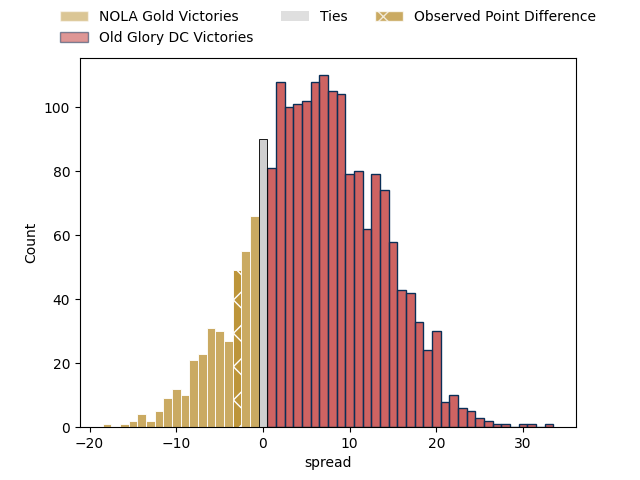

---  
layout: page  
title: NOLA Gold at Old Glory DC; 20-17  
date: 2023-03-25 20:00:00 18:00:00 -0500  
categories: match review  
---
# NOLA Gold at Old Glory DC; 20-17

# Club Level Predictions

The first set of predictions treats a club as the smallest object, as the club develops its members, organizes a gameplan, and deploys its players as needed for each match. This club model has a prediction of 0.659, which translates to predicting Old Glory DC to win by 5.9.

Each club has a rating and a rating deviation (simiar to a Glicko system), and expected performances can be generated. This allows for simulated matches and spreads like the ones below.
## Projected Performances

## Projected Spreads

## Projected Results

# Player Level Predictions

Treating teams instead as an entity made up of the currently active players, I have ratings for each player in an altogether different system. These can be combined to form team ratings once teamsheets are announced, weighting starters a bit higher than the reserves. After the match is played, players can be weighted by their minutes on the field, allowing for an accurate measure of the team's composition. With these compiled team ratings, we can make predictions, measure inaccuracy, and update the individual player ratings.
## Prediction with Player Minutes: NOLA Gold by 5.4

NOLA Gold by 9.4 on a neutral field

There were 11 large changes in win probability in this match
## Prediction without Player Minutes: Old Glory DC by 0.8

NOLA Gold by 3.2 on a neutral pitch

|   Away Minutes | Away Player                              |   Away elo |   Away Percentile |   Number |   Home Percentile |   Home elo | Home Player              |   Home Minutes |
|---------------:|:-----------------------------------------|-----------:|------------------:|---------:|------------------:|-----------:|:-------------------------|---------------:|
|             52 | Matt Harmon                              |      89.19 |               nan |        1 |                 0 |      16.76 | Jack Iscaro              |             72 |
|             80 | Pat O'Toole                              |      81.5  |                12 |        2 |                47 |      94.17 | Nic Souchon              |             45 |
|             62 | Sean Bradley Paranihi                    |     110.84 |                89 |        3 |                37 |      92    | Ramiro Herrera           |             49 |
|             80 | Cameron Dolan                            |      99.37 |                61 |        4 |                55 |      97.43 | Colin Grosse             |             78 |
|             72 | Billy Stewart                            |     143.24 |                99 |        5 |                 3 |      63.62 | Tevita Naqali            |             80 |
|             62 | Malcolm May                              |      78.54 |                10 |        6 |                79 |     107.6  | Lautaro Ezequiel Bavaro  |             80 |
|             80 | Moni Tonga'uiha                          |      41.06 |                 0 |        7 |                46 |      94.23 | Brady Daniel             |             55 |
|             80 | Tom Florence                             |     100.14 |                60 |        8 |                73 |     105.26 | Jamason Fa'anana Schultz |             80 |
|             80 | Luke Campbell                            |     109.22 |                83 |        9 |                14 |      81.88 | Danny Joseph Tusitala    |             78 |
|             80 | Rodney Iona                              |      99.48 |                59 |       10 |                44 |      94.4  | Joaquin Diaz Bonilla     |             80 |
|             62 | Cael Hodgson                             |      63.74 |                 3 |       11 |                 6 |      73.45 | Owen Sheehy              |             65 |
|             80 | Jordan Jackson-Hope                      |      99.58 |                60 |       12 |                95 |     126.14 | Fermin Martinez          |             80 |
|             80 | Philippus Jacobus Snyman (JP) du Plessis |     102.82 |                68 |       13 |                 1 |      52.88 | William Talataina-Mu     |             72 |
|             80 | Dougie Fife                              |     111.71 |                84 |       14 |                64 |     100.28 | Marcos Young             |             80 |
|             80 | Jordan Trainor                           |      96.61 |                50 |       15 |                82 |     109.72 | Mike Dabulas             |             80 |
|             28 | Jarred Adams                             |      98.18 |                60 |       16 |                 1 |      60.87 | Quentin Newcomer         |              8 |
|             18 | Doc Irey                                 |      89.49 |                24 |       17 |               nan |      95.31 | Facundo Gattas           |             35 |
|              8 | Will Waguespack                          |      88.88 |               nan |       18 |                55 |      98.22 | Kyle Stewart             |             31 |
|             18 | Maciu Koroi                              |     104.12 |                67 |       19 |                40 |      93.69 | Fintan Coleman           |              2 |
|             18 | Ross Depperschmidt                       |      46.85 |                 0 |       20 |                68 |     103.28 | Alejandro Daireaux       |             25 |
|            nan | nan                                      |     nan    |               nan |       21 |               nan |      90.84 | John LeFevre             |              2 |
|            nan | nan                                      |     nan    |               nan |       22 |                38 |      93.54 | Thretton Palamo          |             15 |
|            nan | nan                                      |     nan    |               nan |       23 |               nan |      93.99 | Gradyn Bowd              |              8 |

