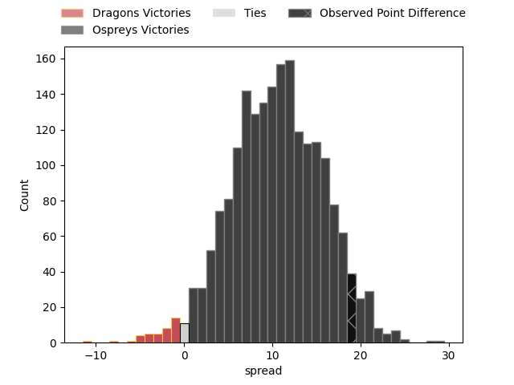

---  
layout: page  
title: Dragons at Ospreys; 18-37  
date: 2023-03-25 14:00:00 18:00:00 -0500  
categories: match review  
---
# Dragons at Ospreys; 18-37

# Club Level Predictions

The first set of predictions treats a club as the smallest object, as the club develops its members, organizes a gameplan, and deploys its players as needed for each match. This club model has a prediction of 0.769, which translates to predicting Ospreys to win by 10.6.

Each club has a rating and a rating deviation (simiar to a Glicko system), and expected performances can be generated. This allows for simulated matches and spreads like the ones below.
## Projected Performances

## Projected Spreads

## Projected Results

# Player Level Predictions

Treating teams instead as an entity made up of the currently active players, I have ratings for each player in an altogether different system. These can be combined to form team ratings once teamsheets are announced, weighting starters a bit higher than the reserves. After the match is played, players can be weighted by their minutes on the field, allowing for an accurate measure of the team's composition. With these compiled team ratings, we can make predictions, measure inaccuracy, and update the individual player ratings.
## Prediction with Player Minutes: Ospreys by 5.5

Ospreys by 1.5 on a neutral field

There were 8 large changes in win probability in this match
## Prediction without Player Minutes: Ospreys by 5.2

Ospreys by 1.2 on a neutral pitch

|   Away Minutes | Away Player                 |   Away elo |   Away Percentile |   Number |   Home Percentile |   Home elo | Home Player            |   Home Minutes |
|---------------:|:----------------------------|-----------:|------------------:|---------:|------------------:|-----------:|:-----------------------|---------------:|
|             47 | Rhodri Jones                |      97.66 |                59 |        1 |                36 |      91.87 | Nicky Smith            |             54 |
|             52 | Elliott Dee                 |      98.03 |               nan |        2 |                32 |      89.95 | Sam Parry              |             51 |
|             44 | Lloyd Fairbrother           |      86.44 |                14 |        3 |                61 |      98.17 | Tom Botha              |             58 |
|             80 | Sean Lonsdale               |      90.76 |                38 |        4 |                29 |      89.14 | Huw Sutton             |             80 |
|             64 | George Nott                 |      88.92 |                21 |        5 |                83 |     110.67 | Alun Wyn Jones         |             70 |
|             80 | Ross Moriarty               |      90.79 |                33 |        6 |                30 |      89.07 | Daniel Lydiate         |             80 |
|             52 | Harri Keddie                |      98.03 |               nan |        7 |                15 |      83.16 | Ethan Roots            |             80 |
|             36 | Ollie Griffiths             |      94.84 |                43 |        8 |                32 |      90.25 | Morgan Morris          |             71 |
|             57 | Rhodri Williams             |      95.19 |                49 |        9 |                38 |      91.88 | Reuben Morgan-Williams |             80 |
|             80 | Will Reed                   |     101.64 |                65 |       10 |                69 |      99.94 | Jack Walsh             |             43 |
|             80 | Ashton Hewitt               |      93.95 |                44 |       11 |                19 |      84.78 | Luke Morgan            |             80 |
|             80 | Steffan Hughes              |      89.43 |                31 |       12 |                38 |      92.01 | Kieran Williams        |             58 |
|             80 | Patelesio Fatuloa Tomkinson |      77.06 |                 9 |       13 |                13 |      80.13 | Owen Watkin            |             80 |
|             64 | Jordan Williams             |      85.46 |                26 |       14 |                90 |     117.1  | George North           |             80 |
|             80 | Angus O'Brien               |      98.1  |                54 |       15 |                21 |      84.77 | Iestyn Hopkins         |             58 |
|             44 | Aaron Wainwright            |     105.7  |                75 |       16 |               nan |     103.1  | Luke Scully            |             37 |
|             36 | Christian Coleman           |      91.32 |                46 |       17 |                61 |      98.29 | Dewi Lake              |             29 |
|             33 | Aki Seiuli                  |      81.86 |                18 |       18 |                 8 |      85.75 | Gareth Thomas          |             26 |
|             28 | Bradley Roberts             |      93.67 |                45 |       19 |                77 |     106.01 | Michael Collins        |             22 |
|             28 | Taine Basham                |      87.28 |                24 |       20 |               nan |      99.24 | Ben Warren             |             22 |
|             23 | Lewis Jones                 |      88.32 |                30 |       21 |               nan |      92.58 | Matthew Aubrey         |             22 |
|             16 | Huw Taylor                  |      93.42 |               nan |       22 |                43 |      93.25 | Rhys Davies            |             10 |
|             16 | Max Clark                   |      98.87 |                58 |       23 |                58 |      90.55 | Harri Deaves           |              9 |

