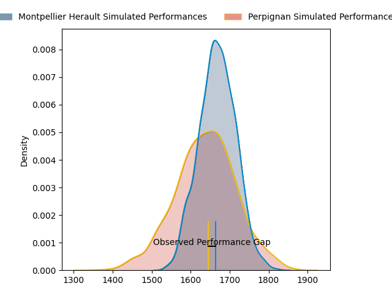

---  
layout: page  
title: Montpellier Herault at Perpignan; 23-22  
date: 2023-03-25 17:00:00 18:00:00 -0500  
categories: match review  
---
# Montpellier Herault at Perpignan; 23-22

# Club Level Predictions

The first set of predictions treats a club as the smallest object, as the club develops its members, organizes a gameplan, and deploys its players as needed for each match. This club model has a prediction of 0.456, which translates to predicting Montpellier Herault to win by 1.6.

Each club has a rating and a rating deviation (simiar to a Glicko system), and expected performances can be generated. This allows for simulated matches and spreads like the ones below.
## Projected Performances

## Projected Spreads

## Projected Results

# Player Level Predictions

Treating teams instead as an entity made up of the currently active players, I have ratings for each player in an altogether different system. These can be combined to form team ratings once teamsheets are announced, weighting starters a bit higher than the reserves. After the match is played, players can be weighted by their minutes on the field, allowing for an accurate measure of the team's composition. With these compiled team ratings, we can make predictions, measure inaccuracy, and update the individual player ratings.
## Prediction with Player Minutes: Montpellier Herault by 0.9

Montpellier Herault by 4.9 on a neutral field

There were 12 large changes in win probability in this match
## Prediction without Player Minutes: Montpellier Herault by 1.1

Montpellier Herault by 5.1 on a neutral pitch

|   Away Minutes | Away Player                                                                                        |   Away elo |   Away Percentile |   Number |   Home Percentile |   Home elo | Home Player                                                             |   Home Minutes |
|---------------:|:---------------------------------------------------------------------------------------------------|-----------:|------------------:|---------:|------------------:|-----------:|:------------------------------------------------------------------------|---------------:|
|             51 | [Grégory Fichten](..//playerfiles//GrégoryFichten_cleaned.md)                                      |     101.99 |                53 |        1 |                29 |      90.11 | [Sacha Lotrian](..//playerfiles//SachaLotrian_cleaned.md)               |             58 |
|             47 | [Vincent Giudicelli](..//playerfiles//VincentGiudicelli_cleaned.md)                                |     100.55 |                59 |        2 |                64 |      98.88 | [Seilala Lam](..//playerfiles//SeilalaLam_cleaned.md)                   |             67 |
|             58 | [Titi Lamositele](..//playerfiles//TitiLamositele_cleaned.md)                                      |      93.44 |                43 |        3 |                77 |     103.65 | [Arthur Joly](..//playerfiles//ArthurJoly_cleaned.md)                   |             58 |
|             51 | [Bastien Chalureau](..//playerfiles//BastienChalureau_cleaned.md)                                  |      96.21 |                52 |        4 |                68 |     101.98 | [Tristan Labouteley](..//playerfiles//TristanLabouteley_cleaned.md)     |             67 |
|             80 | [Tyler Evan Duguid](..//playerfiles//TylerEvanDuguid_cleaned.md)                                   |      98.86 |                60 |        5 |                39 |      92.32 | [Posolo Tuilagi](..//playerfiles//PosoloTuilagi_cleaned.md)             |             65 |
|             80 | [Nicolaas Jacobus Janse van Rensburg](..//playerfiles//NicolaasJacobusJansevanRensburg_cleaned.md) |     102.72 |                69 |        6 |                57 |      98.16 | [Brad Shields](..//playerfiles//BradShields_cleaned.md)                 |             80 |
|             58 | [Masivesi Dakuwaqa](..//playerfiles//MasivesiDakuwaqa_cleaned.md)                                  |     101.25 |                65 |        7 |                22 |      85.1  | [Joaquin Oviedo](..//playerfiles//JoaquinOviedo_cleaned.md)             |             80 |
|             80 | [Zach Mercer](..//playerfiles//ZachMercer_cleaned.md)                                              |     100.26 |                61 |        8 |                56 |      99.12 | [Genesis Mamea Lemalu](..//playerfiles//GenesisMameaLemalu_cleaned.md)  |             65 |
|             58 | [Jacobus Meyer Reinach](..//playerfiles//JacobusMeyerReinach_cleaned.md)                           |     106.95 |                80 |        9 |                53 |      96.53 | [Sadek Deghmache](..//playerfiles//SadekDeghmache_cleaned.md)           |             62 |
|             80 | [Paolo Garbisi](..//playerfiles//PaoloGarbisi_cleaned.md)                                          |     106.92 |                77 |       10 |                54 |      98.16 | [Jake McIntyre](..//playerfiles//JakeMcIntyre_cleaned.md)               |             80 |
|             80 | [George Bridge](..//playerfiles//GeorgeBridge_cleaned.md)                                          |     105.82 |                76 |       11 |                76 |     105.8  | [Alistair Crossdale](..//playerfiles//AlistairCrossdale_cleaned.md)     |             80 |
|             67 | [Jan Lodewyk Serfontein](..//playerfiles//JanLodewykSerfontein_cleaned.md)                         |     108.12 |                78 |       12 |                44 |      93.99 | [Jeronimo de la Fuente](..//playerfiles//JeronimodelaFuente_cleaned.md) |             72 |
|             73 | [Thomas Darmon](..//playerfiles//ThomasDarmon_cleaned.md)                                          |      99.52 |                60 |       13 |                57 |      98.73 | [Afusipa Taumoepeau](..//playerfiles//AfusipaTaumoepeau_cleaned.md)     |             80 |
|             80 | [Vincent Rattez](..//playerfiles//VincentRattez_cleaned.md)                                        |      87.2  |                24 |       14 |                25 |      87.89 | [Lucas Dubois](..//playerfiles//LucasDubois_cleaned.md)                 |             80 |
|             80 | [Anthony Bouthier](..//playerfiles//AnthonyBouthier_cleaned.md)                                    |      95.78 |                48 |       15 |                73 |     106.49 | [Tristan Tedder](..//playerfiles//TristanTedder_cleaned.md)             |             80 |
|             33 | [Brandon Paenga-Amosa](..//playerfiles//BrandonPaenga-Amosa_cleaned.md)                            |      94.81 |                50 |       16 |                67 |      98.36 | [Giorgi Tetrashvili](..//playerfiles//GiorgiTetrashvili_cleaned.md)     |             22 |
|             29 | [Elliott Stooke](..//playerfiles//ElliottStooke_cleaned.md)                                        |      99.26 |                50 |       17 |                26 |      87.34 | [Ma'afu Fia](..//playerfiles//Ma'afuFia_cleaned.md)                     |             22 |
|             29 | [Enzo Forletta](..//playerfiles//EnzoForletta_cleaned.md)                                          |      99.93 |                66 |       18 |                49 |      94.77 | [Matteo Rodor](..//playerfiles//MatteoRodor_cleaned.md)                 |             18 |
|             22 | [Léo Coly](..//playerfiles//LéoColy_cleaned.md)                                                    |      97.93 |                60 |       19 |                32 |      88.79 | [Victor Moreaux](..//playerfiles//VictorMoreaux_cleaned.md)             |             15 |
|             22 | [Henry Thomas](..//playerfiles//HenryThomas_cleaned.md)                                            |      94.08 |               nan |       20 |                29 |      88.73 | [Kélian Galletier](..//playerfiles//KélianGalletier_cleaned.md)         |             15 |
|             22 | [Lenni Nouchi](..//playerfiles//LenniNouchi_cleaned.md)                                            |      94.63 |                39 |       21 |                26 |      87.66 | [Shahn Eru](..//playerfiles//ShahnEru_cleaned.md)                       |             13 |
|             13 | [Louis Carbonel](..//playerfiles//LouisCarbonel_cleaned.md)                                        |      93.72 |                38 |       22 |                17 |      84.16 | [Victor Montgaillard](..//playerfiles//VictorMontgaillard_cleaned.md)   |             13 |
|              7 | [Pierre Lucas](..//playerfiles//PierreLucas_cleaned.md)                                            |      86.49 |                25 |       23 |                51 |      95.86 | [Edward Sawailau](..//playerfiles//EdwardSawailau_cleaned.md)           |              8 |

