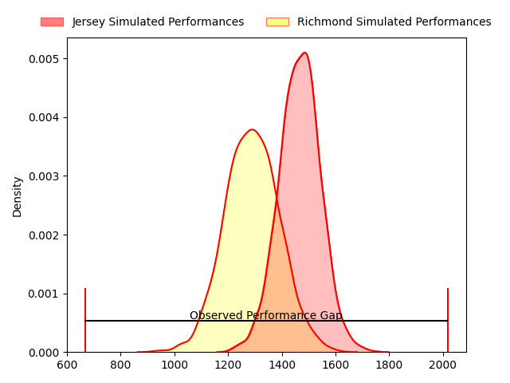
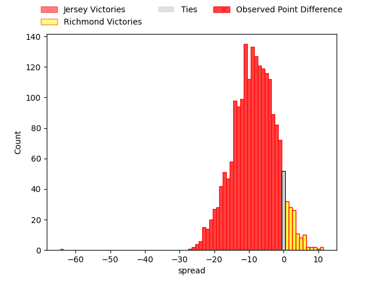

---  
layout: page  
title: Jersey at Richmond; 64-0  
date: 2023-03-25 15:00:00 18:00:00 -0500  
categories: match review  
---
# Jersey at Richmond; 64-0

# Club Level Predictions

The first set of predictions treats a club as the smallest object, as the club develops its members, organizes a gameplan, and deploys its players as needed for each match. This club model has a prediction of 0.274, which translates to predicting Jersey to win by 8.7.

Each club has a rating and a rating deviation (simiar to a Glicko system), and expected performances can be generated. This allows for simulated matches and spreads like the ones below.
## Projected Performances

## Projected Spreads

## Projected Results

# Player Level Predictions

Treating teams instead as an entity made up of the currently active players, I have ratings for each player in an altogether different system. These can be combined to form team ratings once teamsheets are announced, weighting starters a bit higher than the reserves. After the match is played, players can be weighted by their minutes on the field, allowing for an accurate measure of the team's composition. With these compiled team ratings, we can make predictions, measure inaccuracy, and update the individual player ratings.
## Prediction with Player Minutes: Jersey by 7.8

Jersey by 11.8 on a neutral field

There were 2 large changes in win probability in this match
## Prediction without Player Minutes: Jersey by 7.6

Jersey by 11.6 on a neutral pitch

|   Away Minutes | Away Player                 |   Away elo |   Away Percentile |   Number |   Home Percentile |   Home elo | Home Player       |   Home Minutes |
|---------------:|:----------------------------|-----------:|------------------:|---------:|------------------:|-----------:|:------------------|---------------:|
|             48 | Huw Owen                    |      90.88 |                32 |        1 |                38 |      92.38 | George Cave       |             60 |
|             48 | Eoghan Clarke               |     106.3  |                82 |        2 |                69 |     100.93 | Alexander Post    |             43 |
|             48 | Steven Longwell             |     110.56 |                90 |        3 |                 1 |      56.22 | Jimmy Litchfield  |             66 |
|             80 | Tom Everard                 |      78.4  |                 7 |        4 |               nan |      95    | Rhys Anstey       |             66 |
|             56 | Macauley Cook               |     108.73 |                80 |        5 |                19 |      84.45 | Jake Monson       |             46 |
|             80 | Max Argyle                  |      88.35 |                35 |        6 |                45 |      93.98 | David Massey      |             80 |
|             80 | Lewis Wynne                 |     104.02 |                72 |        7 |               nan |      95.99 | Lucas Brooke      |             80 |
|             56 | Alun Lawrence               |      87.65 |                24 |        8 |                 4 |      71.35 | Ethan Benson      |             80 |
|             59 | James Elliott               |      57.74 |                 1 |        9 |                57 |      99.54 | James Lennon      |             48 |
|             59 | Ben Burnell                 |      97.75 |               nan |       10 |                32 |      90.35 | Bill Johnston     |             80 |
|             80 | Will Brown                  |     113.6  |                88 |       11 |                18 |      84.13 | Owain James       |             48 |
|             80 | Jordan Holgate              |      87.44 |                25 |       12 |                 8 |      75.37 | Craig Duncan      |             80 |
|             80 | Charlie Powell              |      89.37 |                31 |       13 |                 6 |      72.32 | Paul Kiernan      |             80 |
|             48 | Ben Woollett                |      98.95 |                59 |       14 |                47 |      95.1  | Raz Patel         |             65 |
|             80 | Brendan Owen                |      97.43 |                52 |       15 |                15 |      82.59 | Alexander O'Meara |             80 |
|             32 | Samuel Alexander Grahamslaw |     111.64 |                91 |       16 |                25 |      84.55 | Joseph Vajner     |             37 |
|             32 | James Hadfield              |      84.6  |                17 |       17 |               nan |      94.2  | Edward Johnson    |             34 |
|             32 | Adam Nicol                  |      97.03 |                57 |       18 |               nan |      93.3  | Stephen Kerins    |             32 |
|             32 | Ryan Hutler                 |      70.53 |                 5 |       19 |                33 |      90.23 | Jack Walsh        |             32 |
|             24 | Hallam Chapman              |      88.82 |                45 |       20 |                 8 |      78.66 | Conor Maguire     |             20 |
|             24 | James Scott                 |      91.11 |                35 |       21 |               nan |      97.22 | Alex Burrage      |             15 |
|             21 | James Mitchell              |     105.77 |                81 |       22 |                62 |      92.49 | Luke Spring       |             14 |
|             21 | Russell Bennett             |      95.9  |                47 |       23 |                43 |      95.73 | Miles Wakeling    |             14 |

