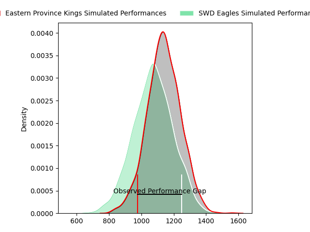
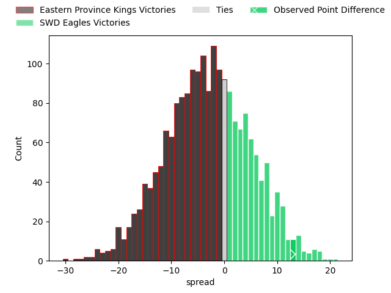

---  
layout: page  
title: Eastern Province Kings at SWD Eagles; 23-36  
date: 2023-03-25 15:15:00 18:00:00 -0500  
categories: match review  
---
# Eastern Province Kings at SWD Eagles; 23-36

# Club Level Predictions

The first set of predictions treats a club as the smallest object, as the club develops its members, organizes a gameplan, and deploys its players as needed for each match. This club model has a prediction of 0.411, which translates to predicting Eastern Province Kings to win by 3.3.

Each club has a rating and a rating deviation (simiar to a Glicko system), and expected performances can be generated. This allows for simulated matches and spreads like the ones below.
## Projected Performances

## Projected Spreads

## Projected Results

# Player Level Predictions

Treating teams instead as an entity made up of the currently active players, I have ratings for each player in an altogether different system. These can be combined to form team ratings once teamsheets are announced, weighting starters a bit higher than the reserves. After the match is played, players can be weighted by their minutes on the field, allowing for an accurate measure of the team's composition. With these compiled team ratings, we can make predictions, measure inaccuracy, and update the individual player ratings.
## Prediction with Player Minutes: SWD Eagles by 6.7

SWD Eagles by 2.7 on a neutral field

There were 5 large changes in win probability in this match
## Prediction without Player Minutes: SWD Eagles by 6.7

SWD Eagles by 2.7 on a neutral pitch

|   Away Minutes | Away Player                                                                         |   Away elo |   Away Percentile |   Number |   Home Percentile |   Home elo | Home Player                                                                                         |   Home Minutes |
|---------------:|:------------------------------------------------------------------------------------|-----------:|------------------:|---------:|------------------:|-----------:|:----------------------------------------------------------------------------------------------------|---------------:|
|             80 | [Zukisa Sali](..//playerfiles//ZukisaSali_cleaned.md)                               |      91.36 |                34 |        1 |               nan |     101.02 | [Qhama Hope Hina](..//playerfiles//QhamaHopeHina_cleaned.md)                                        |             80 |
|             80 | [Duan du Plessis](..//playerfiles//DuanduPlessis_cleaned.md)                        |      78.81 |                 9 |        2 |                29 |      88.04 | [Keanu Hendricks](..//playerfiles//KeanuHendricks_cleaned.md)                                       |             80 |
|             80 | [Andile Ngonyama](..//playerfiles//AndileNgonyama_cleaned.md)                       |      85.17 |                17 |        3 |                15 |      88.62 | [Mhleli Dlamini](..//playerfiles//MhleliDlamini_cleaned.md)                                         |             80 |
|             80 | [Lindokuhle Welemu](..//playerfiles//LindokuhleWelemu_cleaned.md)                   |      95.28 |                49 |        4 |                59 |      98.27 | [Ethan Stuurman](..//playerfiles//EthanStuurman_cleaned.md)                                         |             80 |
|             80 | [Johannes Frederik Huisamen](..//playerfiles//JohannesFrederikHuisamen_cleaned.md)  |      86.71 |                36 |        5 |                42 |      93.2  | [Ruben Cronje](..//playerfiles//RubenCronje_cleaned.md)                                             |             80 |
|             80 | [Diego Nuran Virgol Williams](..//playerfiles//DiegoNuranVirgolWilliams_cleaned.md) |      97.51 |                55 |        6 |                46 |      94.09 | [Uzile Tele](..//playerfiles//UzileTele_cleaned.md)                                                 |             80 |
|             80 | [Gerrit Huisamen](..//playerfiles//GerritHuisamen_cleaned.md)                       |      66.58 |                 2 |        7 |                13 |      82.05 | [Johannes Hendrik (Janneman) Stander](..//playerfiles//JohannesHendrik(Janneman)Stander_cleaned.md) |             80 |
|             80 | [Laken Gray](..//playerfiles//LakenGray_cleaned.md)                                 |      96.07 |               nan |        8 |                 6 |      81.23 | [Chuma Biyana](..//playerfiles//ChumaBiyana_cleaned.md)                                             |             80 |
|             80 | [Andur-Rageem Ismail](..//playerfiles//Andur-RageemIsmail_cleaned.md)               |     101.6  |                68 |        9 |                72 |     102.04 | [Sacha Toring](..//playerfiles//SachaToring_cleaned.md)                                             |             80 |
|             80 | [Masixole Banda](..//playerfiles//MasixoleBanda_cleaned.md)                         |     102.73 |                69 |       10 |                27 |      88.95 | [Sergio Stalmeester](..//playerfiles//SergioStalmeester_cleaned.md)                                 |             80 |
|             80 | [Ayabonga (Aya) Oliphant](..//playerfiles//Ayabonga(Aya)Oliphant_cleaned.md)        |     107.61 |                85 |       11 |                65 |     100.93 | [Mpho Ntsane](..//playerfiles//MphoNtsane_cleaned.md)                                               |             80 |
|             80 | [Sherwyn Slater](..//playerfiles//SherwynSlater_cleaned.md)                         |      97.83 |                55 |       12 |                28 |      88.26 | [Edwin Sass](..//playerfiles//EdwinSass_cleaned.md)                                                 |             80 |
|             80 | [Riaan Arendse](..//playerfiles//RiaanArendse_cleaned.md)                           |      99.08 |                58 |       13 |                48 |      95.76 | [Clive Kruger](..//playerfiles//CliveKruger_cleaned.md)                                             |             80 |
|             80 | [Rodney Damons](..//playerfiles//RodneyDamons_cleaned.md)                           |      79.65 |                12 |       14 |                34 |      90.49 | [Rosco Systers](..//playerfiles//RoscoSysters_cleaned.md)                                           |             80 |
|             80 | [Jayden Bantom](..//playerfiles//JaydenBantom_cleaned.md)                           |      83.41 |                19 |       15 |                67 |     103.4  | [Darryn Fortuin](..//playerfiles//DarrynFortuin_cleaned.md)                                         |             80 |

