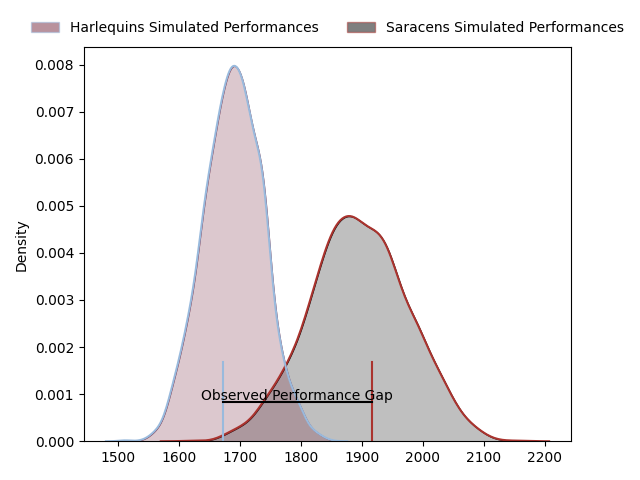
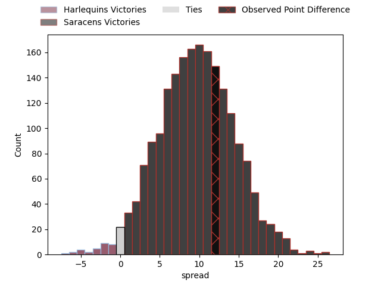

---  
layout: page  
title: Harlequins at Saracens; 24.0-36.0  
date: 2023-03-25 11:00:00 18:00:00 -0500  
categories: match review  
---
# Harlequins at Saracens; 24.0-36.0

# Club Level Predictions

The first set of predictions treats a club as the smallest object, as the club develops its members, organizes a gameplan, and deploys its players as needed for each match. This club model has a prediction of 0.763, which translates to predicting Saracens to win by 10.3.

Each club has a rating and a rating deviation (simiar to a Glicko system), and expected performances can be generated. This allows for simulated matches and spreads like the ones below.
## Projected Performances

## Projected Spreads

## Projected Results

# Player Level Predictions

Treating teams instead as an entity made up of the currently active players, I have ratings for each player in an altogether different system. These can be combined to form team ratings once teamsheets are announced, weighting starters a bit higher than the reserves. After the match is played, players can be weighted by their minutes on the field, allowing for an accurate measure of the team's composition. With these compiled team ratings, we can make predictions, measure inaccuracy, and update the individual player ratings.
## Prediction with Player Minutes: Saracens by 14.4

Saracens by 10.4 on a neutral field

There were 7 large changes in win probability in this match
## Prediction without Player Minutes: Saracens by 16.1

Saracens by 12.1 on a neutral pitch

|   Away Minutes | Away Player       |   Away elo |   Away Percentile |   Number |   Home Percentile |   Home elo | Home Player    |   Home Minutes |
|---------------:|:------------------|-----------:|------------------:|---------:|------------------:|-----------:|:---------------|---------------:|
|             75 | Joe Marler        |      99.16 |                66 |        1 |                97 |     125.4  | Mako Vunipola  |             63 |
|             67 | Jack Walker       |      76.57 |                 8 |        2 |               100 |     162.38 | Jamie George   |             74 |
|             63 | Wilco Louw        |     115.16 |                92 |        3 |                80 |     104.87 | Marco Riccioni |             67 |
|             80 | Dino Lamb         |     110.42 |                83 |        4 |                80 |     108.54 | Maro Itoje     |             80 |
|             58 | Irne Herbst       |     111.87 |                86 |        5 |                54 |      96.84 | Hugh Tizard    |             63 |
|             80 | Jack Kenningham   |      87.12 |                23 |        6 |                32 |      89.32 | Andy Christie  |             80 |
|             58 | James Chisholm    |     126.46 |                95 |        7 |                93 |     122.02 | Ben Earl       |             74 |
|             80 | Alex Dombrandt    |     136.39 |                98 |        8 |                86 |     112.44 | Billy Vunipola |             80 |
|             80 | Danny Care        |     107.82 |                81 |        9 |                91 |     115.07 | Ivan van Zyl   |             55 |
|             80 | Marcus Smith      |     127.36 |                94 |       10 |                95 |     130.42 | Owen Farrell   |             70 |
|             75 | Cadan Murley      |      92.5  |                40 |       11 |                89 |     116.73 | Sean Maitland  |             59 |
|             80 | Andre Esterhuizen |     113.66 |                86 |       12 |                99 |     157.85 | Nick Tompkins  |             80 |
|             80 | Luke Northmore    |     115.65 |                88 |       13 |                49 |      96.1  | Alex Lozowski  |             80 |
|             80 | Joe Marchant      |      99.54 |                51 |       14 |                14 |      81.58 | Max Malins     |             80 |
|             80 | Nick David        |      91.1  |                39 |       15 |                67 |     103.27 | Alex Goode     |             80 |
|             13 | Sam Riley         |      94.77 |                49 |       16 |                55 |      96.34 | Theo Dan       |              6 |
|              5 | Fin Baxter        |      85.02 |                16 |       17 |                16 |      84.81 | Eroni Mawi     |             17 |
|             17 | Will Collier      |      97.03 |                58 |       18 |                36 |      91.65 | Alec Clarey    |             13 |
|             22 | George Hammond    |      75.83 |                 7 |       19 |                34 |      92.03 | Nick Isiekwe   |             17 |
|             22 | Will Evans        |      98.29 |                53 |       20 |                98 |     142.09 | Jackson Wray   |              6 |
|              0 | Scott Steele      |      62.42 |               nan |       21 |                68 |     101.42 | Aled Davies    |             25 |
|              0 | Tommaso Allan     |      99.68 |                60 |       22 |                80 |     108.93 | Duncan Taylor  |             10 |
|              5 | Oscar Beard       |     105.48 |                75 |       23 |                59 |      98.82 | Alex Lewington |             21 |

