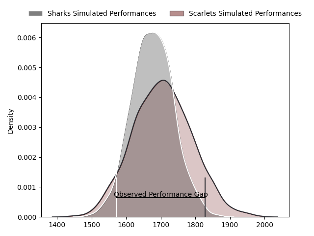
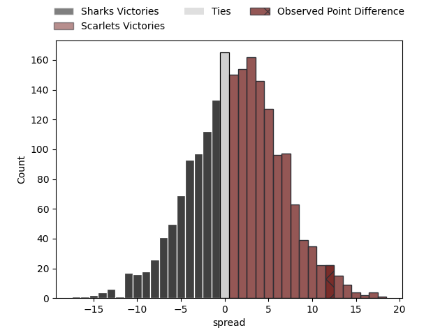

---  
layout: page  
title: Sharks at Scarlets; 20-32  
date: 2023-03-25 18:00:00 18:00:00 -0500  
categories: match review  
---
# Sharks at Scarlets; 20-32

# Club Level Predictions

The first set of predictions treats a club as the smallest object, as the club develops its members, organizes a gameplan, and deploys its players as needed for each match. This club model has a prediction of 0.539, which translates to predicting Scarlets to win by 1.4.

Each club has a rating and a rating deviation (simiar to a Glicko system), and expected performances can be generated. This allows for simulated matches and spreads like the ones below.
## Projected Performances

## Projected Spreads

## Projected Results

# Player Level Predictions

Treating teams instead as an entity made up of the currently active players, I have ratings for each player in an altogether different system. These can be combined to form team ratings once teamsheets are announced, weighting starters a bit higher than the reserves. After the match is played, players can be weighted by their minutes on the field, allowing for an accurate measure of the team's composition. With these compiled team ratings, we can make predictions, measure inaccuracy, and update the individual player ratings.
## Prediction with Player Minutes: Scarlets by 9.2

Scarlets by 5.2 on a neutral field

There were 12 large changes in win probability in this match
## Prediction without Player Minutes: Scarlets by 10.3

Scarlets by 6.3 on a neutral pitch

|   Away Minutes | Away Player                                                                      |   Away elo |   Away Percentile |   Number |   Home Percentile |   Home elo | Home Player                                                          |   Home Minutes |
|---------------:|:---------------------------------------------------------------------------------|-----------:|------------------:|---------:|------------------:|-----------:|:---------------------------------------------------------------------|---------------:|
|             71 | [Retshegofaditswe Nche](..//playerfiles//RetshegofaditsweNche_cleaned.md)        |     101.88 |                72 |        1 |                86 |     108.52 | [Kemsley Mathias](..//playerfiles//KemsleyMathias_cleaned.md)        |             60 |
|             67 | [Mbongeni Mbonambi](..//playerfiles//MbongeniMbonambi_cleaned.md)                |     100.18 |                68 |        2 |                80 |     105.19 | [Shaun Evans](..//playerfiles//ShaunEvans_cleaned.md)                |             76 |
|             71 | [Thomas Joubert du Toit](..//playerfiles//ThomasJoubertduToit_cleaned.md)        |     103.38 |                76 |        3 |                52 |      99.9  | [Javan Sebastian](..//playerfiles//JavanSebastian_cleaned.md)        |             55 |
|             80 | [Eben Etzebeth](..//playerfiles//EbenEtzebeth_cleaned.md)                        |     110.2  |                83 |        4 |                89 |     116.05 | [Vaea Fifita](..//playerfiles//VaeaFifita_cleaned.md)                |             80 |
|             53 | [Emile van Heerden](..//playerfiles//EmilevanHeerden_cleaned.md)                 |      91.91 |                38 |        5 |                90 |     116.81 | [Sam Lousi](..//playerfiles//SamLousi_cleaned.md)                    |             80 |
|             80 | [Siya Kolisi](..//playerfiles//SiyaKolisi_cleaned.md)                            |     110.97 |                84 |        6 |                62 |      99.96 | [Joshua McLeod](..//playerfiles//JoshuaMcLeod_cleaned.md)            |             80 |
|             80 | [Vincent Tshikaya Tshituka](..//playerfiles//VincentTshikayaTshituka_cleaned.md) |     107.05 |                77 |        7 |                91 |     118.77 | [Daniel Fabian Davis](..//playerfiles//DanielFabianDavis_cleaned.md) |             11 |
|             53 | [Phendulani Buthelezi](..//playerfiles//PhendulaniButhelezi_cleaned.md)          |      99.11 |                48 |        8 |                89 |     116.83 | [Sione Kalamafoni](..//playerfiles//SioneKalamafoni_cleaned.md)      |             65 |
|             56 | [Jaden Hendrikse](..//playerfiles//JadenHendrikse_cleaned.md)                    |     104.91 |                75 |        9 |                71 |     105.81 | [Gareth Davies](..//playerfiles//GarethDavies_cleaned.md)            |             67 |
|             80 | [Curwin Dominique Bosch](..//playerfiles//CurwinDominiqueBosch_cleaned.md)       |     105.96 |                76 |       10 |                80 |     109.2  | [Sam Costelow](..//playerfiles//SamCostelow_cleaned.md)              |             75 |
|             80 | [Makazole Mapimpi](..//playerfiles//MakazoleMapimpi_cleaned.md)                  |     108.27 |                80 |       11 |                67 |     101.5  | [Ryan Conbeer](..//playerfiles//RyanConbeer_cleaned.md)              |             80 |
|             71 | [Rohan Janse van Rensburg](..//playerfiles//RohanJansevanRensburg_cleaned.md)    |     100.35 |                62 |       12 |               nan |      99.96 | [Johnny Williams](..//playerfiles//JohnnyWilliams_cleaned.md)        |             80 |
|             80 | [Lukhanyo Am](..//playerfiles//LukhanyoAm_cleaned.md)                            |     110.97 |                82 |       13 |                90 |     117.17 | [Joe Roberts](..//playerfiles//JoeRoberts_cleaned.md)                |             80 |
|             65 | [Werner Kok](..//playerfiles//WernerKok_cleaned.md)                              |     105.37 |                75 |       14 |                89 |     117.23 | [Steffan Evans](..//playerfiles//SteffanEvans_cleaned.md)            |             80 |
|             80 | [Boeta Chamberlain](..//playerfiles//BoetaChamberlain_cleaned.md)                |     107.55 |                76 |       15 |                66 |     101.3  | [Tom Rogers](..//playerfiles//TomRogers_cleaned.md)                  |             67 |
|             27 | [Sikhumbuzo Notshe](..//playerfiles//SikhumbuzoNotshe_cleaned.md)                |     111.41 |                84 |       16 |                85 |     112.45 | [Aaron Shingler](..//playerfiles//AaronShingler_cleaned.md)          |             69 |
|             27 | [Douw Gerbrandt Grobler](..//playerfiles//DouwGerbrandtGrobler_cleaned.md)       |      98.57 |                59 |       17 |                32 |      90.97 | [Sam Wainwright](..//playerfiles//SamWainwright_cleaned.md)          |             25 |
|             24 | [Grant Williams](..//playerfiles//GrantWilliams_cleaned.md)                      |     106.8  |                79 |       18 |                65 |     102.73 | [Steff Thomas](..//playerfiles//SteffThomas_cleaned.md)              |             20 |
|             15 | [Thaakir Abrahams](..//playerfiles//ThaakirAbrahams_cleaned.md)                  |      83.36 |                19 |       19 |                47 |      95.89 | [Morgan Jones](..//playerfiles//MorganJones_cleaned.md)              |             15 |
|             13 | [Kerron van Vuuren](..//playerfiles//KerronvanVuuren_cleaned.md)                 |      96.56 |                46 |       20 |               nan |      97.68 | [Kieran Hardy](..//playerfiles//KieranHardy_cleaned.md)              |             13 |
|              9 | [Khuthuzani Kingdom Mchunu](..//playerfiles//KhuthuzaniKingdomMchunu_cleaned.md) |      90.49 |               nan |       21 |                82 |     110.93 | [Ioan Nicholas](..//playerfiles//IoanNicholas_cleaned.md)            |             13 |
|              9 | [Carlu Johann Sadie](..//playerfiles//CarluJohannSadie_cleaned.md)               |     104.49 |                79 |       22 |               nan |      98.16 | [Dan Jones](..//playerfiles//DanJones_cleaned.md)                    |              5 |
|              9 | [Ben Tapuai](..//playerfiles//BenTapuai_cleaned.md)                              |      90.13 |                31 |       23 |               nan |      96.35 | [Taylor Davies](..//playerfiles//TaylorDavies_cleaned.md)            |              4 |

