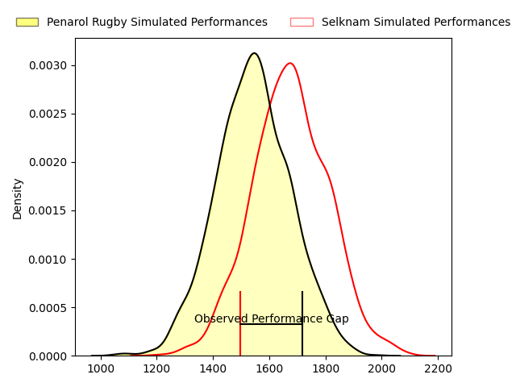
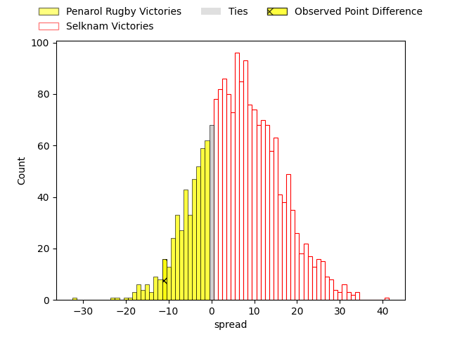
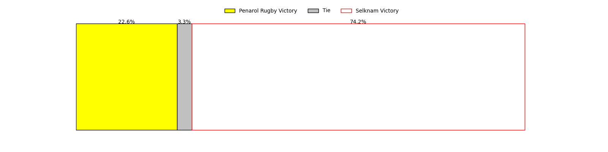

---  
layout: page  
title: Penarol Rugby at Selknam; 35-24  
date: 2023-03-25 22:00:00 18:00:00 -0500  
categories: match review  
---
# Penarol Rugby at Selknam; 35-24

# Club Level Predictions

The first set of predictions treats a club as the smallest object, as the club develops its members, organizes a gameplan, and deploys its players as needed for each match. This club model has a prediction of 0.668, which translates to predicting Selknam to win by 6.6.

Each club has a rating and a rating deviation (simiar to a Glicko system), and expected performances can be generated. This allows for simulated matches and spreads like the ones below.
## Projected Performances

## Projected Spreads

## Projected Results

# Player Level Predictions

Treating teams instead as an entity made up of the currently active players, I have ratings for each player in an altogether different system. These can be combined to form team ratings once teamsheets are announced, weighting starters a bit higher than the reserves. After the match is played, players can be weighted by their minutes on the field, allowing for an accurate measure of the team's composition. With these compiled team ratings, we can make predictions, measure inaccuracy, and update the individual player ratings.
## Prediction with Player Minutes: Penarol Rugby by 8.6

Penarol Rugby by 12.6 on a neutral field

There were 10 large changes in win probability in this match
## Prediction without Player Minutes: Penarol Rugby by 1.4

Penarol Rugby by 5.4 on a neutral pitch

|   Away Minutes | Away Player                        |   Away elo |   Away Percentile |   Number |   Home Percentile |   Home elo | Home Player                       |   Home Minutes |
|---------------:|:-----------------------------------|-----------:|------------------:|---------:|------------------:|-----------:|:----------------------------------|---------------:|
|             69 | Edgardo Matias Benitez Santin      |     101.18 |                71 |        1 |                53 |      92.63 | Javier Carrasco                   |             57 |
|             69 | Guillermo Pujadas Leon             |     101.36 |                71 |        2 |                32 |      89.92 | Diego Escobar                     |             57 |
|             56 | Ignacio Alfredo Peculo Rodriguez   |     103.66 |                77 |        3 |               nan |      95.59 | Lucas Bordigoni                   |             50 |
|             80 | Felipe Aliaga                      |      96.87 |                54 |        4 |                61 |      95.35 | Santiago Pedrero                  |             80 |
|             48 | Agustin Morales                    |      94.65 |               nan |        5 |                15 |      82.01 | Javier Eissmann                   |             51 |
|             55 | Carlos Manuel Deus Lopes de Amorin |      85.43 |                19 |        6 |                22 |      86.51 | Raimundo Martinez                 |             80 |
|             80 | Lucas Bianchi                      |      91.74 |                42 |        7 |               nan |      89.51 | Thomas Hans Orchard Meyer-Rachner |             45 |
|             80 | Manuel Diana                       |     100.6  |                63 |        8 |                32 |      90.43 | Ernesto Tchimino                  |             76 |
|             80 | Santiago Álvarez Viera Da Cunha    |      98.47 |                57 |        9 |                37 |      91.45 | Lukas Carvallo                    |             76 |
|             80 | Felipe Etcheverry                  |     103.15 |                71 |       10 |                48 |      96.41 | Rodrigo Fernandez                 |             80 |
|             80 | Alfonso Silva                      |      95.92 |                53 |       11 |                35 |      90.72 | Matias Garafulic                  |             80 |
|             80 | Juan Zuccarino                     |     111.75 |                83 |       12 |                37 |      91.48 | Jose Ignacio Larenas              |             80 |
|             80 | Tomas Inciarte Rachetti            |     101.37 |                65 |       13 |                10 |      77.97 | Domingo Saavedra                  |             73 |
|             80 | Gaston Mieres Valente              |      98.65 |                59 |       14 |                43 |      93.58 | Clemente Armstrong                |             80 |
|             80 | Rodrigo Silva                      |     100.6  |                62 |       15 |                33 |      90.72 | Francisco Urroz                   |             80 |
|             32 | Juan Manuel Rodriguez              |     102.24 |               nan |       16 |                58 |      98.67 | Clemente Saavedra                 |             35 |
|             25 | Manuel Rosmarino                   |      95    |               nan |       17 |                58 |      98.21 | Pablo Huete                       |             29 |
|             24 | Diego Arbelo                       |     100.01 |                41 |       18 |                41 |      93.09 | Salvador Lues                     |             23 |
|             11 | Mateo Perillo                      |      98.15 |                58 |       19 |                24 |      87.58 | Tomas Dussaillant                 |             23 |
|             11 | Emiliano Faccennini                |     102.17 |                71 |       20 |                33 |      90.28 | Pablo Casas                       |              7 |
|            nan | nan                                |     nan    |               nan |       21 |               nan |      93.29 | Jorge Delgado                     |              4 |
|            nan | nan                                |     nan    |               nan |       22 |                74 |     104.22 | Benjamin Videla                   |              4 |
|            nan | nan                                |     nan    |               nan |       23 |               nan |      91.62 | Vittorio Lastra                   |             30 |

