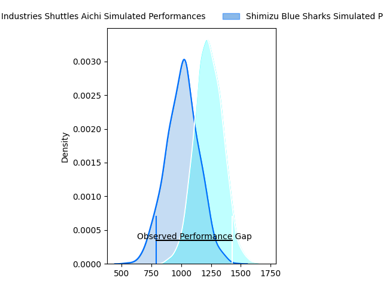
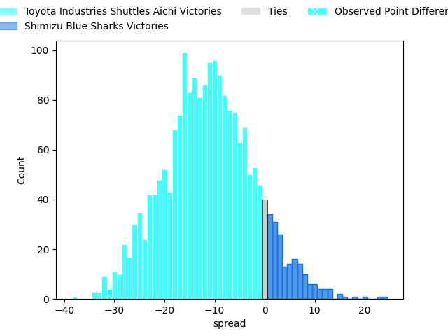
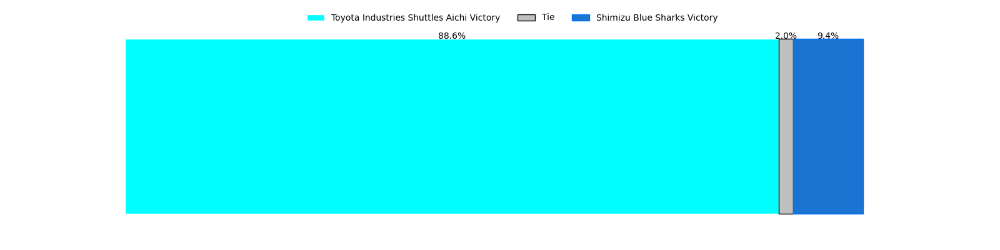

---  
layout: page  
title: Toyota Industries Shuttles Aichi at Shimizu Blue Sharks; 34-3  
date: 2023-03-25 00:00:00 18:00:00 -0500  
categories: match review  
---
# Toyota Industries Shuttles Aichi at Shimizu Blue Sharks; 34-3

# Club Level Predictions

The first set of predictions treats a club as the smallest object, as the club develops its members, organizes a gameplan, and deploys its players as needed for each match. This club model has a prediction of 0.23, which translates to predicting Toyota Industries Shuttles Aichi to win by 11.2.

Each club has a rating and a rating deviation (simiar to a Glicko system), and expected performances can be generated. This allows for simulated matches and spreads like the ones below.
## Projected Performances

## Projected Spreads

## Projected Results

# Player Level Predictions

Treating teams instead as an entity made up of the currently active players, I have ratings for each player in an altogether different system. These can be combined to form team ratings once teamsheets are announced, weighting starters a bit higher than the reserves. After the match is played, players can be weighted by their minutes on the field, allowing for an accurate measure of the team's composition. With these compiled team ratings, we can make predictions, measure inaccuracy, and update the individual player ratings.
## Prediction with Player Minutes: Shimizu Blue Sharks by 7.1

Shimizu Blue Sharks by 3.1 on a neutral field

There were 2 large changes in win probability in this match
## Prediction without Player Minutes: Shimizu Blue Sharks by 9.0

Shimizu Blue Sharks by 5.0 on a neutral pitch

|   Away Minutes | Away Player                                                              |   Away elo |   Away Percentile |   Number |   Home Percentile |   Home elo | Home Player                                                                 |   Home Minutes |
|---------------:|:-------------------------------------------------------------------------|-----------:|------------------:|---------:|------------------:|-----------:|:----------------------------------------------------------------------------|---------------:|
|             52 | [Tomoki Minami](..//playerfiles//TomokiMinami_cleaned.md)                |      90.97 |                32 |        1 |                90 |     112.88 | [Fumiyake Mato](..//playerfiles//FumiyakeMato_cleaned.md)                   |             40 |
|             52 | [Tomoya Watanabe](..//playerfiles//TomoyaWatanabe_cleaned.md)            |      74.09 |               nan |        2 |                79 |     104.76 | [Naomichi Tatekawa](..//playerfiles//NaomichiTatekawa_cleaned.md)           |             57 |
|             52 | [Ryota Fukamura](..//playerfiles//RyotaFukamura_cleaned.md)              |      81.45 |                12 |        3 |                88 |     110.6  | [Kazuki Kanazawa](..//playerfiles//KazukiKanazawa_cleaned.md)               |             40 |
|             80 | [Taishi Nakamura](..//playerfiles//TaishiNakamura_cleaned.md)            |      93.71 |                46 |        4 |                32 |      89.54 | [Tetsunori Osaki](..//playerfiles//TetsunoriOsaki_cleaned.md)               |             80 |
|             57 | [James Gaskell](..//playerfiles//JamesGaskell_cleaned.md)                |      95.83 |                51 |        5 |                33 |      90.77 | [Thomas Nowlan](..//playerfiles//ThomasNowlan_cleaned.md)                   |              8 |
|             80 | [Seta Naivaluwaga](..//playerfiles//SetaNaivaluwaga_cleaned.md)          |      95    |               nan |        6 |                43 |      95.87 | [Koudai Takahashi](..//playerfiles//KoudaiTakahashi_cleaned.md)             |             80 |
|             80 | [Yamato Matsuoka](..//playerfiles//YamatoMatsuoka_cleaned.md)            |      80.73 |                11 |        7 |                64 |     100.23 | [Ginjiro Hase](..//playerfiles//GinjiroHase_cleaned.md)                     |             71 |
|             80 | [Tama Kapene](..//playerfiles//TamaKapene_cleaned.md)                    |      89.72 |                33 |        8 |                13 |      81.47 | [Murphy Taramai](..//playerfiles//MurphyTaramai_cleaned.md)                 |             80 |
|             61 | [Riku Morisaki](..//playerfiles//RikuMorisaki_cleaned.md)                |      86.79 |                23 |        9 |                16 |      83.37 | [Kayne Hammington](..//playerfiles//KayneHammington_cleaned.md)             |             61 |
|             80 | [Akihiro Shimizu](..//playerfiles//AkihiroShimizu_cleaned.md)            |      88.53 |                26 |       10 |                34 |      91.06 | [Soichiro Kuwata](..//playerfiles//SoichiroKuwata_cleaned.md)               |             40 |
|             70 | [Go Nakano](..//playerfiles//GoNakano_cleaned.md)                        |     106.23 |                77 |       11 |                21 |      86.12 | [Shuhei Sasaki](..//playerfiles//ShuheiSasaki_cleaned.md)                   |             80 |
|             57 | [Josh Matavesi](..//playerfiles//JoshMatavesi_cleaned.md)                |      86.56 |                24 |       12 |                13 |      80.73 | [Orbyn Leger](..//playerfiles//OrbynLeger_cleaned.md)                       |             80 |
|             80 | [Joe Kamana](..//playerfiles//JoeKamana_cleaned.md)                      |      71.55 |                 6 |       13 |                17 |      83.57 | [Michael Va'a Toloke](..//playerfiles//MichaelVa'aToloke_cleaned.md)        |             80 |
|             79 | [Naoto Kubo](..//playerfiles//NaotoKubo_cleaned.md)                      |      93.37 |               nan |       14 |                66 |     100.98 | [Usa Baleilautoka](..//playerfiles//UsaBaleilautoka_cleaned.md)             |             61 |
|             80 | [Timothy Gregory Swiel](..//playerfiles//TimothyGregorySwiel_cleaned.md) |      92.65 |                42 |       15 |                10 |      76.52 | [Tatsuhiro Ozaki](..//playerfiles//TatsuhiroOzaki_cleaned.md)               |             80 |
|             28 | [Hiroshi Murakawa](..//playerfiles//HiroshiMurakawa_cleaned.md)          |      77.77 |                12 |       16 |               nan |     106.75 | [Minato Goto](..//playerfiles//MinatoGoto_cleaned.md)                       |             72 |
|             28 | [Kosuke Oike](..//playerfiles//KosukeOike_cleaned.md)                    |     107.65 |               nan |       17 |                 7 |      78.21 | [Daiki Shimura](..//playerfiles//DaikiShimura_cleaned.md)                   |             40 |
|             28 | [Naoya Ishibashi](..//playerfiles//NaoyaIshibashi_cleaned.md)            |      96.31 |               nan |       18 |                 8 |      80.28 | [Ryota Saitou](..//playerfiles//RyotaSaitou_cleaned.md)                     |             40 |
|             23 | [James Mollentze](..//playerfiles//JamesMollentze_cleaned.md)            |      69.13 |                 5 |       19 |               nan |      94.02 | [John Ben Kotze](..//playerfiles//JohnBenKotze_cleaned.md)                  |             40 |
|             23 | [Shoma Makinouchi](..//playerfiles//ShomaMakinouchi_cleaned.md)          |      90.44 |                42 |       20 |                13 |      84.77 | [Kaito Tamori](..//playerfiles//KaitoTamori_cleaned.md)                     |             23 |
|             19 | [Keisuke Ishida](..//playerfiles//KeisukeIshida_cleaned.md)              |      98.1  |                51 |       21 |                60 |     101.34 | [Kenji Harada](..//playerfiles//KenjiHarada_cleaned.md)                     |             19 |
|             10 | [Hiroaki Saito](..//playerfiles//HiroakiSaito_cleaned.md)                |      81.38 |                13 |       22 |                15 |      80.39 | [Coenraad George van Wyk](..//playerfiles//CoenraadGeorgevanWyk_cleaned.md) |             19 |
|              1 | [Talifolofola Tangipa](..//playerfiles//TalifolofolaTangipa_cleaned.md)  |     104.93 |                72 |       23 |                17 |      83.69 | [Ryo Sato](..//playerfiles//RyoSato_cleaned.md)                             |              9 |

