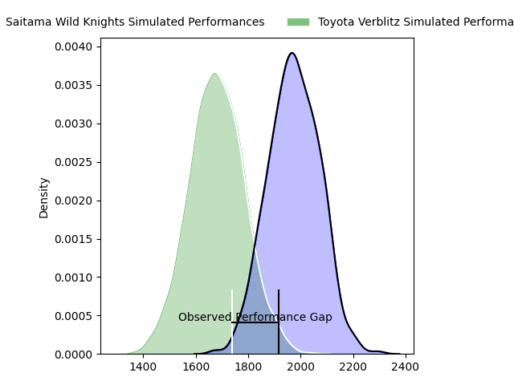
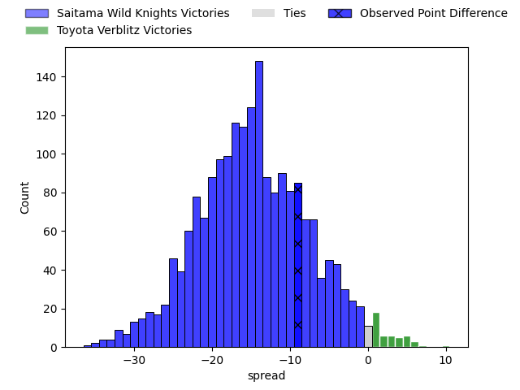

---  
layout: page  
title: Saitama Wild Knights at Toyota Verblitz; 19-10  
date: 2023-03-25 00:00:00 18:00:00 -0500  
categories: match review  
---
# Saitama Wild Knights at Toyota Verblitz; 19-10

# Club Level Predictions

The first set of predictions treats a club as the smallest object, as the club develops its members, organizes a gameplan, and deploys its players as needed for each match. This club model has a prediction of 0.166, which translates to predicting Saitama Wild Knights to win by 14.7.

Each club has a rating and a rating deviation (simiar to a Glicko system), and expected performances can be generated. This allows for simulated matches and spreads like the ones below.
## Projected Performances

## Projected Spreads

## Projected Results

# Player Level Predictions

Treating teams instead as an entity made up of the currently active players, I have ratings for each player in an altogether different system. These can be combined to form team ratings once teamsheets are announced, weighting starters a bit higher than the reserves. After the match is played, players can be weighted by their minutes on the field, allowing for an accurate measure of the team's composition. With these compiled team ratings, we can make predictions, measure inaccuracy, and update the individual player ratings.
## Prediction with Player Minutes: Saitama Wild Knights by 8.8

Saitama Wild Knights by 12.8 on a neutral field

There were 6 large changes in win probability in this match
## Prediction without Player Minutes: Saitama Wild Knights by 11.7

Saitama Wild Knights by 15.7 on a neutral pitch

|   Away Minutes | Away Player       |   Away elo |   Away Percentile |   Number |   Home Percentile |   Home elo | Home Player              |   Home Minutes |
|---------------:|:------------------|-----------:|------------------:|---------:|------------------:|-----------:|:-------------------------|---------------:|
|             78 | Keita Inagaki     |     103    |                75 |        1 |                61 |      98.37 | Shogo Miura              |             65 |
|             51 | Atsushi Sakate    |     112.73 |                89 |        2 |                97 |     126.15 | Yoshikatsu Hikosaka      |             70 |
|             60 | Asaleli Valu      |     109.45 |                81 |        3 |                63 |      98.79 | Runya Choi               |             51 |
|             65 | Mark Abbott       |      98.8  |                60 |        4 |                50 |      95.84 | Daichi Akiyama           |             80 |
|             75 | Lodewyk de Jager  |     107.12 |                78 |        5 |                16 |      82.62 | Michael Allardice        |             46 |
|             75 | Shota Fukui       |     115.5  |                88 |        6 |                68 |     102.44 | Pieter Stephanus du Toit |             80 |
|             80 | Lachlan Boshier   |     117.67 |                90 |        7 |                60 |      99.09 | Kazuki Himeno            |             80 |
|             80 | Jack Cornelsen    |     107.49 |                78 |        8 |                34 |      91.42 | Lautaimi Fetuani         |             51 |
|             57 | Keisuke Uchida    |     120.48 |                95 |        9 |                76 |     106.77 | Kenta Fukuda             |             60 |
|             80 | Rikiya Matsuda    |     118.72 |                89 |       10 |                27 |      88.57 | Willem Jacobus Le Roux   |             80 |
|             80 | Marika Koroibete  |     113.25 |                86 |       11 |                86 |     112.95 | Viliame Tuidraki         |             80 |
|             80 | Damian de Allende |     104.13 |                71 |       12 |                95 |     126.36 | Charlie Lawrence         |             80 |
|             80 | Dylan Riley       |     117.04 |                90 |       13 |                93 |     120.65 | Yuki Okada               |             80 |
|             80 | Tomoki Osada      |     115.16 |                88 |       14 |                60 |      99.14 | Taichi Takahashi         |             80 |
|             80 | Ryuji Noguchi     |     118.38 |                91 |       15 |                65 |     102.11 | Tiaan Falcon             |             80 |
|             29 | Shota Horie       |     101.08 |                72 |       16 |                57 |      98    | Joe Launchbury           |             34 |
|             23 | Taiki Koyama      |     126.73 |                97 |       17 |                 9 |      79.62 | Yusuke Kizu              |             29 |
|             20 | Taiki Fujii       |     100.92 |                70 |       18 |                45 |      97.43 | Will Tupou               |             29 |
|             15 | Itsuki Onishi     |      97.4  |                55 |       19 |                53 |      96.62 | Kaito Shigeno            |             20 |
|              5 | Liam Mitchell     |     121.09 |                92 |       20 |                67 |      99.63 | Shunsuke Asaoka          |             15 |
|              5 | Ryota Hasegawa    |     111.36 |                75 |       21 |                37 |      93.67 | Ryusei Kato              |             10 |
|              2 | Daniel Perez      |     100.17 |                67 |       22 |               nan |     nan    | nan                      |            nan |

