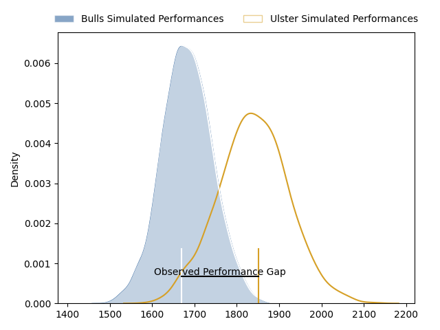
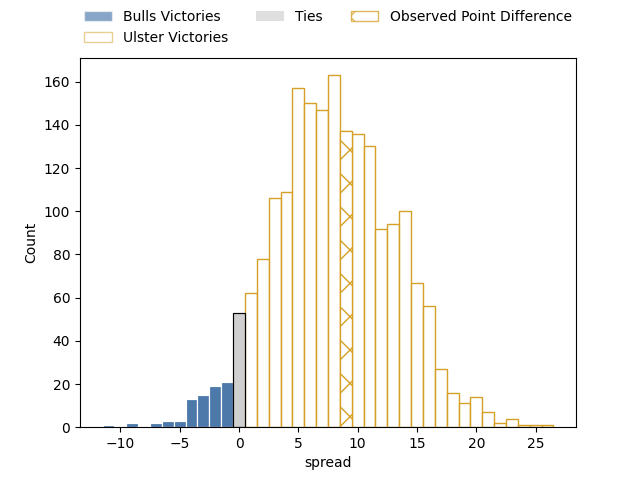

---  
layout: page  
title: Bulls at Ulster; 23-32  
date: 2023-03-25 20:35:00 18:00:00 -0500  
categories: match review  
---
# Bulls at Ulster; 23-32

# Club Level Predictions

The first set of predictions treats a club as the smallest object, as the club develops its members, organizes a gameplan, and deploys its players as needed for each match. This club model has a prediction of 0.692, which translates to predicting Ulster to win by 7.2.

Each club has a rating and a rating deviation (simiar to a Glicko system), and expected performances can be generated. This allows for simulated matches and spreads like the ones below.
## Projected Performances

## Projected Spreads

## Projected Results

# Player Level Predictions

Treating teams instead as an entity made up of the currently active players, I have ratings for each player in an altogether different system. These can be combined to form team ratings once teamsheets are announced, weighting starters a bit higher than the reserves. After the match is played, players can be weighted by their minutes on the field, allowing for an accurate measure of the team's composition. With these compiled team ratings, we can make predictions, measure inaccuracy, and update the individual player ratings.
## Prediction with Player Minutes: Ulster by 22.5

Ulster by 18.5 on a neutral field

There were 8 large changes in win probability in this match
## Prediction without Player Minutes: Ulster by 26.3

Ulster by 22.3 on a neutral pitch

|   Away Minutes | Away Player                  |   Away elo |   Away Percentile |   Number |   Home Percentile |   Home elo | Home Player            |   Home Minutes |
|---------------:|:-----------------------------|-----------:|------------------:|---------:|------------------:|-----------:|:-----------------------|---------------:|
|             73 | Gerhardus Cornelis Steenkamp |      94.66 |                48 |        1 |                63 |     100.41 | Andrew Warwick         |             49 |
|             80 | Cornelis Johannes Grobbelaar |      98.32 |                61 |        2 |                34 |      97.71 | Tom Stewart            |             77 |
|             80 | Mornay Jan Jakobus Smith     |      92.58 |                40 |        3 |                94 |     117.98 | Jeffery To'omaga-Allen |             61 |
|             80 | Ruan Stefan Vermaak          |      91.94 |                48 |        4 |                70 |     102.84 | Kieran Treadwell       |             61 |
|             80 | Ruan Nortje                  |      96.23 |                52 |        5 |                73 |     103.98 | Sam Carter             |             50 |
|             72 | Marco Gerhardt van Staden    |      91.81 |                39 |        6 |                70 |     103.51 | David McCann           |             61 |
|             63 | Cyle Justin Brink            |      88.68 |                29 |        7 |                93 |     123.43 | Nick Timoney           |             80 |
|             80 | Elrigh Louw                  |      97.08 |                49 |        8 |                85 |     111.49 | Duane Vermeulen        |             80 |
|             54 | Izak Jacobus Burger          |     103.98 |                74 |        9 |                83 |     108.81 | Nathan Doak            |             77 |
|             54 | Chris Smith                  |      94.65 |                44 |       10 |                73 |     104.29 | Billy Burns            |             80 |
|             80 | David Kriel                  |      86.21 |                23 |       11 |                71 |     103.13 | Jacob Stockdale        |             80 |
|             80 | Harold William Vorster       |     102.55 |                68 |       12 |                80 |     109.08 | Stewart Moore          |             50 |
|             80 | Cornal Hendricks             |      79.98 |                12 |       13 |                65 |     101.41 | James Hume             |             80 |
|             80 | Canan Moodie                 |     101.71 |                67 |       14 |                45 |      94.24 | Robert Baloucoune      |             80 |
|             74 | Kurt-Lee Arendse             |     104.39 |                69 |       15 |                95 |     127.26 | Michael Lowry          |             80 |
|             26 | Francois Klopper             |      85.35 |                14 |       16 |                73 |     101.91 | Eric O'Sullivan        |             31 |
|             26 | Embrose Cheldon Papier       |      84.35 |                16 |       17 |               nan |      96.48 | Jude Posthlewaite      |             30 |
|             17 | WJ Steenkamp                 |      99.74 |                58 |       18 |                72 |     104.19 | Harry Sheridan         |             30 |
|              8 | Bismarck du Plessis          |      93.22 |                42 |       19 |               nan |      92.85 | Gareth Milasinovich    |             19 |
|              7 | Simphiwe Matanzima           |      89.03 |                37 |       20 |                88 |     116.21 | Alan O'Connor          |             19 |
|              6 | Stedman-Gee Rivett Gans      |      98.27 |                53 |       21 |                64 |     100.64 | Marcus Rea             |             19 |
|            nan | nan                          |     nan    |               nan |       22 |                57 |      96.93 | John Andrew            |              3 |
|            nan | nan                          |     nan    |               nan |       23 |                71 |     102.84 | John Cooney            |              3 |

