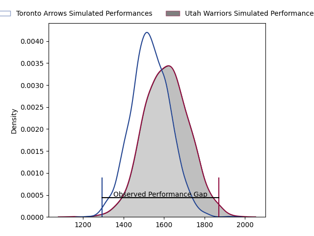
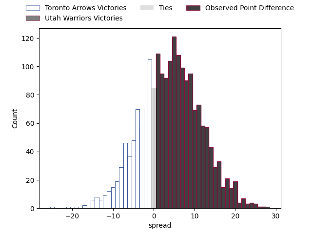

---  
layout: page  
title: Toronto Arrows at Utah Warriors; 19-47  
date: 2023-03-25 21:30:00 18:00:00 -0500  
categories: match review  
---
# Toronto Arrows at Utah Warriors; 19-47

# Club Level Predictions

The first set of predictions treats a club as the smallest object, as the club develops its members, organizes a gameplan, and deploys its players as needed for each match. This club model has a prediction of 0.609, which translates to predicting Utah Warriors to win by 4.0.

Each club has a rating and a rating deviation (simiar to a Glicko system), and expected performances can be generated. This allows for simulated matches and spreads like the ones below.
## Projected Performances

## Projected Spreads

## Projected Results

# Player Level Predictions

Treating teams instead as an entity made up of the currently active players, I have ratings for each player in an altogether different system. These can be combined to form team ratings once teamsheets are announced, weighting starters a bit higher than the reserves. After the match is played, players can be weighted by their minutes on the field, allowing for an accurate measure of the team's composition. With these compiled team ratings, we can make predictions, measure inaccuracy, and update the individual player ratings.
## Prediction with Player Minutes: Utah Warriors by 10.8

Utah Warriors by 6.8 on a neutral field

There were 11 large changes in win probability in this match
## Prediction without Player Minutes: Utah Warriors by 16.4

Utah Warriors by 12.4 on a neutral pitch

|   Away Minutes | Away Player                                                                  |   Away elo |   Away Percentile |   Number |   Home Percentile |   Home elo | Home Player                                                                 |   Home Minutes |
|---------------:|:-----------------------------------------------------------------------------|-----------:|------------------:|---------:|------------------:|-----------:|:----------------------------------------------------------------------------|---------------:|
|             58 | [Lolani Faleiva](..//playerfiles//LolaniFaleiva_cleaned.md)                  |      41.07 |                 0 |        1 |                45 |      96.91 | [Emerson Prior](..//playerfiles//EmersonPrior_cleaned.md)                   |             52 |
|             17 | [Ramon Ayarza](..//playerfiles//RamonAyarza_cleaned.md)                      |      81.58 |                12 |        2 |               nan |      92.57 | [Joey Backe](..//playerfiles//JoeyBacke_cleaned.md)                         |             52 |
|             67 | [Tyler Rowland](..//playerfiles//TylerRowland_cleaned.md)                    |      91.52 |                35 |        3 |                15 |      84.37 | [Angus McLellan](..//playerfiles//AngusMcLellan_cleaned.md)                 |             80 |
|             29 | [Mason Flesch](..//playerfiles//MasonFlesch_cleaned.md)                      |      11.07 |                 0 |        4 |                27 |      86.69 | [Jurie George van Vuuren](..//playerfiles//JurieGeorgevanVuuren_cleaned.md) |             52 |
|             80 | [Michael Sheppard](..//playerfiles//MichaelSheppard_cleaned.md)              |      90.06 |                31 |        5 |                33 |      90.43 | [Jamie Lane](..//playerfiles//JamieLane_cleaned.md)                         |             80 |
|             52 | [Owain Ruttan](..//playerfiles//OwainRuttan_cleaned.md)                      |      94.83 |               nan |        6 |               nan |      95.31 | [Jeremiah Noaese](..//playerfiles//JeremiahNoaese_cleaned.md)               |             80 |
|             80 | [James O'Neill](..//playerfiles//JamesO'Neill_cleaned.md)                    |     106.97 |                80 |        7 |                 3 |      66.67 | [Lance Williams](..//playerfiles//LanceWilliams_cleaned.md)                 |             70 |
|             80 | [Lucas Rumball](..//playerfiles//LucasRumball_cleaned.md)                    |      88.4  |                27 |        8 |                 0 |      52.98 | [Thomas Tu'avao](..//playerfiles//ThomasTu'avao_cleaned.md)                 |             80 |
|             72 | [Ross Braude](..//playerfiles//RossBraude_cleaned.md)                        |      88.13 |                27 |        9 |                66 |      99.09 | [Zion Going](..//playerfiles//ZionGoing_cleaned.md)                         |             63 |
|             80 | [Sam Malcolm](..//playerfiles//SamMalcolm_cleaned.md)                        |      92.13 |                38 |       10 |                36 |      91.74 | [Joel Hodgson](..//playerfiles//JoelHodgson_cleaned.md)                     |             80 |
|             80 | [Avery Oitomen](..//playerfiles//AveryOitomen_cleaned.md)                    |      71.3  |                 8 |       11 |                24 |      87.28 | [Joseph Mano](..//playerfiles//JosephMano_cleaned.md)                       |             80 |
|             80 | [Mitch Eadie](..//playerfiles//MitchEadie_cleaned.md)                        |      94.77 |                43 |       12 |                92 |     121.12 | [Tyler Luke Fisher](..//playerfiles//TylerLukeFisher_cleaned.md)            |             80 |
|             80 | [Fabian Goodall](..//playerfiles//FabianGoodall_cleaned.md)                  |      92.88 |                42 |       13 |                34 |      90.43 | [Mika Kruse](..//playerfiles//MikaKruse_cleaned.md)                         |             80 |
|             80 | [Kobe Faust](..//playerfiles//KobeFaust_cleaned.md)                          |      76.65 |                10 |       14 |               nan |      95.44 | [Logan Tago](..//playerfiles//LoganTago_cleaned.md)                         |             52 |
|             80 | [Brenden Black](..//playerfiles//BrendenBlack_cleaned.md)                    |      95    |               nan |       15 |                26 |      86.77 | [Caleb Makene](..//playerfiles//CalebMakene_cleaned.md)                     |             80 |
|             22 | [Conan O'Donnell](..//playerfiles//ConanO'Donnell_cleaned.md)                |      86.65 |                18 |       16 |               nan |      91.81 | [Olive Kilifi](..//playerfiles//OliveKilifi_cleaned.md)                     |             28 |
|             63 | [Gene Syminton](..//playerfiles//GeneSyminton_cleaned.md)                    |      87.35 |                22 |       17 |                72 |     101.89 | [Chad Gough](..//playerfiles//ChadGough_cleaned.md)                         |             28 |
|             33 | [Isaac Salmon](..//playerfiles//IsaacSalmon_cleaned.md)                      |      86.77 |                20 |       18 |                10 |      77.25 | [Saia Uhila](..//playerfiles//SaiaUhila_cleaned.md)                         |             28 |
|             31 | [Takaji Young Yen](..//playerfiles//TakajiYoungYen_cleaned.md)               |      95    |               nan |       19 |               nan |     nan    | nan                                                                         |            nan |
|             20 | [Onehunga Havili Kaufusi](..//playerfiles//OnehungaHaviliKaufusi_cleaned.md) |      94.81 |               nan |       20 |               nan |     nan    | nan                                                                         |            nan |
|            nan | nan                                                                          |     nan    |               nan |       21 |                 4 |      69.26 | [Bailey Wilson](..//playerfiles//BaileyWilson_cleaned.md)                   |             10 |
|            nan | nan                                                                          |     nan    |               nan |       22 |                38 |      91.72 | [Connor McLeod](..//playerfiles//ConnorMcLeod_cleaned.md)                   |             17 |
|            nan | nan                                                                          |     nan    |               nan |       23 |                39 |      92.33 | [Paul Lasike](..//playerfiles//PaulLasike_cleaned.md)                       |             28 |

