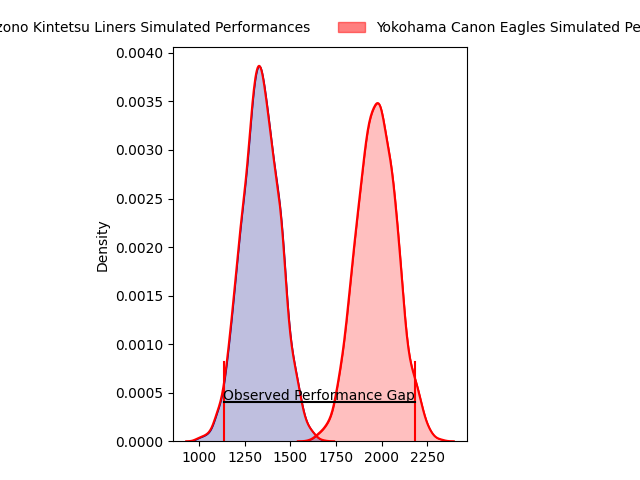
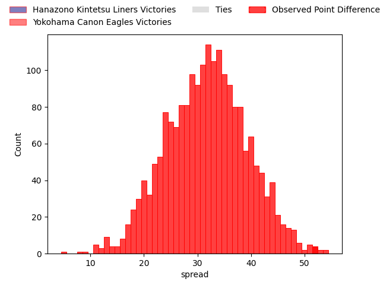
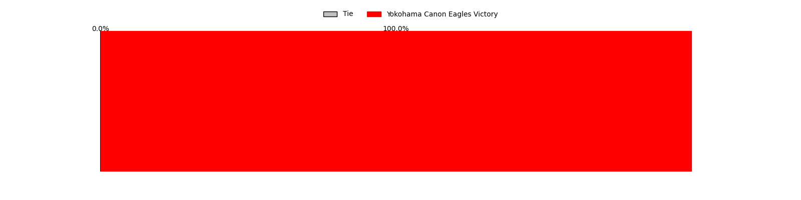

---  
layout: page  
title: Hanazono Kintetsu Liners at Yokohama Canon Eagles; 12-64  
date: 2023-03-25 00:00:00 18:00:00 -0500  
categories: match review  
---
# Hanazono Kintetsu Liners at Yokohama Canon Eagles; 12-64

# Club Level Predictions

The first set of predictions treats a club as the smallest object, as the club develops its members, organizes a gameplan, and deploys its players as needed for each match. This club model has a prediction of 0.97, which translates to predicting Yokohama Canon Eagles to win by 31.7.

Each club has a rating and a rating deviation (simiar to a Glicko system), and expected performances can be generated. This allows for simulated matches and spreads like the ones below.
## Projected Performances

## Projected Spreads

## Projected Results

# Player Level Predictions

Treating teams instead as an entity made up of the currently active players, I have ratings for each player in an altogether different system. These can be combined to form team ratings once teamsheets are announced, weighting starters a bit higher than the reserves. After the match is played, players can be weighted by their minutes on the field, allowing for an accurate measure of the team's composition. With these compiled team ratings, we can make predictions, measure inaccuracy, and update the individual player ratings.
## Prediction with Player Minutes: Yokohama Canon Eagles by 37.7

Yokohama Canon Eagles by 33.7 on a neutral field

There were 1 large changes in win probability in this match
## Prediction without Player Minutes: Yokohama Canon Eagles by 36.0

Yokohama Canon Eagles by 32.0 on a neutral pitch

|   Away Minutes | Away Player           |   Away elo |   Away Percentile |   Number |   Home Percentile |   Home elo | Home Player              |   Home Minutes |
|---------------:|:----------------------|-----------:|------------------:|---------:|------------------:|-----------:|:-------------------------|---------------:|
|             60 | Kenta Tanaka          |      78.95 |                 8 |        1 |               nan |     103.45 | Chang Ho Ahn             |             67 |
|             53 | Atsushi Kashimoto     |     102.92 |                74 |        2 |                 5 |      79.08 | Shin Kawamura            |             67 |
|             60 | Kota Mitake           |      79.25 |                10 |        3 |                92 |     117.69 | Rento Tsukayama          |             62 |
|             80 | Isamu Matsuoka        |      86.62 |                23 |        4 |                83 |     109.91 | Cory Hill                |             62 |
|             80 | Ben Toolis            |      59.76 |                 2 |        5 |                94 |     121.03 | Liaki Moli               |             80 |
|             67 | Takahito Sugahara     |      74.23 |                 8 |        6 |                68 |     101.9  | Jacobus Johannes van Dyk |             80 |
|             80 | Reiya Ueyama          |     103.96 |                73 |        7 |                56 |      97.78 | Naoto Shimada            |             80 |
|             77 | Shohei Nonaka         |     106.35 |                76 |        8 |                87 |     113.24 | Sione Halasili           |             57 |
|             62 | Tomoya Nakamura       |      90.6  |                33 |        9 |                18 |      87.04 | Kafazumi Yamasuga        |             67 |
|             80 | Jackson Garden-Bachop |      49.98 |                 1 |       10 |                90 |     120.88 | Yu Tamura                |             80 |
|             60 | Vincent Sefo          |      90.71 |                35 |       11 |                14 |      82.11 | Masayoshi Takezawa       |             80 |
|             53 | Patrick Stehlin       |     131.91 |                97 |       12 |                91 |     118.84 | Yusuke Kajimura          |             62 |
|             80 | Koji Okamura          |      72.61 |                 6 |       13 |                92 |     120.33 | Jesse Andre Kriel        |             80 |
|             80 | Joshua Nohra          |      84.65 |                19 |       14 |                91 |     119.28 | Inoke Burua              |             80 |
|             80 | Yoshizumi Takeda      |      66.01 |                 4 |       15 |                85 |     114.04 | Sarel Petrus Marais      |             67 |
|             27 | Sho Fukui             |      86.78 |                22 |       16 |                50 |      97.96 | Sosefo Fakatava          |             23 |
|             27 | Haruki Kanazawa       |      91.21 |               nan |       17 |                88 |     118.77 | Naoya Minamihashi        |             18 |
|             20 | Yushi Inoue           |      90.58 |                31 |       18 |                81 |     109.33 | Mitchell Brown           |             18 |
|             20 | Kensyo Kawamura       |      93.93 |               nan |       19 |                 5 |      73.4  | Tatsuro Sugimoto         |             18 |
|             20 | Ryo Iwakami           |      95    |               nan |       20 |                69 |     104.36 | Junpei Ogura             |             13 |
|             18 | Keitaro Hitora        |      98.07 |                79 |       21 |                89 |     113.68 | Francois (Faf) de Klerk  |             13 |
|             13 | Daiki Miyashita       |      63.63 |                 2 |       22 |                57 |      96.98 | Yusaku Miyoshi           |             13 |
|              3 | Shu Umemura           |      90.75 |               nan |       23 |                98 |     134.81 | Takato Okabe             |             13 |

