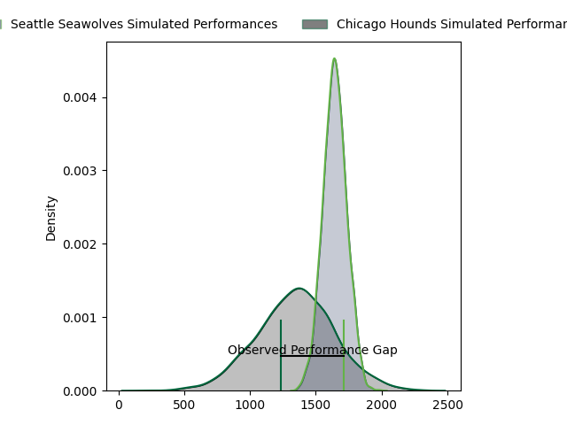
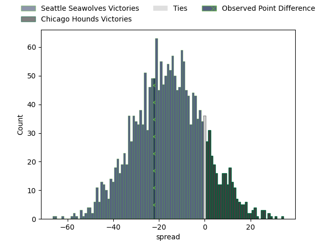

---  
layout: page  
title: Seattle Seawolves at Chicago Hounds; 27-5  
date: 2023-03-26 22:00:00 18:00:00 -0500  
categories: match review  
---
# Seattle Seawolves at Chicago Hounds; 27-5

# Club Level Predictions

The first set of predictions treats a club as the smallest object, as the club develops its members, organizes a gameplan, and deploys its players as needed for each match. This club model has a prediction of 0.148, which translates to predicting Seattle Seawolves to win by 15.8.

Each club has a rating and a rating deviation (simiar to a Glicko system), and expected performances can be generated. This allows for simulated matches and spreads like the ones below.
## Projected Performances

## Projected Spreads

## Projected Results

# Player Level Predictions

Treating teams instead as an entity made up of the currently active players, I have ratings for each player in an altogether different system. These can be combined to form team ratings once teamsheets are announced, weighting starters a bit higher than the reserves. After the match is played, players can be weighted by their minutes on the field, allowing for an accurate measure of the team's composition. With these compiled team ratings, we can make predictions, measure inaccuracy, and update the individual player ratings.
## Prediction with Player Minutes: Seattle Seawolves by 24.2

Seattle Seawolves by 28.2 on a neutral field
## Prediction without Player Minutes: Seattle Seawolves by 24.2

Seattle Seawolves by 28.2 on a neutral pitch

|   Away Minutes | Away Player                                                                |   Away elo |   Away Percentile |   Number |   Home Percentile |   Home elo | Home Player                                                             |   Home Minutes |
|---------------:|:---------------------------------------------------------------------------|-----------:|------------------:|---------:|------------------:|-----------:|:------------------------------------------------------------------------|---------------:|
|             80 | [Jake Turnbull](..//playerfiles//JakeTurnbull_cleaned.md)                  |      95.77 |                54 |        1 |               nan |      84.6  | [LaRome White](..//playerfiles//LaRomeWhite_cleaned.md)                 |             80 |
|             80 | [James Malcolm](..//playerfiles//JamesMalcolm_cleaned.md)                  |      98.22 |                61 |        2 |                 4 |      71.82 | [Lindsey Stevens](..//playerfiles//LindseyStevens_cleaned.md)           |             80 |
|             80 | [Sam Matenga](..//playerfiles//SamMatenga_cleaned.md)                      |      93.18 |                42 |        3 |               nan |      88.36 | [Paddy Ryan](..//playerfiles//PaddyRyan_cleaned.md)                     |             80 |
|             80 | [Ben Landry](..//playerfiles//BenLandry_cleaned.md)                        |      98.18 |                59 |        4 |                90 |     115.45 | [Dineshwaran Krishnan](..//playerfiles//DineshwaranKrishnan_cleaned.md) |             80 |
|             80 | [Rhyno Herbst](..//playerfiles//RhynoHerbst_cleaned.md)                    |      94.07 |                46 |        5 |                 6 |      72.45 | [Luke White](..//playerfiles//LukeWhite_cleaned.md)                     |             80 |
|             80 | [Charles Elton](..//playerfiles//CharlesElton_cleaned.md)                  |      94.57 |                46 |        6 |                 3 |      67.78 | [Luke Beauchamp](..//playerfiles//LukeBeauchamp_cleaned.md)             |             80 |
|             80 | [Nakai Penny](..//playerfiles//NakaiPenny_cleaned.md)                      |      99.34 |                61 |        7 |                 3 |      67.24 | [Maclean Jones](..//playerfiles//MacleanJones_cleaned.md)               |             80 |
|             80 | [Riekert Hattingh](..//playerfiles//RiekertHattingh_cleaned.md)            |      94.74 |                43 |        8 |                 0 |      29.6  | [Michael De Waal](..//playerfiles//MichaelDeWaal_cleaned.md)            |             80 |
|             80 | [JP Smith](..//playerfiles//JPSmith_cleaned.md)                            |     106.24 |                78 |        9 |                80 |     107.87 | [Michael Baska](..//playerfiles//MichaelBaska_cleaned.md)               |             80 |
|             80 | [AJ Alatimu](..//playerfiles//AJAlatimu_cleaned.md)                        |      97.02 |                51 |       10 |                 4 |      70.29 | [Luke Carty](..//playerfiles//LukeCarty_cleaned.md)                     |             80 |
|             80 | [Lauina Futi](..//playerfiles//LauinaFuti_cleaned.md)                      |     150.79 |                99 |       11 |                17 |      83.49 | [Julian Dominguez](..//playerfiles//JulianDominguez_cleaned.md)         |             80 |
|             80 | [Daniel David Kriel](..//playerfiles//DanielDavidKriel_cleaned.md)         |      94.74 |                46 |       12 |                13 |      81    | [Bill Meakes](..//playerfiles//BillMeakes_cleaned.md)                   |             80 |
|             80 | [Tevita Lopeti](..//playerfiles//TevitaLopeti_cleaned.md)                  |      95.88 |                48 |       13 |                 4 |      67.24 | [Bryce Campbell](..//playerfiles//BryceCampbell_cleaned.md)             |             80 |
|             80 | [Conner Mooneyham](..//playerfiles//ConnerMooneyham_cleaned.md)            |      68.82 |                 5 |       14 |                 0 |      34.1  | [Mark O'Keeffe](..//playerfiles//MarkO'Keeffe_cleaned.md)               |             80 |
|             80 | [Duncan Victor Matthews](..//playerfiles//DuncanVictorMatthews_cleaned.md) |      94.74 |                46 |       15 |                99 |     153.39 | [Chris Mattina](..//playerfiles//ChrisMattina_cleaned.md)               |             80 |

