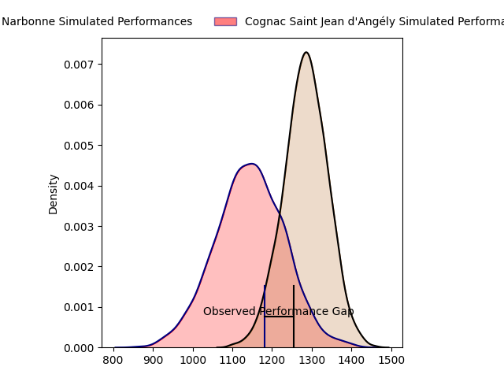
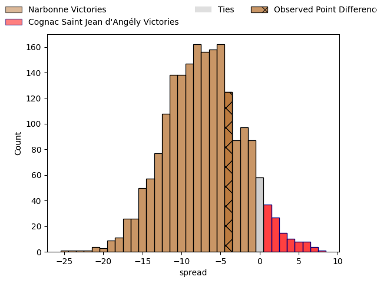

---  
layout: page  
title: Narbonne at Cognac Saint Jean d'Angély; 7-3  
date: 2023-03-26 15:00:00 18:00:00 -0500  
categories: match review  
---
# Narbonne at Cognac Saint Jean d'Angély; 7-3

# Club Level Predictions

The first set of predictions treats a club as the smallest object, as the club develops its members, organizes a gameplan, and deploys its players as needed for each match. This club model has a prediction of 0.312, which translates to predicting Narbonne to win by 7.0.

Each club has a rating and a rating deviation (simiar to a Glicko system), and expected performances can be generated. This allows for simulated matches and spreads like the ones below.
## Projected Performances

## Projected Spreads

## Projected Results

# Player Level Predictions

Treating teams instead as an entity made up of the currently active players, I have ratings for each player in an altogether different system. These can be combined to form team ratings once teamsheets are announced, weighting starters a bit higher than the reserves. After the match is played, players can be weighted by their minutes on the field, allowing for an accurate measure of the team's composition. With these compiled team ratings, we can make predictions, measure inaccuracy, and update the individual player ratings.
## Prediction with Player Minutes: Narbonne by 15.5

Narbonne by 19.5 on a neutral field

There were 4 large changes in win probability in this match
## Prediction without Player Minutes: Narbonne by 19.8

Narbonne by 23.8 on a neutral pitch

|   Away Minutes | Away Player           |   Away elo |   Away Percentile |   Number |   Home Percentile |   Home elo | Home Player      |   Home Minutes |
|---------------:|:----------------------|-----------:|------------------:|---------:|------------------:|-----------:|:-----------------|---------------:|
|             43 | Geoffrey Moise        |     101.15 |                71 |        1 |                45 |      94.09 | Kevin Tougne     |             80 |
|             65 | Jordan Rochier        |      97.14 |                67 |        2 |                11 |      79.43 | Paul Sauzaret    |             80 |
|             43 | Levi Tikoipau         |      96.09 |               nan |        3 |                36 |      91.31 | Maxime Gau       |             80 |
|             43 | Valentin Sese         |      94.25 |                46 |        4 |                 0 |      46.71 | Utu Maninoa      |             75 |
|             80 | Mohamed Kbaier        |      94.33 |                58 |        5 |                 1 |      50.27 | Clément Praud    |             80 |
|             80 | Arthur Christienne    |      90.87 |                44 |        6 |                25 |      87.83 | Matthieu Thomas  |             80 |
|             43 | Bill Caffo            |      96.84 |                53 |        7 |                 2 |      60.21 | Lucas Gulizzi    |             41 |
|             80 | Flavien Nouhaillaguet |      77.97 |                 9 |        8 |                15 |      82.2  | Filipe Manu      |             80 |
|             80 | Pierrick Nova         |      77.85 |                10 |        9 |                11 |      78.46 | Mathieu Billou   |             75 |
|             80 | Tom Chauvet           |      85.3  |                19 |       10 |                32 |      90.13 | Serafin Bordoli  |             80 |
|             80 | Pierre-Hugo Ducom     |      95.76 |                49 |       11 |                 7 |      73.57 | Eneri Lotawa     |             80 |
|             80 | Sébastien Giorgis     |      93.72 |                44 |       12 |                32 |      89.64 | Henry Tuilagi    |             80 |
|             80 | Théo Mias             |      97.63 |                54 |       13 |                52 |      96.79 | Isimeli Kuruibua |             80 |
|             80 | Étienne Ducom         |      87.15 |                38 |       14 |                18 |      84.57 | Jone Tuva        |             42 |
|             65 | Thibault Santoro      |      94.42 |                58 |       15 |                18 |      82.6  | Dany Antunes     |             80 |
|             37 | Théo Castinel         |     116.68 |                93 |       16 |                 2 |      57.13 | Thomas Toevalu   |              5 |
|             37 | Matthieu Loudet       |      87.27 |                36 |       17 |                71 |     103.81 | Damien Bonnet    |             39 |
|             15 | Gabriel Atlan         |      95    |               nan |       18 |                40 |      92.13 | William Beaudon  |              5 |
|             37 | Mauro Rebussone       |     110.76 |                84 |       19 |                 3 |      62.98 | Vincent Pageneau |             38 |
|             37 | Luke Nakobukobua      |     103.86 |                70 |       20 |               nan |     nan    | nan              |            nan |
|             15 | Pierre Nueno          |     100.73 |                64 |       21 |               nan |     nan    | nan              |            nan |

