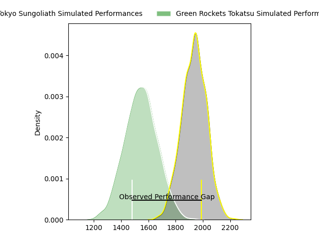
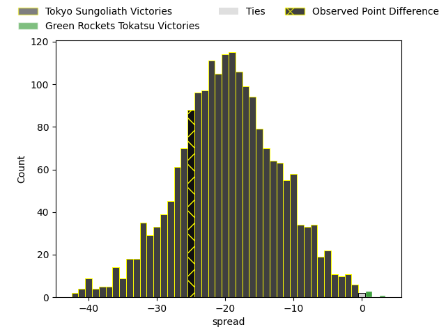

---  
layout: page  
title: Tokyo Sungoliath at Green Rockets Tokatsu; 32-7  
date: 2023-03-26 00:00:00 18:00:00 -0500  
categories: match review  
---
# Tokyo Sungoliath at Green Rockets Tokatsu; 32-7

# Club Level Predictions

The first set of predictions treats a club as the smallest object, as the club develops its members, organizes a gameplan, and deploys its players as needed for each match. This club model has a prediction of 0.104, which translates to predicting Tokyo Sungoliath to win by 19.5.

Each club has a rating and a rating deviation (simiar to a Glicko system), and expected performances can be generated. This allows for simulated matches and spreads like the ones below.
## Projected Performances

## Projected Spreads

## Projected Results

# Player Level Predictions

Treating teams instead as an entity made up of the currently active players, I have ratings for each player in an altogether different system. These can be combined to form team ratings once teamsheets are announced, weighting starters a bit higher than the reserves. After the match is played, players can be weighted by their minutes on the field, allowing for an accurate measure of the team's composition. With these compiled team ratings, we can make predictions, measure inaccuracy, and update the individual player ratings.
## Prediction with Player Minutes: Tokyo Sungoliath by 30.1

Tokyo Sungoliath by 34.1 on a neutral field

There were 2 large changes in win probability in this match
## Prediction without Player Minutes: Tokyo Sungoliath by 32.9

Tokyo Sungoliath by 36.9 on a neutral pitch

|   Away Minutes | Away Player         |   Away elo |   Away Percentile |   Number |   Home Percentile |   Home elo | Home Player       |   Home Minutes |
|---------------:|:--------------------|-----------:|------------------:|---------:|------------------:|-----------:|:------------------|---------------:|
|             49 | Yukio Morikawa      |     131.53 |                98 |        1 |               nan |      92.25 | Kosei Yamamoto    |             43 |
|             58 | Kosuke Horikoshi    |      94.71 |                49 |        2 |                10 |      80.52 | Ash Dixon         |             80 |
|             58 | Shinnosuke Kakinaga |     108.49 |                86 |        3 |                26 |      88.87 | Keisuke Kikuta    |             43 |
|             49 | Wataru Kobayashi    |     129.99 |                97 |        4 |                 4 |      66.92 | Daiki Yamagiwa    |             80 |
|             80 | Harrison Hockings   |     107.93 |                77 |        5 |                18 |      83.79 | Jake Ball         |             80 |
|             80 | Koji Iino           |     106.52 |                77 |        6 |                31 |      89    | Yoshida Hosoda    |             43 |
|             80 | Ryuga Hashimoto     |      91.22 |                31 |        7 |                44 |      95.19 | Aseri Masivou     |             68 |
|             60 | Tevita Tatafu       |     111.64 |                85 |        8 |                 7 |      76    | Wheetu Douglas    |             80 |
|             75 | Naoto Saito         |     104.83 |                76 |        9 |                19 |      84.79 | Nicholas Phipps   |             68 |
|             67 | Aaron Cruden        |     100.59 |                62 |       10 |                 8 |      78.09 | Doga Maeda        |             80 |
|             62 | Tevita Li           |      97.69 |                56 |       11 |                78 |     104.19 | Yuma Sugimoto     |             69 |
|             80 | Ryoto Nakamura      |     116.1  |                89 |       12 |                12 |      80.4  | Christian Laui    |             58 |
|             80 | Shogo Nakano        |     108.58 |                79 |       13 |                10 |      78.31 | Tim Bennetts      |             80 |
|             80 | Seiya Ozaki         |     106.41 |                77 |       14 |                13 |      81.17 | Teruya Goto       |             80 |
|             80 | Kotaro Matsushima   |     100.65 |                62 |       15 |                11 |      76.64 | Lomano Lemeki     |             80 |
|             31 | Ryosuke Iwaihara    |     101.25 |                66 |       16 |                91 |     113.28 | Satoshi Ueda      |             37 |
|             31 | Tom Savage          |     105.3  |                78 |       17 |                27 |      88.26 | Kavaia Tagivetaua |             37 |
|             22 | Shunta Nakamura     |     133.63 |                98 |       18 |                22 |      87.45 | Sunao Takizawa    |             37 |
|             22 | Kotaro Hosoki       |      95    |               nan |       19 |               nan |      94.81 | Masaki Obata      |             22 |
|             20 | Kanji Shimokawa     |     110.38 |                83 |       20 |                 0 |      52.45 | Ryoi Kamei        |             12 |
|             18 | Taiga Ozaki         |      94.07 |                44 |       21 |               nan |     101.94 | Tatsuya Fujii     |             12 |
|             13 | Hideto Niguma       |     113.68 |                86 |       22 |                20 |      81.34 | Tom Marshall      |             11 |
|              5 | Genki Okoshi        |      95.86 |               nan |       23 |               nan |     nan    | nan               |            nan |

