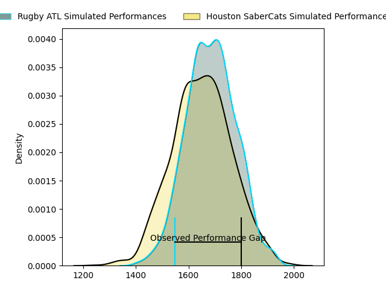
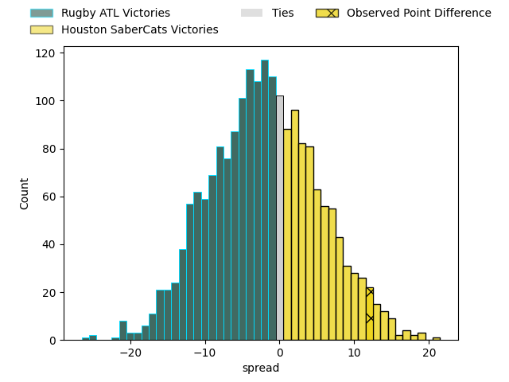

---  
layout: page  
title: Rugby ATL at Houston SaberCats; 28-40  
date: 2023-03-26 01:00:00 18:00:00 -0500  
categories: match review  
---
# Rugby ATL at Houston SaberCats; 28-40

# Club Level Predictions

The first set of predictions treats a club as the smallest object, as the club develops its members, organizes a gameplan, and deploys its players as needed for each match. This club model has a prediction of 0.45, which translates to predicting Rugby ATL to win by 1.8.

Each club has a rating and a rating deviation (simiar to a Glicko system), and expected performances can be generated. This allows for simulated matches and spreads like the ones below.
## Projected Performances

## Projected Spreads

## Projected Results

# Player Level Predictions

Treating teams instead as an entity made up of the currently active players, I have ratings for each player in an altogether different system. These can be combined to form team ratings once teamsheets are announced, weighting starters a bit higher than the reserves. After the match is played, players can be weighted by their minutes on the field, allowing for an accurate measure of the team's composition. With these compiled team ratings, we can make predictions, measure inaccuracy, and update the individual player ratings.
## Prediction with Player Minutes: Houston SaberCats by 18.5

Houston SaberCats by 14.5 on a neutral field

There were 5 large changes in win probability in this match
## Prediction without Player Minutes: Houston SaberCats by 18.7

Houston SaberCats by 14.7 on a neutral pitch

|   Away Minutes | Away Player                                                                 |   Away elo |   Away Percentile |   Number |   Home Percentile |   Home elo | Home Player                                                                              |   Home Minutes |
|---------------:|:----------------------------------------------------------------------------|-----------:|------------------:|---------:|------------------:|-----------:|:-----------------------------------------------------------------------------------------|---------------:|
|             50 | [Will Burke](..//playerfiles//WillBurke_cleaned.md)                         |      72.33 |                 6 |        1 |                70 |     104.21 | [Alec McDonnell](..//playerfiles//AlecMcDonnell_cleaned.md)                              |             68 |
|             62 | [Tiaan Erasmus](..//playerfiles//TiaanErasmus_cleaned.md)                   |      24.02 |                 0 |        2 |                 3 |      69.9  | [Dean Muir](..//playerfiles//DeanMuir_cleaned.md)                                        |             66 |
|             62 | [John Roy Jenkinson](..//playerfiles//JohnRoyJenkinson_cleaned.md)          |     104.7  |                80 |        3 |                87 |     109.44 | [Morgan Mitchell](..//playerfiles//MorganMitchell_cleaned.md)                            |             64 |
|             56 | [Christian Nahuel Milan](..//playerfiles//ChristianNahuelMilan_cleaned.md)  |      95.65 |               nan |        4 |                64 |     100.46 | [Siaosi Mahoni](..//playerfiles//SiaosiMahoni_cleaned.md)                                |             49 |
|             40 | [Jordan Brown](..//playerfiles//JordanBrown_cleaned.md)                     |     103.94 |                75 |        5 |                12 |      79.26 | [Nathan Den Hoedt](..//playerfiles//NathanDenHoedt_cleaned.md)                           |             80 |
|             80 | [Johannes Momsen](..//playerfiles//JohannesMomsen_cleaned.md)               |      55.2  |                 1 |        6 |                22 |      86.8  | [Marno Redelinghuys](..//playerfiles//MarnoRedelinghuys_cleaned.md)                      |             80 |
|             80 | [Matthew Heaton](..//playerfiles//MatthewHeaton_cleaned.md)                 |      85.3  |                18 |        7 |                74 |     106.31 | [Danny Barrett](..//playerfiles//DannyBarrett_cleaned.md)                                |             40 |
|             66 | [Daemon Torres](..//playerfiles//DaemonTorres_cleaned.md)                   |     104.82 |                76 |        8 |                68 |     102.11 | [Wynand Grassmann](..//playerfiles//WynandGrassmann_cleaned.md)                          |             66 |
|             66 | [Rowan Gouws](..//playerfiles//RowanGouws_cleaned.md)                       |      73.5  |                 8 |        9 |                49 |      94.84 | [Carlo de Nysschen](..//playerfiles//CarlodeNysschen_cleaned.md)                         |             70 |
|             45 | [Duncan van Schalkwyk](..//playerfiles//DuncanvanSchalkwyk_cleaned.md)      |      47.42 |                 1 |       10 |                19 |      85.39 | [David Coetzer](..//playerfiles//DavidCoetzer_cleaned.md)                                |             66 |
|             80 | [Jack Shaw](..//playerfiles//JackShaw_cleaned.md)                           |     111.82 |                85 |       11 |                69 |     102.43 | [Gherardus Jacobus Labuschagne](..//playerfiles//GherardusJacobusLabuschagne_cleaned.md) |             80 |
|             80 | [Will Leonard](..//playerfiles//WillLeonard_cleaned.md)                     |     200.85 |               100 |       12 |                44 |      93.91 | [Louritz van der Schyff](..//playerfiles//LouritzvanderSchyff_cleaned.md)                |             80 |
|             80 | [Te Rangatira Waitokia](..//playerfiles//TeRangatiraWaitokia_cleaned.md)    |      82.25 |                15 |       13 |                29 |      88.65 | [Dominic Akina](..//playerfiles//DominicAkina_cleaned.md)                                |             80 |
|             80 | [Harley Davidson](..//playerfiles//HarleyDavidson_cleaned.md)               |      83.93 |                18 |       14 |                85 |     112.72 | [Christian Dyer](..//playerfiles//ChristianDyer_cleaned.md)                              |             80 |
|             80 | [Martini Talapusi](..//playerfiles//MartiniTalapusi_cleaned.md)             |      72.61 |                 8 |       15 |                86 |     112.72 | [Drew Wild](..//playerfiles//DrewWild_cleaned.md)                                        |             80 |
|             30 | [Alex Maughan](..//playerfiles//AlexMaughan_cleaned.md)                     |     -13.76 |                 0 |       16 |                22 |      87.44 | [Frikkie de Beer](..//playerfiles//FrikkiedeBeer_cleaned.md)                             |             12 |
|             18 | [Jonas Petrakopoulos](..//playerfiles//JonasPetrakopoulos_cleaned.md)       |      60.9  |                 1 |       17 |                83 |     107.25 | [Axel Zapata](..//playerfiles//AxelZapata_cleaned.md)                                    |             14 |
|             18 | [Lincoln Sii](..//playerfiles//LincolnSii_cleaned.md)                       |      95.71 |               nan |       18 |               nan |     105.4  | [Pono Davis](..//playerfiles//PonoDavis_cleaned.md)                                      |             16 |
|             24 | [Ross Deacon](..//playerfiles//RossDeacon_cleaned.md)                       |      35.83 |               nan |       19 |                39 |      94.63 | [Emmanuel Albert](..//playerfiles//EmmanuelAlbert_cleaned.md)                            |             31 |
|             40 | [Justin Johan Basson](..//playerfiles//JustinJohanBasson_cleaned.md)        |      98.32 |                59 |       20 |                60 |     100.12 | [Gideon van Wyk](..//playerfiles//GideonvanWyk_cleaned.md)                               |             40 |
|             14 | [Frederick Henry-Ajudua](..//playerfiles//FrederickHenry-Ajudua_cleaned.md) |      95.22 |               nan |       21 |               nan |      95    | [Malon Maurice Al-Jiboori](..//playerfiles//MalonMauriceAl-Jiboori_cleaned.md)           |             14 |
|             14 | [Ryan Rees](..//playerfiles//RyanRees_cleaned.md)                           |      88.24 |                27 |       22 |                 0 |      16.11 | [Nick Boyer](..//playerfiles//NickBoyer_cleaned.md)                                      |             10 |
|             35 | [Kurt Kendall Coleman](..//playerfiles//KurtKendallColeman_cleaned.md)      |      86.36 |                22 |       23 |                13 |      79.85 | [Zach Pangeliman](..//playerfiles//ZachPangeliman_cleaned.md)                            |             14 |

