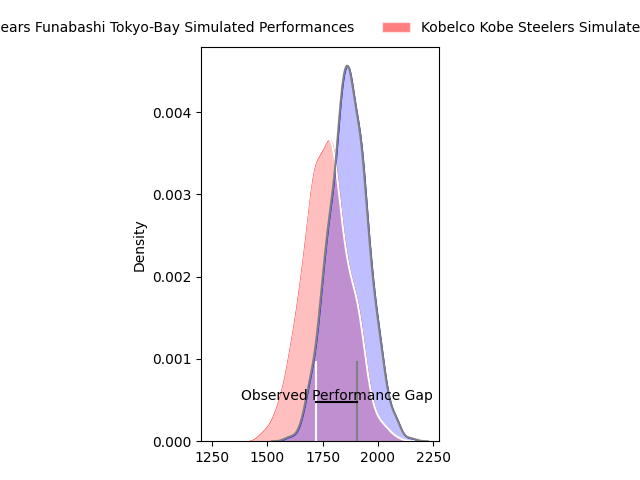
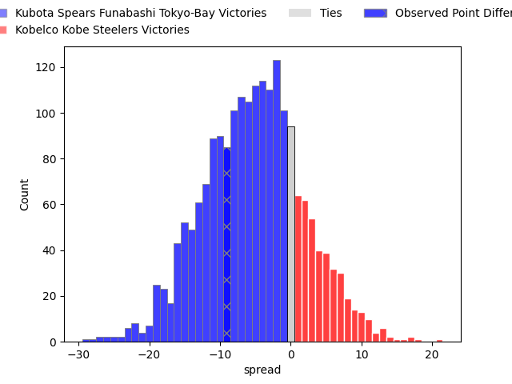
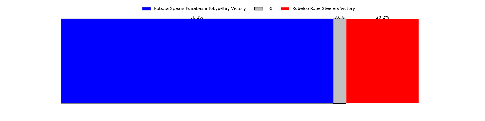

---  
layout: page  
title: Kubota Spears Funabashi Tokyo-Bay at Kobelco Kobe Steelers; 23-14  
date: 2023-03-26 00:00:00 18:00:00 -0500  
categories: match review  
---
# Kubota Spears Funabashi Tokyo-Bay at Kobelco Kobe Steelers; 23-14

# Club Level Predictions

The first set of predictions treats a club as the smallest object, as the club develops its members, organizes a gameplan, and deploys its players as needed for each match. This club model has a prediction of 0.358, which translates to predicting Kubota Spears Funabashi Tokyo-Bay to win by 5.3.

Each club has a rating and a rating deviation (simiar to a Glicko system), and expected performances can be generated. This allows for simulated matches and spreads like the ones below.
## Projected Performances

## Projected Spreads

## Projected Results

# Player Level Predictions

Treating teams instead as an entity made up of the currently active players, I have ratings for each player in an altogether different system. These can be combined to form team ratings once teamsheets are announced, weighting starters a bit higher than the reserves. After the match is played, players can be weighted by their minutes on the field, allowing for an accurate measure of the team's composition. With these compiled team ratings, we can make predictions, measure inaccuracy, and update the individual player ratings.
## Prediction with Player Minutes: Kubota Spears Funabashi Tokyo-Bay by 14.7

Kubota Spears Funabashi Tokyo-Bay by 18.7 on a neutral field

There were 5 large changes in win probability in this match
## Prediction without Player Minutes: Kubota Spears Funabashi Tokyo-Bay by 12.4

Kubota Spears Funabashi Tokyo-Bay by 16.4 on a neutral pitch

|   Away Minutes | Away Player                    |   Away elo |   Away Percentile |   Number |   Home Percentile |   Home elo | Home Player              |   Home Minutes |
|---------------:|:-------------------------------|-----------:|------------------:|---------:|------------------:|-----------:|:-------------------------|---------------:|
|             47 | Kota Kaishi                    |     116.67 |                93 |        1 |                90 |     112.37 | Isileli Nakajima Vakauta |             61 |
|             45 | Malcolm Justin Marx            |     104.04 |                77 |        2 |                77 |     103.8  | Kenta Matsuoka           |             68 |
|             67 | Opeti Helu                     |     120.3  |                92 |        3 |               nan |      94.64 | Jiwon Koo                |             53 |
|             47 | Uwe Helu                       |     101.2  |                71 |        4 |                29 |      89.4  | Gerard Cowley-Tuioti     |             80 |
|             80 | Ruan Botha                     |      96.09 |                51 |        5 |                14 |      83.5  | John Dave Schickerling   |             80 |
|             67 | Yuki Aoki                      |     107.08 |                77 |        6 |                56 |      97.89 | Takara Imamura           |             80 |
|             80 | Takeo Suenaga                  |     129.44 |                96 |        7 |                98 |     142.01 | Hikaru Hashimoto         |             61 |
|             40 | Faulua Makisi                  |     115.42 |                88 |        8 |                39 |      92.07 | Tiennan Costley          |             68 |
|             40 | Kazuhiro Taniguchi             |     125.45 |                96 |        9 |                92 |     116.69 | Daiki Nakajima           |             53 |
|             80 | Bernard Foley                  |     107.5  |                78 |       10 |                37 |      91.98 | Timothy Lafaele          |             80 |
|             80 | Haruto Kida                    |     125.87 |                95 |       11 |                41 |      92.66 | Ataata Moeakiola         |             80 |
|             80 | Harumichi Tatekawa             |     103.62 |                70 |       12 |                46 |      95.11 | Richard Buckman          |             65 |
|             67 | Sione Teaupa                   |     103.55 |                64 |       13 |                51 |      97.35 | Junta Hamano             |             80 |
|             80 | Koga Nezuka                    |      90.03 |                32 |       14 |                64 |     100.36 | Shintaro Hayashi         |             63 |
|             80 | Gerhard Jacobus van den Heever |     115.27 |                88 |       15 |                22 |      85.53 | Ryohei Yamanaka          |             80 |
|             40 | Finau Tupa                     |     149.48 |                99 |       16 |                58 |      99.97 | Kenta Tokuda             |             27 |
|             40 | Shinobu Fujiwara               |     106.19 |                78 |       17 |                79 |     101.41 | Go Maeda                 |             27 |
|             35 | Hiraoki Sugimoto               |     116.17 |                84 |       18 |                24 |      85.78 | Naohiro Kotaki           |             19 |
|             33 | Yota Kaminori                  |      99.7  |                61 |       19 |               nan |      94.86 | Koki Yamamoto            |             19 |
|             33 | David James Bulbring           |     116.08 |                90 |       20 |                98 |     138.56 | Rakuhei Yamashita        |             17 |
|             13 | Suryung Kim                    |     115.17 |                88 |       21 |               nan |      92.27 | Beaudein Waaka           |             15 |
|             13 | Kengo Kitagawa                 |     119.86 |                95 |       22 |               nan |      97.99 | Rinpei Sasaki            |             12 |
|             13 | Rikus Pretorius                |     113.08 |                85 |       23 |                99 |     144.9  | Seokhwan Jang            |             12 |

